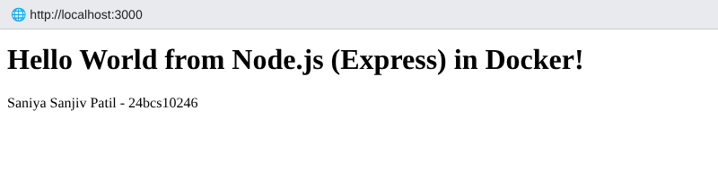
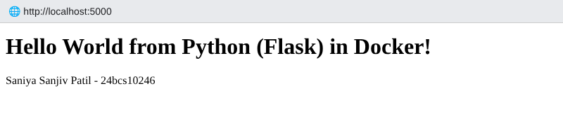
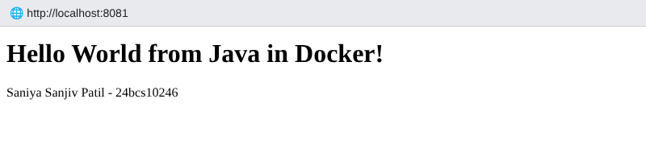
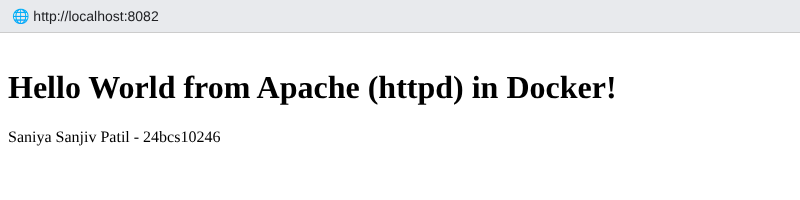
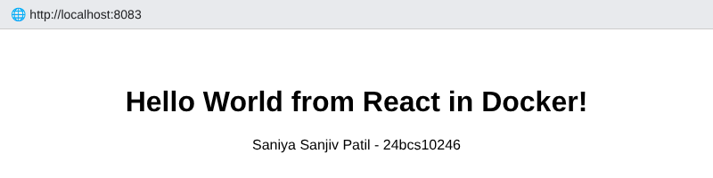
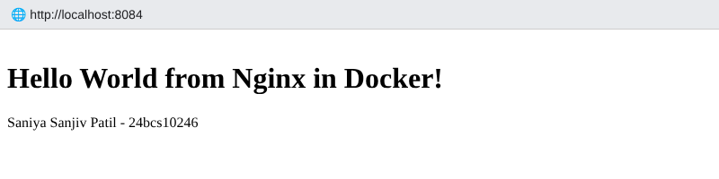

# Session 6 – Docker Fundamentals: Hello World Applications

**Name:** Saniya Sanjiv Patil · **Roll No:** 24bcs10246 · **Batch:** B

Six Hello-World web applications, each in its own folder with its code and a `Dockerfile`.
Each image was built, run as a container, and verified with `curl` – real terminal output below.

| Folder | Stack | Base image(s) | Container port → host port |
|---|---|---|---|
| [`nodejs-app`](./nodejs-app) | Node.js + Express | `node:24-alpine` | 3000 → 3000 |
| [`python-app`](./python-app) | Python + Flask | `python:3.12-slim` | 5000 → 5000 |
| [`java-app`](./java-app) | Java 21 (built-in HttpServer), multi-stage | `eclipse-temurin:21-jdk-alpine` → `21-jre-alpine` | 8080 → 8081 |
| [`Apache-app`](./Apache-app) | Apache httpd static page | `httpd:2.4-alpine` | 80 → 8082 |
| [`React-app`](./React-app) | React 18 + Vite, multi-stage (build → nginx) | `node:24-alpine` → `nginx:1.27-alpine` | 80 → 8083 |
| [`nginx-app`](./nginx-app) | Nginx static page | `nginx:1.27-alpine` | 80 → 8084 |

> Note: my machine sits behind a proxy, so I ran `docker build` with `--network host --build-arg HTTPS_PROXY=…`; those flags are omitted below for readability.

---

## nodejs-app

**Dockerfile**

```dockerfile
FROM node:24-alpine
WORKDIR /app
COPY package*.json ./
RUN npm install --omit=dev
COPY . .
EXPOSE 3000
CMD ["npm", "start"]
```

```console
saniya@saniya-devops:~/devops-homework/session-06-docker-fundamentals/nodejs-app$ docker build -t saniya/nodejs-app:1.0 .
#2 DONE 0.0s
#3 DONE 0.0s
#4 DONE 0.0s
#5 [1/5] FROM docker.io/library/node:24-alpine@sha256:b60d869960e3184d45768c86f21a3521858095d9c69608950866bef7b4bf23bd
#5 DONE 0.0s
#6 [2/5] WORKDIR /app
#7 [3/5] COPY package*.json ./
#7 DONE 0.0s
#8 [4/5] RUN npm install --omit=dev
#8 DONE 1.9s
#9 [5/5] COPY . .
#9 DONE 0.0s
#10 naming to docker.io/saniya/nodejs-app:1.0 done
#10 DONE 0.6s
```

```console
saniya@saniya-devops:~/devops-homework/session-06-docker-fundamentals/nodejs-app$ docker run -d --name nodejs-app -p 3000:3000 saniya/nodejs-app:1.0
05121fc92eb1dbb0cb2bdff7be3afa874a383a44481f6a3936bb49211d1b73e2
```

```console
saniya@saniya-devops:~/devops-homework/session-06-docker-fundamentals/nodejs-app$ curl -s http://localhost:3000
<h1>Hello World from Node.js (Express) in Docker!</h1><p>Saniya Sanjiv Patil - 24bcs10246</p>
```

**Browser screenshot:**



---

## python-app

**Dockerfile**

```dockerfile
FROM python:3.12-slim
WORKDIR /app
COPY requirements.txt .
RUN pip install --no-cache-dir -r requirements.txt
COPY app.py .
EXPOSE 5000
CMD ["python", "app.py"]
```

```console
saniya@saniya-devops:~/devops-homework/session-06-docker-fundamentals/python-app$ docker build -t saniya/python-app:1.0 .
#2 DONE 0.0s
#3 DONE 0.0s
#4 DONE 0.0s
#5 [1/5] FROM docker.io/library/python:3.12-slim@sha256:53767d72c49c98b62ff66b2d095edf5791f81c171fcf85b4d5db4abdacf39992
#5 DONE 0.0s
#6 [2/5] WORKDIR /app
#7 [3/5] COPY requirements.txt .
#7 DONE 0.0s
#8 [4/5] RUN pip install --no-cache-dir -r requirements.txt
#8 DONE 4.7s
#9 [5/5] COPY app.py .
#9 DONE 0.0s
#10 naming to docker.io/saniya/python-app:1.0 done
#10 DONE 1.1s
```

```console
saniya@saniya-devops:~/devops-homework/session-06-docker-fundamentals/python-app$ docker run -d --name python-app -p 5000:5000 saniya/python-app:1.0
d41ec81d7b7c83f53f5d749e20c0ba48d23af79c5ae607c9931766cc4c80f135
```

```console
saniya@saniya-devops:~/devops-homework/session-06-docker-fundamentals/python-app$ curl -s http://localhost:5000
<h1>Hello World from Python (Flask) in Docker!</h1><p>Saniya Sanjiv Patil - 24bcs10246</p>
```

**Browser screenshot:**



---

## java-app

**Dockerfile**

```dockerfile
# Stage 1: compile
FROM eclipse-temurin:21-jdk-alpine AS build
WORKDIR /src
COPY HelloWorld.java .
RUN javac HelloWorld.java

# Stage 2: run on a smaller JRE image
FROM eclipse-temurin:21-jre-alpine
WORKDIR /app
COPY --from=build /src/*.class ./
EXPOSE 8080
CMD ["java", "HelloWorld"]
```

```console
saniya@saniya-devops:~/devops-homework/session-06-docker-fundamentals/java-app$ docker build -t saniya/java-app:1.0 .
#5 DONE 0.0s
#6 [stage-1 1/3] FROM docker.io/library/eclipse-temurin:21-jre-alpine@sha256:51ab5e3302e7141ce665ca3ea85e8b5cd648eafbc3c0c90dd79d6537684e4555
#6 DONE 0.0s
#7 [build 2/4] WORKDIR /src
#8 [stage-1 2/3] WORKDIR /app
#9 DONE 0.0s
#10 [build 3/4] COPY HelloWorld.java .
#10 DONE 0.0s
#11 [build 4/4] RUN javac HelloWorld.java
#11 DONE 0.9s
#12 [stage-1 3/3] COPY --from=build /src/*.class ./
#12 DONE 0.0s
#13 naming to docker.io/saniya/java-app:1.0 done
#13 DONE 0.1s
```

```console
saniya@saniya-devops:~/devops-homework/session-06-docker-fundamentals/java-app$ docker run -d --name java-app -p 8081:8080 saniya/java-app:1.0
87bf03e02e00e7de684a6cbb17c6d49fddd94a1fd0e8631e695c6f04492e7ee8
```

```console
saniya@saniya-devops:~/devops-homework/session-06-docker-fundamentals/java-app$ curl -s http://localhost:8081
<h1>Hello World from Java in Docker!</h1><p>Saniya Sanjiv Patil - 24bcs10246</p>
```

**Browser screenshot:**



---

## Apache-app

**Dockerfile**

```dockerfile
FROM httpd:2.4-alpine
COPY index.html /usr/local/apache2/htdocs/index.html
EXPOSE 80
```

```console
saniya@saniya-devops:~/devops-homework/session-06-docker-fundamentals/Apache-app$ docker build -t saniya/apache-app:1.0 .
#1 DONE 0.0s
#2 DONE 0.0s
#3 DONE 0.0s
#4 DONE 0.0s
#5 [1/2] FROM docker.io/library/httpd:2.4-alpine@sha256:3440c39d8d6f54fa9ad2549e5a60c19ddd435faadc29c1ad28aa795f71888889
#6 [2/2] COPY index.html /usr/local/apache2/htdocs/index.html
#6 DONE 0.0s
#7 naming to docker.io/saniya/apache-app:1.0 done
#7 DONE 0.1s
```

```console
saniya@saniya-devops:~/devops-homework/session-06-docker-fundamentals/Apache-app$ docker run -d --name apache-app -p 8082:80 saniya/apache-app:1.0
f02a722b79948faee86e48764724886aff8383d8941aee283f5361e786b470c0
```

```console
saniya@saniya-devops:~/devops-homework/session-06-docker-fundamentals/Apache-app$ curl -s http://localhost:8082
<head><title>Apache Hello World</title></head>
<h1>Hello World from Apache (httpd) in Docker!</h1>
<p>Saniya Sanjiv Patil - 24bcs10246</p>
```

**Browser screenshot:**



---

## React-app

**Dockerfile**

```dockerfile
# Stage 1: build the React app
FROM node:24-alpine AS build
WORKDIR /app
COPY package*.json ./
RUN npm ci
COPY . .
RUN npm run build

# Stage 2: serve the static build with nginx
FROM nginx:1.27-alpine
COPY --from=build /app/dist /usr/share/nginx/html
EXPOSE 80
CMD ["nginx", "-g", "daemon off;"]
```

```console
saniya@saniya-devops:~/devops-homework/session-06-docker-fundamentals/React-app$ docker build -t saniya/react-app:1.0 .
#7 [stage-1 1/2] FROM docker.io/library/nginx:1.27-alpine@sha256:65645c7bb6a0661892a8b03b89d0743208a18dd2f3f17a54ef4b76fb8e2f2a10
#8 DONE 0.0s
#9 [build 3/6] COPY package*.json ./
#9 DONE 0.0s
#10 [build 4/6] RUN npm ci
#10 DONE 3.3s
#11 [build 5/6] COPY . .
#11 DONE 0.0s
#12 [build 6/6] RUN npm run build
#12 DONE 10.5s
#13 [stage-1 2/2] COPY --from=build /app/dist /usr/share/nginx/html
#13 DONE 0.0s
#14 naming to docker.io/saniya/react-app:1.0 done
#14 DONE 0.1s
```

```console
saniya@saniya-devops:~/devops-homework/session-06-docker-fundamentals/React-app$ docker run -d --name react-app -p 8083:80 saniya/react-app:1.0
f5251545f21d019bcb1fd8890b2d9196714486bef06ffb3ea2081662ce9d9bb0
```

```console
saniya@saniya-devops:~/devops-homework/session-06-docker-fundamentals/React-app$ curl -s http://localhost:8083
<head><meta charset="UTF-8" /><title>React Hello World</title>  <script type="module" crossorigin src="/assets/index-4Zf1DZCY.js"></script>
<div id="root"></div>
```

**Browser screenshot:**



---

## nginx-app

**Dockerfile**

```dockerfile
FROM nginx:1.27-alpine
COPY index.html /usr/share/nginx/html/index.html
EXPOSE 80
CMD ["nginx", "-g", "daemon off;"]
```

```console
saniya@saniya-devops:~/devops-homework/session-06-docker-fundamentals/nginx-app$ docker build -t saniya/nginx-app:1.0 .
#1 DONE 0.0s
#2 DONE 0.0s
#3 DONE 0.0s
#4 DONE 0.0s
#5 [1/2] FROM docker.io/library/nginx:1.27-alpine@sha256:65645c7bb6a0661892a8b03b89d0743208a18dd2f3f17a54ef4b76fb8e2f2a10
#6 [2/2] COPY index.html /usr/share/nginx/html/index.html
#6 DONE 0.0s
#7 naming to docker.io/saniya/nginx-app:1.0 done
#7 DONE 0.1s
```

```console
saniya@saniya-devops:~/devops-homework/session-06-docker-fundamentals/nginx-app$ docker run -d --name nginx-app -p 8084:80 saniya/nginx-app:1.0
3f4076ae26e872ae9361bc6b500cc920a45c4a02ef5f2588bd2809a1ba46ebe2
```

```console
saniya@saniya-devops:~/devops-homework/session-06-docker-fundamentals/nginx-app$ curl -s http://localhost:8084
<head><title>Nginx Hello World</title></head>
<h1>Hello World from Nginx in Docker!</h1>
<p>Saniya Sanjiv Patil - 24bcs10246</p>
```

**Browser screenshot:**



---

## All containers running

```console
saniya@saniya-devops:~/devops-homework/session-06-docker-fundamentals$ docker ps --format 'table {{.Names}}\t{{.Image}}\t{{.Ports}}\t{{.Status}}' --filter name=-app
NAMES        IMAGE                   PORTS                    STATUS
nginx-app    saniya/nginx-app:1.0    0.0.0.0:8084->80/tcp     Up 5 seconds
react-app    saniya/react-app:1.0    0.0.0.0:8083->80/tcp     Up 11 seconds
apache-app   saniya/apache-app:1.0   0.0.0.0:8082->80/tcp     Up 30 seconds
java-app     saniya/java-app:1.0     0.0.0.0:8081->8080/tcp   Up 36 seconds
python-app   saniya/python-app:1.0   0.0.0.0:5000->5000/tcp   Up 43 seconds
nodejs-app   saniya/nodejs-app:1.0   0.0.0.0:3000->3000/tcp   Up 54 seconds
```

```console
saniya@saniya-devops:~/devops-homework/session-06-docker-fundamentals$ docker images 'saniya/*'
REPOSITORY          TAG       SIZE
saniya/nginx-app    1.0       73.6MB
saniya/react-app    1.0       73.8MB
saniya/apache-app   1.0       105MB
saniya/java-app     1.0       286MB
saniya/python-app   1.0       198MB
saniya/nodejs-app   1.0       254MB
```

## Notes / observations
- The React page HTML only contains `<div id="root">` – React renders the "Hello World" text in the browser from the bundled JS (`/assets/index-*.js`), which I confirmed by checking the bundle contains the text.
- Multi-stage builds (Java, React) keep the final image small: the JDK / Node toolchain is not shipped, only the compiled `.class` files or static `dist/` folder.
- `.dockerignore` keeps `node_modules` out of the build context.
```console
saniya@saniya-devops:~/devops-homework/session-06-docker-fundamentals$ curl -s http://localhost:8083/assets/$(curl -s http://localhost:8083 | grep -o 'index-[^"]*\.js' | head -1) | grep -o 'Hello World from React in Docker!'
Hello World from React in Docker!
```

