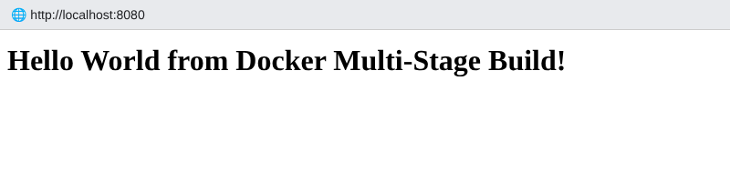
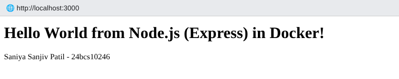
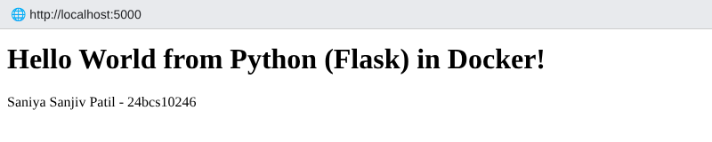
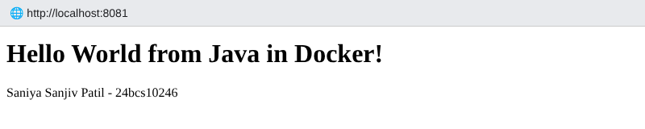

# Session 7 – Docker Images & Multi-Stage Build Homework

| | |
|---|---|
| **Name** | Saniya Sanjiv Patil |
| **Enrollment / Roll No.** | 24bcs10246 |
| **Batch** | B |

All outputs below are real terminal output from my machine.

---

## Task 1 – Run the multi-stage Dockerfile

### 1. Clone the repository
```console
saniya@saniya-devops:~ git clone https://github.com/Nency-Ravaliya/devops-heros.git
Cloning into 'devops-heros'... done.
```

```console
saniya@saniya-devops:~ cd devops-heros/session6-7-docker/multi-stage-dockerfile && ls && cat Dockerfile
Dockerfile
package.json
server.js
# -------------------------
# Stage 1: Build
# -------------------------
FROM node:24-alpine AS builder
WORKDIR /app
COPY package*.json ./
RUN npm install
COPY . .

# -------------------------
# Stage 2: Production
# -------------------------
FROM node:24-alpine AS production
WORKDIR /app
COPY --from=builder /app/package*.json ./
RUN npm install --omit=dev
COPY --from=builder /app/server.js ./
EXPOSE 3000
CMD ["npm", "start"]
```

**How the multi-stage build works:** Stage 1 (`builder`) installs all dependencies and copies the source.
Stage 2 (`production`) starts from a clean `node:24-alpine`, copies only `package*.json` + `server.js` from the builder and installs **production** dependencies only (`--omit=dev`). Build tools / dev deps never reach the final image → smaller and more secure image.

### 2. Build the image
```console
saniya@saniya-devops:~/devops-heros/session6-7-docker/multi-stage-dockerfile$ docker build -t multistage-app:1.0 .
#5 [builder 2/5] WORKDIR /app
#6 DONE 0.0s
#7 [builder 3/5] COPY package*.json ./
#7 DONE 0.0s
#8 [builder 4/5] RUN npm install
#8 DONE 7.4s
#9 [builder 5/5] COPY . .
#9 DONE 0.0s
#10 [production 3/5] COPY --from=builder /app/package*.json ./
#10 DONE 0.0s
#11 [production 4/5] RUN npm install --omit=dev
#11 DONE 1.9s
#12 [production 5/5] COPY --from=builder /app/server.js ./
#12 DONE 0.0s
#13 naming to docker.io/library/multistage-app:1.0 done
#13 DONE 0.6s
```

### 3. Run a container (app listens on 3000 inside, published on **8080**)

```console
saniya@saniya-devops:~/devops-heros/session6-7-docker/multi-stage-dockerfile$ docker run -d --name multistage-app -p 8080:3000 multistage-app:1.0
1ff68a5bfa3c446aa6feeea68450cbb43d68c81731f457cbb028b4ca0a133135
```

### 4. Access the application

```console
saniya@saniya-devops:~/devops-heros/session6-7-docker/multi-stage-dockerfile$ curl http://localhost:8080
<h1>Hello World from Docker Multi-Stage Build!</h1>
```



✅ The application displays **Hello World from Docker Multi-Stage Build!**

### 5. Verify with `docker ps` – running on port 8080

```console
saniya@saniya-devops:~/devops-heros/session6-7-docker/multi-stage-dockerfile$ docker ps --filter name=multistage-app
CONTAINER ID   IMAGE                COMMAND                  CREATED         STATUS         PORTS                    NAMES
1ff68a5bfa3c   multistage-app:1.0   "docker-entrypoint.s…"   5 seconds ago   Up 5 seconds   0.0.0.0:8080->3000/tcp   multistage-app
```

```console
saniya@saniya-devops:~/devops-heros/session6-7-docker/multi-stage-dockerfile$ docker logs multistage-app

> docker-hello-world@1.0.0 start
> node server.js

Server running on port 3000
```

```console
saniya@saniya-devops:~/devops-heros/session6-7-docker/multi-stage-dockerfile$ docker images multistage-app
REPOSITORY       TAG       IMAGE ID       SIZE
multistage-app   1.0       65a0cc1b8e92   253MB
```

---

## Task 3 – Deploy 3 different types of applications (Node.js, Python, Java)

The three apps (code + Dockerfiles) are in [`session-06-docker-fundamentals`](../session-06-docker-fundamentals).
I deployed them together with Docker Compose: [`multi-app-deployment/docker-compose.yml`](./multi-app-deployment/docker-compose.yml)

```yaml
# Deploys 3 different types of applications with Docker
# (source code + Dockerfiles live in ../../session-06-docker-fundamentals)
services:
  node-app:
    build: ../../session-06-docker-fundamentals/nodejs-app
    image: saniya/nodejs-app:1.0
    container_name: s7-node
    ports: ["3000:3000"]
    restart: unless-stopped

  python-app:
    build: ../../session-06-docker-fundamentals/python-app
    image: saniya/python-app:1.0
    container_name: s7-python
    ports: ["5000:5000"]
    restart: unless-stopped

  java-app:
    build: ../../session-06-docker-fundamentals/java-app
    image: saniya/java-app:1.0
    container_name: s7-java
    ports: ["8081:8080"]
    restart: unless-stopped
```

```console
saniya@saniya-devops:~/devops-homework/session-07-docker-images/multi-app-deployment$ docker compose up -d
 Container s7-java Creating 
 Container s7-node Creating 
 Container s7-python Creating 
 Container s7-python Created 
 Container s7-java Created 
 Container s7-node Created 
 Container s7-python Starting 
 Container s7-java Starting 
 Container s7-node Starting 
 Container s7-python Started 
 Container s7-java Started 
 Container s7-node Started 
```

```console
saniya@saniya-devops:~/devops-homework/session-07-docker-images/multi-app-deployment$ docker compose ps
NAME        IMAGE                   PORTS                    STATUS
s7-java     saniya/java-app:1.0     0.0.0.0:8081->8080/tcp   Up 5 seconds
s7-node     saniya/nodejs-app:1.0   0.0.0.0:3000->3000/tcp   Up 5 seconds
s7-python   saniya/python-app:1.0   0.0.0.0:5000->5000/tcp   Up 5 seconds
```

```console
saniya@saniya-devops:~/devops-homework/session-07-docker-images/multi-app-deployment$ curl -s localhost:3000; echo; curl -s localhost:5000; echo; curl -s localhost:8081; echo
<h1>Hello World from Node.js (Express) in Docker!</h1><p>Saniya Sanjiv Patil - 24bcs10246</p>
<h1>Hello World from Python (Flask) in Docker!</h1><p>Saniya Sanjiv Patil - 24bcs10246</p>
<h1>Hello World from Java in Docker!</h1><p>Saniya Sanjiv Patil - 24bcs10246</p>
```







✅ All three applications (Node.js, Python, Java) are deployed with Docker and reachable.

## Key learnings
- **Image vs container:** an image is a read-only template made of layers; a container is a running instance of it.
- **Multi-stage builds** – use `FROM ... AS name` and `COPY --from=name` to keep build tools out of the final image.
- `docker build -t`, `docker run -d -p host:container`, `docker ps`, `docker logs`, `docker images`, `docker compose up -d / ps / down`.
