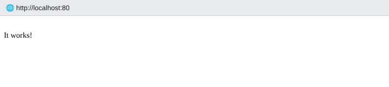
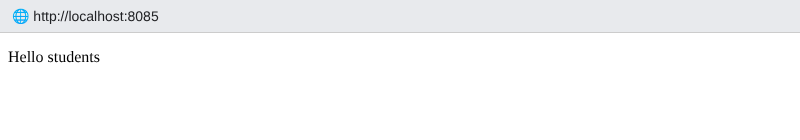
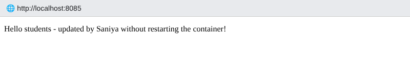

# Session 8 – Docker Networking & Volumes Homework

**Name:** Saniya Sanjiv Patil · **Roll No:** 24bcs10246 · **Batch:** B

All command output below is real output from my terminal.

---

## Task 1 – Container networking (Frontend / Backend / Database)

**Design**

```
          frontend-net                 backend-net                  db-net
   ┌──────────────────────┐   ┌──────────────────────┐   ┌────────────────────┐
   │ frontend (nginx)     │   │                      │   │                    │
   │        ▲             │   │                      │   │                    │
   │        │            backend (alpine) ───────────►  database (mysql:8.0)   │
   └──────────────────────┘   └──────────────────────┘   └────────────────────┘
```
- **3 networks:** `frontend-net`, `backend-net`, `db-net`
- `frontend` → only `frontend-net`
- `backend` → **2 networks**: `frontend-net` + `backend-net`
- `database` → `backend-net` + `db-net` (db-net reserved for DB admin/replication traffic)
- So the frontend can talk to the backend, the backend can talk to the DB, but the **frontend cannot reach the database directly**.

### Create the networks
```console
saniya@saniya-devops:~/devops-homework/session-08-docker-networking-volumes$ docker network create frontend-net && docker network create backend-net && docker network create db-net
4452ef20625c1b38e8b201b64b7c0d77ddba4a211c20845cb3c55617462dc1c1
5765197ad096e0f2ae02dc115623565fc702b017f5d7606155869bb5f22e309f
be41401846d29943288e34b22cd72d91289ab93c024d4659ce3d609e69e5a8cc
```

```console
saniya@saniya-devops:~/devops-homework/session-08-docker-networking-volumes$ docker network ls --filter name=-net
NETWORK ID     NAME           DRIVER    SCOPE
5765197ad096   backend-net    bridge    local
be41401846d2   db-net         bridge    local
4452ef20625c   frontend-net   bridge    local
```

### Create the containers

```console
saniya@saniya-devops:~/devops-homework/session-08-docker-networking-volumes$ docker run -d --name database --network backend-net -e MYSQL_ROOT_PASSWORD=Saniya@123 -e MYSQL_DATABASE=appdb mysql:8.0
f4acf23eca5d5a7c0d4879bf80f50e2975d51946f35e856daa1f25564bd1bdb7
```

```console
saniya@saniya-devops:~/devops-homework/session-08-docker-networking-volumes$ docker network connect db-net database
```

```console
saniya@saniya-devops:~/devops-homework/session-08-docker-networking-volumes$ docker run -d --name backend --network frontend-net alpine:3.20 sleep infinity
00a861ba863af83fd656460ae9d2526797c44d56bc3ef564b006a0612107d9b3
```

Add the backend to its **second** network:

```console
saniya@saniya-devops:~/devops-homework/session-08-docker-networking-volumes$ docker network connect backend-net backend
```

```console
saniya@saniya-devops:~/devops-homework/session-08-docker-networking-volumes$ docker run -d --name frontend --network frontend-net nginx:1.27-alpine
986a468844997d23ba4217e2b2bec4b5868725466eedc8833c97dedd2dc4a087
```

```console
saniya@saniya-devops:~/devops-homework/session-08-docker-networking-volumes$ docker ps --format 'table {{.Names}}\t{{.Image}}\t{{.Networks}}\t{{.Status}}' --filter name=frontend --filter name=backend --filter name=database
NAMES      IMAGE               NETWORKS                   STATUS
frontend   nginx:1.27-alpine   frontend-net               Up 25 seconds
backend    alpine:3.20         backend-net,frontend-net   Up 25 seconds
database   mysql:8.0           backend-net,db-net         Up 25 seconds
```

```console
saniya@saniya-devops:~/devops-homework/session-08-docker-networking-volumes$ docker inspect backend --format '{{range $k,$v := .NetworkSettings.Networks}}{{$k}} -> {{$v.IPAddress}}{{println}}{{end}}'
backend-net -> 172.23.0.3
frontend-net -> 172.22.0.2

```

### Check connectivity

**Frontend → Backend** (same network, DNS by container name works):

```console
saniya@saniya-devops:~/devops-homework/session-08-docker-networking-volumes$ docker exec frontend ping -c 2 backend
PING backend (172.22.0.2): 56 data bytes
64 bytes from 172.22.0.2: seq=0 ttl=64 time=0.081 ms
64 bytes from 172.22.0.2: seq=1 ttl=64 time=0.086 ms

--- backend ping statistics ---
2 packets transmitted, 2 packets received, 0% packet loss
round-trip min/avg/max = 0.081/0.083/0.086 ms
```

**Backend → Frontend** over HTTP:

```console
saniya@saniya-devops:~/devops-homework/session-08-docker-networking-volumes$ docker exec backend wget -qO- http://frontend | grep -o '<title>.*</title>'
<title>Welcome to nginx!</title>
```

**Backend → Database** (backend-net) – MySQL port 3306 open:

```console
saniya@saniya-devops:~/devops-homework/session-08-docker-networking-volumes$ docker exec backend ping -c 2 database
PING database (172.23.0.2): 56 data bytes
64 bytes from 172.23.0.2: seq=0 ttl=64 time=0.096 ms
64 bytes from 172.23.0.2: seq=1 ttl=64 time=0.079 ms

--- database ping statistics ---
2 packets transmitted, 2 packets received, 0% packet loss
round-trip min/avg/max = 0.079/0.087/0.096 ms
```

```console
saniya@saniya-devops:~/devops-homework/session-08-docker-networking-volumes$ docker exec backend nc -zv database 3306
database (172.23.0.2:3306) open
```

```console
saniya@saniya-devops:~/devops-homework/session-08-docker-networking-volumes$ docker exec database mysql -uroot -pSaniya@123 -e 'SHOW DATABASES;' 2>/dev/null
Database
appdb
information_schema
mysql
performance_schema
sys
```

**Frontend → Database** – ❌ not on a shared network, so the name doesn't even resolve:

```console
saniya@saniya-devops:~/devops-homework/session-08-docker-networking-volumes$ docker exec frontend ping -c 2 -W 2 database
ping: bad address 'database'
```

```console
saniya@saniya-devops:~/devops-homework/session-08-docker-networking-volumes$ docker network inspect backend-net --format '{{range .Containers}}{{.Name}} {{.IPv4Address}}{{println}}{{end}}'
backend 172.23.0.3/16
database 172.23.0.2/16

```

**Observation:** Containers on the same user-defined bridge network can resolve each other by name (Docker's embedded DNS) and communicate. Containers on different networks are isolated. A container attached to two networks (backend) acts as the bridge between tiers – this is how we keep the database private.

---

## Task 2 – Host network (Apache2)
```console
saniya@saniya-devops:~/devops-homework/session-08-docker-networking-volumes$ docker pull httpd:2.4
docker.io/library/httpd:2.4
```

```console
saniya@saniya-devops:~/devops-homework/session-08-docker-networking-volumes$ docker run -d --name apache-host --network host httpd:2.4
90b3de3febaa6405a1f56b018d11f4e589a31bfcce8673ed641d5d17e44db8ce
```

```console
saniya@saniya-devops:~/devops-homework/session-08-docker-networking-volumes$ docker ps --filter name=apache-host --format 'table {{.Names}}\t{{.Image}}\t{{.Networks}}\t{{.Ports}}'
NAMES         IMAGE       NETWORKS   PORTS
apache-host   httpd:2.4   host       
```

```console
saniya@saniya-devops:~/devops-homework/session-08-docker-networking-volumes$ curl -i http://localhost:80
HTTP/1.1 200 OK
Date: Wed, 07 Oct 2026 12:50:55 GMT
Server: Apache/2.4.69 (Unix)
Last-Modified: Fri, 07 Nov 2025 08:23:08 GMT
ETag: "bf-642fce432f300"
Accept-Ranges: bytes
Content-Length: 191
Content-Type: text/html

<!DOCTYPE HTML PUBLIC "-//W3C//DTD HTML 4.01//EN" "http://www.w3.org/TR/html4/strict.dtd">
<html>
<head>
<title>It works! Apache httpd</title>
</head>
<body>
<p>It works!</p>
</body>
</html>
```



**Observation:** with `--network host` there is **no `-p` port mapping** and the `PORTS` column is empty – the container shares the host's network stack, so Apache is directly reachable on host port **80**. Pros: no NAT overhead. Cons: no isolation, port conflicts with the host.

---

## Task 3 – Bind mount
```console
saniya@saniya-devops:~/devops-homework/session-08-docker-networking-volumes$ mkdir -p bind-mount-site && echo 'Hello students' > bind-mount-site/index.html && cat bind-mount-site/index.html
Hello students
```

```console
saniya@saniya-devops:~/devops-homework/session-08-docker-networking-volumes$ docker run -d --name nginx-bind -p 8085:80 -v $(pwd)/bind-mount-site:/usr/share/nginx/html nginx:1.27-alpine
63b1e20d4500b9703894ffb3ff955b74444c62aecd688f2612bfe6f804405da6
```

```console
saniya@saniya-devops:~/devops-homework/session-08-docker-networking-volumes$ curl http://localhost:8085
Hello students
```



Now modify the file **on the host** (container is NOT restarted):

```console
saniya@saniya-devops:~/devops-homework/session-08-docker-networking-volumes$ echo 'Hello students - updated by Saniya without restarting the container!' > bind-mount-site/index.html
```

```console
saniya@saniya-devops:~/devops-homework/session-08-docker-networking-volumes$ curl http://localhost:8085
Hello students - updated by Saniya without restarting the container!
```



```console
saniya@saniya-devops:~/devops-homework/session-08-docker-networking-volumes$ docker ps --filter name=nginx-bind --format 'table {{.Names}}\t{{.Status}}\t{{.Ports}}'
NAMES        STATUS         PORTS
nginx-bind   Up 5 seconds   0.0.0.0:8085->80/tcp
```

```console
saniya@saniya-devops:~/devops-homework/session-08-docker-networking-volumes$ docker inspect nginx-bind --format '{{range .Mounts}}{{.Type}}: {{.Source}} -> {{.Destination}}{{end}}'
bind: ~/devops-homework/session-08-docker-networking-volumes/bind-mount-site -> /usr/share/nginx/html
```

✅ The change is reflected immediately – the container's "Up" time shows it was never restarted. A bind mount maps a host directory straight into the container, so both see the same files.

---

## Task 4 – Overlay networks (research + small demo)

**What:** an overlay network is a Docker network driver (`-d overlay`) that creates a **single virtual L2 network spanning multiple Docker hosts**. Containers on different machines get IPs from the same subnet and talk as if they were on one switch.

**How it works across hosts:**
- Requires **Docker Swarm** (or an external key-value store in old versions). The swarm managers store the network state (Raft).
- Traffic between hosts is encapsulated with **VXLAN** (UDP port **4789**); the container's L2 frame is wrapped inside a UDP packet sent over the hosts' physical network, and unwrapped on the destination host.
- Control plane: TCP **2377** (cluster management), TCP/UDP **7946** (node gossip / discovery).
- Built-in service discovery (DNS) + VIP load balancing via the **ingress** overlay network (routing mesh).
- Optional encryption: `--opt encrypted` (IPsec between nodes).

**Use cases:** Swarm services spread across many nodes (web on node1, DB on node2), multi-host microservices, the routing mesh for published service ports. (Kubernetes uses CNI plugins like Flannel/Calico VXLAN that follow the same idea.)

| Driver | Scope | Use |
|---|---|---|
| bridge | single host | default, isolated containers on one host |
| host | single host | share host network stack |
| none | single host | no networking |
| **overlay** | **multi-host** | Swarm services across nodes |
| macvlan | single host | container gets its own MAC on the physical LAN |

**Small demo** (single-node swarm):
```console
saniya@saniya-devops:~/devops-homework/session-08-docker-networking-volumes$ docker swarm init
Swarm initialized: current node (toctoftr7fg6l1meftvosjk66) is now a manager.

```

```console
saniya@saniya-devops:~/devops-homework/session-08-docker-networking-volumes$ docker network create -d overlay --attachable saniya-overlay
jctjayk7l2z6hwhlavu37499h
```

```console
saniya@saniya-devops:~/devops-homework/session-08-docker-networking-volumes$ docker network ls --filter driver=overlay
NETWORK ID     NAME             DRIVER    SCOPE
suszvhvroq7q   ingress          overlay   swarm
jctjayk7l2z6   saniya-overlay   overlay   swarm
```

```console
saniya@saniya-devops:~/devops-homework/session-08-docker-networking-volumes$ docker network inspect saniya-overlay --format 'Driver={{.Driver}} Scope={{.Scope}} Subnet={{range .IPAM.Config}}{{.Subnet}}{{end}} VXLAN-ID={{index .Options "com.docker.network.driver.overlay.vxlanid_list"}}'
Driver=overlay Scope=swarm Subnet=10.0.1.0/24 VXLAN-ID=4097
```

```console
saniya@saniya-devops:~/devops-homework/session-08-docker-networking-volumes$ docker network rm saniya-overlay && docker swarm leave --force
saniya-overlay
Node left the swarm.
```

