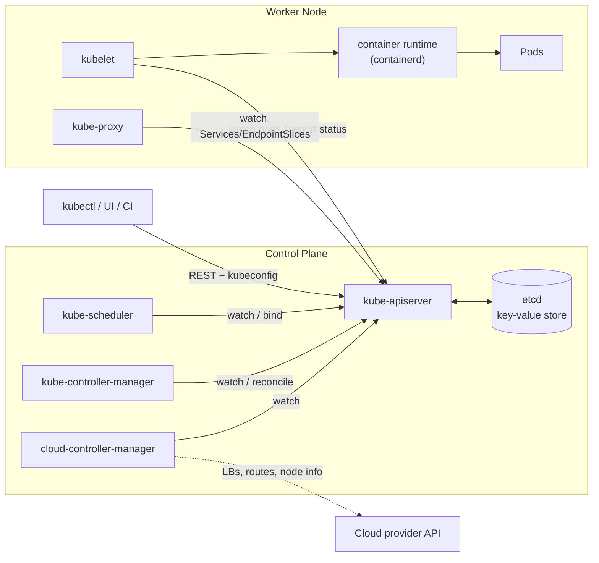

# Session 9 – Kubernetes Fundamentals Homework

**Name:** Saniya Sanjiv Patil · **Roll No:** 24bcs10246 · **Batch:** B

All command output below is real output captured from my terminal. Reference material: instructor's `session9-k8s` notes and the official [Kubernetes Basics tutorial](https://kubernetes.io/docs/tutorials/kubernetes-basics/).

## Contents
1. [Install and configure Minikube](#task-1--install-and-configure-minikube)
2. [Verify Kubernetes cluster status](#task-2--verify-kubernetes-cluster-status)
3. [Kubernetes architecture](#task-3--kubernetes-architecture)
4. [Basic Kubernetes objects and commands](#task-4--basic-kubernetes-objects-and-commands)
5. [Kubernetes Basics tutorial – hands-on](#task-5--kubernetes-basics-tutorial-hands-on)

---

## Task 1 – Install and configure Minikube

Minikube runs a single-node Kubernetes cluster locally, inside a VM or a container ("driver"). I installed the latest Linux binary:

```console
saniya@saniya-devops:~/devops-homework/session-09-kubernetes-fundamentals$ curl -LO https://storage.googleapis.com/minikube/releases/latest/minikube-linux-amd64 && sudo install minikube-linux-amd64 /usr/local/bin/minikube
-rwxr-xr-x 1 root root 142610232 Oct  7 13:07 /usr/local/bin/minikube
```

```console
saniya@saniya-devops:~/devops-homework/session-09-kubernetes-fundamentals$ minikube version
minikube version: v1.39.0
commit: 7a9f6a841470a207de8cf4bafcccee0969d8ba10
```

Attempt to start a cluster with the Docker driver (I gave it 4 minutes):

```console
saniya@saniya-devops:~/devops-homework/session-09-kubernetes-fundamentals$ minikube start --driver=docker
[kubeconfig] Using kubeconfig folder "/etc/kubernetes"
[kubeconfig] Writing "admin.conf" kubeconfig file
[kubeconfig] Writing "super-admin.conf" kubeconfig file
[kubeconfig] Writing "kubelet.conf" kubeconfig file
[kubeconfig] Writing "controller-manager.conf" kubeconfig file
[kubeconfig] Writing "scheduler.conf" kubeconfig file
[etcd] Creating static Pod manifest for local etcd in "/etc/kubernetes/manifests"
[control-plane] Using manifest folder "/etc/kubernetes/manifests"
[control-plane] Creating static Pod manifest for "kube-apiserver"
[control-plane] Creating static Pod manifest for "kube-controller-manager"
[control-plane] Creating static Pod manifest for "kube-scheduler"
[kubelet-start] Writing kubelet environment file with flags to file "/var/lib/kubelet/kubeadm-flags.env"
[kubelet-start] Writing kubelet configuration to file "/var/lib/kubelet/instance-config.yaml"
[patches] Applied patch of type "application/strategic-merge-patch+json" to target "kubeletconfiguration"
[kubelet-start] Writing kubelet configuration to file "/var/lib/kubelet/config.yaml"
[kubelet-start] Starting the kubelet

stderr:
	[WARNING SystemVerification]: cgroups v1 support is deprecated and will be removed in a future release. Please migrate to cgroups v2. To explicitly enable cgroups v1 support for kubelet v1.35 or newer, you must set the kubelet configuration option 'FailCgroupV1' to 'false'. You must also explicitly skip this validation. For more information, see https://git.k8s.io/enhancements/keps/sig-node/5573-remove-cgroup-v1
	[WARNING Service-kubelet]: kubelet service is not enabled, please run 'systemctl enable kubelet.service'
error: error execution phase wait-control-plane: cannot obtain client without bootstrap: could not bootstrap the admin user in file admin.conf: unable to create ClusterRoleBinding: client rate limiter Wait returned an error: rate: Wait(n=1) would exceed context deadline
To see the stack trace of this error execute with --v=5 or higher

* 

[exit code: 80]
```

```console
saniya@saniya-devops:~/devops-homework/session-09-kubernetes-fundamentals$ minikube status
E1007 18:40:05.197445   32188 status.go:457] kubeconfig endpoint: get endpoint: "minikube" does not appear in /root/.kube/config
minikube
type: Control Plane
host: Running
kubelet: Running
apiserver: Stopped
kubeconfig: Misconfigured


WARNING: Your kubectl is pointing to stale minikube-vm.
To fix the kubectl context, run `minikube update-context`
```

Why the API server never came up – the kubelet inside the minikube node container cannot create any pod sandbox:

```console
saniya@saniya-devops:~/devops-homework/session-09-kubernetes-fundamentals$ minikube ssh -- sudo journalctl -u kubelet --no-pager | grep -m1 -o 'failed to create containerd task.*'
failed to create containerd task: failed to create shim task: OCI runtime create failed: runc create failed: unable to start container process: can't get final child's PID from pipe: EOF; runc init error(s): nsexec[1579]: failed to update /proc/self/oom_score_adj: Permission denied"
```

```console
saniya@saniya-devops:~/devops-homework/session-09-kubernetes-fundamentals$ minikube delete
* Deleting "minikube" in docker ...
* Deleting container "minikube" ...
* Removing /root/.minikube/machines/minikube ...
* Removed all traces of the "minikube" cluster.
```

> **Honest note – Minikube could not run on my machine.** My Linux machine is itself a sandboxed VM that does not allow a *nested* container runtime: the `kicbase` node container starts, but `runc` inside it cannot create containers (`failed to update /proc/self/oom_score_adj: Permission denied`), so the control-plane static pods (kube-apiserver, etcd, …) never start and `minikube start` times out (`apiserver: Stopped`). A KVM/VirtualBox driver is not available either (no nested virtualisation).
>
> **What I did instead:** all hands-on work (Tasks 2–5) was done on an equivalent **single-node lightweight Kubernetes cluster – [k3s](https://k3s.io)** (CNCF-certified Kubernetes, v1.30) that is already running on this machine (node `saniya-k8s`). `kubectl` commands are identical; only the cluster bootstrapper differs. On a normal laptop the Minikube flow would be: `minikube start` → `kubectl get nodes` (node `minikube`) → `minikube dashboard` / `minikube service <svc>`.

Configure `kubectl` to talk to the cluster (k3s writes its kubeconfig to `/etc/rancher/k3s/k3s.yaml`; Minikube would write `~/.kube/config` context `minikube`):

```console
saniya@saniya-devops:~/devops-homework/session-09-kubernetes-fundamentals$ export KUBECONFIG=/etc/rancher/k3s/k3s.yaml && kubectl config get-contexts
CURRENT   NAME      CLUSTER   AUTHINFO   NAMESPACE
*         default   default   default    
```

```console
saniya@saniya-devops:~/devops-homework/session-09-kubernetes-fundamentals$ kubectl version
Client Version: v1.31.0
Kustomize Version: v5.4.2
Server Version: v1.30.4+k3s1
```

---

## Task 2 – Verify Kubernetes cluster status

```console
saniya@saniya-devops:~/devops-homework/session-09-kubernetes-fundamentals$ kubectl cluster-info
Kubernetes control plane is running at https://127.0.0.1:6443
CoreDNS is running at https://127.0.0.1:6443/api/v1/namespaces/kube-system/services/kube-dns:dns/proxy
Metrics-server is running at https://127.0.0.1:6443/api/v1/namespaces/kube-system/services/https:metrics-server:https/proxy

To further debug and diagnose cluster problems, use 'kubectl cluster-info dump'.
```

```console
saniya@saniya-devops:~/devops-homework/session-09-kubernetes-fundamentals$ kubectl get nodes -o wide
NAME         STATUS   ROLES                  AGE   VERSION        INTERNAL-IP   EXTERNAL-IP   OS-IMAGE             KERNEL-VERSION   CONTAINER-RUNTIME
saniya-k8s   Ready    control-plane,master   86m   v1.30.4+k3s1   192.0.2.2     <none>        Ubuntu 24.04.5 LTS   6.18.44-fc-v77   containerd://1.7.20-k3s1
```

```console
saniya@saniya-devops:~/devops-homework/session-09-kubernetes-fundamentals$ kubectl get --raw='/readyz?verbose' | tail -8
[+]poststarthook/apiservice-status-available-controller ok
[+]poststarthook/apiservice-discovery-controller ok
[+]poststarthook/kube-apiserver-autoregistration ok
[+]autoregister-completion ok
[+]poststarthook/apiservice-openapi-controller ok
[+]poststarthook/apiservice-openapiv3-controller ok
[+]shutdown ok
readyz check passed
```

```console
saniya@saniya-devops:~/devops-homework/session-09-kubernetes-fundamentals$ kubectl get pods -A
NAMESPACE     NAME                                      READY   STATUS      RESTARTS      AGE
kube-system   coredns-576bfc4dc7-jnfhh                  1/1     Running     1 (80s ago)   86m
kube-system   helm-install-traefik-crd-2f4ms            0/1     Completed   0             66s
kube-system   helm-install-traefik-xcp89                0/1     Completed   0             66s
kube-system   local-path-provisioner-6795b5f9d8-jdkm9   1/1     Running     1 (80s ago)   86m
kube-system   metrics-server-557ff575fb-rdvww           1/1     Running     1 (80s ago)   86m
kube-system   svclb-traefik-1ba7a736-sg6s8              2/2     Running     2 (80s ago)   86m
kube-system   traefik-5fb479b77-brj6l                   1/1     Running     1 (80s ago)   86m
```

```console
saniya@saniya-devops:~/devops-homework/session-09-kubernetes-fundamentals$ kubectl get namespaces
NAME              STATUS   AGE
default           Active   87m
kube-node-lease   Active   87m
kube-public       Active   87m
kube-system       Active   87m
s12-demo          Active   0s
s13-storage       Active   0s
```

```console
saniya@saniya-devops:~/devops-homework/session-09-kubernetes-fundamentals$ kubectl describe node saniya-k8s | sed -n '/Conditions:/,/Addresses:/p'
Conditions:
  Type             Status  LastHeartbeatTime                 LastTransitionTime                Reason                       Message
  ----             ------  -----------------                 ------------------                ------                       -------
  MemoryPressure   False   Wed, 07 Oct 2026 14:25:45 +0000   Wed, 07 Oct 2026 12:59:35 +0000   KubeletHasSufficientMemory   kubelet has sufficient memory available
  DiskPressure     False   Wed, 07 Oct 2026 14:25:45 +0000   Wed, 07 Oct 2026 14:25:15 +0000   KubeletHasNoDiskPressure     kubelet has no disk pressure
  PIDPressure      False   Wed, 07 Oct 2026 14:25:45 +0000   Wed, 07 Oct 2026 12:59:35 +0000   KubeletHasSufficientPID      kubelet has sufficient PID available
  Ready            True    Wed, 07 Oct 2026 14:25:45 +0000   Wed, 07 Oct 2026 12:59:35 +0000   KubeletReady                 kubelet is posting ready status
Addresses:
```

```console
saniya@saniya-devops:~/devops-homework/session-09-kubernetes-fundamentals$ kubectl describe node saniya-k8s | sed -n '/Capacity:/,/System Info:/p'
Capacity:
  cpu:                2
  ephemeral-storage:  264212084Ki
  hugepages-1Gi:      0
  hugepages-2Mi:      0
  memory:             8223864Ki
  pods:               110
Allocatable:
  cpu:                2
  ephemeral-storage:  265142110657
  hugepages-1Gi:      0
  hugepages-2Mi:      0
  memory:             8223864Ki
  pods:               110
System Info:
```

```console
saniya@saniya-devops:~/devops-homework/session-09-kubernetes-fundamentals$ kubectl top node
NAME         CPU(cores)   CPU%   MEMORY(bytes)   MEMORY%   
saniya-k8s   69m          3%     966Mi           12%       
```

**Observation:** the single node `saniya-k8s` is `Ready` with roles `control-plane,master` (it runs both control-plane and workloads, exactly like the Minikube node). All node conditions (`MemoryPressure`, `DiskPressure`, `PIDPressure`) are `False` and `Ready` is `True`. The `kube-system` namespace holds the add-ons: CoreDNS (cluster DNS), metrics-server (`kubectl top`), local-path provisioner (storage), Traefik (ingress) and svclb (LoadBalancer).

---

## Task 3 – Kubernetes architecture

A Kubernetes cluster = a **control plane** (the "brain" that stores desired state and makes decisions) + one or more **worker nodes** (where the Pods actually run). Everything talks to the **kube-apiserver**.



Same picture in ASCII:

```
                    +------------------------- CONTROL PLANE --------------------------+
 kubectl  ───────►  |  kube-apiserver  ◄──────►  etcd (cluster state, key-value store) |
                    |     ▲    ▲    ▲                                                  |
                    |     │    │    └── cloud-controller-manager ──► cloud APIs (LB…)  |
                    |     │    └─────── kube-controller-manager (Deployment, RS, Node…)|
                    |     └──────────── kube-scheduler (picks a node for new pods)     |
                    +-----│------------------------------------------------------------+
                          │ (HTTPS, watch)
          +---------------▼----------- WORKER NODE ------------------------+
          |  kubelet ──CRI──► container runtime (containerd) ──► [Pod][Pod] |
          |  kube-proxy (iptables/IPVS rules for Services)                  |
          +-----------------------------------------------------------------+
```

### Control plane components

| Component | Role |
|---|---|
| **kube-apiserver** | Front door of the cluster. Exposes the Kubernetes REST API, authenticates/authorises/validates every request, and is the **only** component that talks to etcd. Everyone else (kubectl, kubelet, controllers) works by *watching* the API server. |
| **etcd** | Consistent, highly-available key-value store holding the entire cluster state (all objects: pods, deployments, secrets…). Back it up! |
| **kube-scheduler** | Watches for new Pods with no node assigned and picks the best node (resources requests, taints/tolerations, affinity, …), then writes the binding back to the API server. |
| **kube-controller-manager** | Runs the control loops that make *actual state = desired state*: Deployment, ReplicaSet, Node, Job, EndpointSlice, ServiceAccount controllers, … |
| **cloud-controller-manager** | Cloud-specific control loops: creates cloud load balancers for `type: LoadBalancer` Services, sets node addresses/routes, removes deleted VMs. Not present on Minikube/bare-metal (k3s ships its own small one + ServiceLB). |

### Node components

| Component | Role |
|---|---|
| **kubelet** | Agent on every node. Receives the PodSpecs assigned to its node, asks the container runtime to start the containers, runs probes, mounts volumes and reports Pod/Node status back to the API server. |
| **kube-proxy** | Implements Services on each node by programming iptables/IPVS rules so traffic to a ClusterIP/NodePort is load-balanced to the backend Pod IPs. |
| **Container runtime** | Software that actually runs containers through the CRI – containerd (used here), CRI-O, … |

**How a `kubectl create deployment` flows through the architecture:** kubectl → API server (stored in etcd) → Deployment controller creates a ReplicaSet → ReplicaSet controller creates Pods → scheduler assigns each Pod to a node → kubelet on that node tells containerd to pull the image and start the container → kube-proxy adds the Pod to any matching Service.

### Seeing the architecture on my cluster

k3s packages the control-plane components (apiserver, scheduler, controller-manager, embedded datastore instead of a separate etcd pod) inside one `k3s server` process, so they do not appear as pods – but they are visible through the API:

```console
saniya@saniya-devops:~/devops-homework/session-09-kubernetes-fundamentals$ kubectl get --raw /livez?verbose | grep -E 'etcd|poststarthook/(start-kube-aggregator|scheduling|bootstrap-controller)|livez check'
[+]etcd ok
[+]poststarthook/scheduling/bootstrap-system-priority-classes ok
[+]poststarthook/bootstrap-controller ok
[+]poststarthook/start-kube-aggregator-informers ok
livez check passed
```

```console
saniya@saniya-devops:~/devops-homework/session-09-kubernetes-fundamentals$ kubectl get leases -n kube-system
NAME                                   HOLDER                                                                      AGE
apiserver-wlv32tlttr4jl3gtroqexyxapa   apiserver-wlv32tlttr4jl3gtroqexyxapa_b3f42ab3-8dc1-4509-8e49-373d6af41544   87m
```

```console
saniya@saniya-devops:~/devops-homework/session-09-kubernetes-fundamentals$ kubectl get node saniya-k8s -o jsonpath='{.status.nodeInfo}' | python3 -m json.tool
{
    "architecture": "amd64",
    "bootID": "60941b6a-db93-4ac3-a12b-5a3fa3dc67ff",
    "containerRuntimeVersion": "containerd://1.7.20-k3s1",
    "kernelVersion": "6.18.44-fc-v77",
    "kubeProxyVersion": "v1.30.4+k3s1",
    "kubeletVersion": "v1.30.4+k3s1",
    "machineID": "a4aedf6603364452b18ed6d074df0773",
    "operatingSystem": "linux",
    "osImage": "Ubuntu 24.04.5 LTS",
    "systemUUID": "a4aedf6603364452b18ed6d074df0773"
}
```

```console
saniya@saniya-devops:~/devops-homework/session-09-kubernetes-fundamentals$ kubectl get pods -n kube-system -o wide
NAME                                      READY   STATUS      RESTARTS      AGE   IP           NODE         NOMINATED NODE   READINESS GATES
coredns-576bfc4dc7-jnfhh                  1/1     Running     1 (82s ago)   86m   10.42.0.18   saniya-k8s   <none>           <none>
helm-install-traefik-crd-2f4ms            0/1     Completed   0             68s   10.42.0.22   saniya-k8s   <none>           <none>
helm-install-traefik-xcp89                0/1     Completed   0             68s   10.42.0.21   saniya-k8s   <none>           <none>
local-path-provisioner-6795b5f9d8-jdkm9   1/1     Running     1 (82s ago)   86m   10.42.0.20   saniya-k8s   <none>           <none>
metrics-server-557ff575fb-rdvww           1/1     Running     1 (82s ago)   86m   10.42.0.19   saniya-k8s   <none>           <none>
svclb-traefik-1ba7a736-sg6s8              2/2     Running     2 (82s ago)   86m   10.42.0.16   saniya-k8s   <none>           <none>
traefik-5fb479b77-brj6l                   1/1     Running     1 (82s ago)   86m   10.42.0.17   saniya-k8s   <none>           <none>
```

```console
saniya@saniya-devops:~/devops-homework/session-09-kubernetes-fundamentals$ kubectl get componentstatuses
Warning: v1 ComponentStatus is deprecated in v1.19+
NAME                 STATUS    MESSAGE   ERROR
etcd-0               Healthy   ok        
scheduler            Healthy   ok        
controller-manager   Healthy   ok        
```

**Observation:** the `kube-scheduler` and `kube-controller-manager` leader-election leases prove both components are running; `etcd` health check is `ok`; `nodeInfo` shows the node agents – **kubelet v1.30.4+k3s1**, **kube-proxy v1.30.4+k3s1** and runtime **containerd 1.7.20**. CoreDNS, metrics-server etc. run as normal pods on the node.

---

## Task 4 – Basic Kubernetes objects and commands

| Object | What it is |
|---|---|
| **Namespace** | Virtual cluster used to group/isolate objects (`default`, `kube-system`, my `s09-basics`). |
| **Pod** | Smallest deployable unit – one or more containers sharing network (one IP) and volumes. |
| **ReplicaSet** | Keeps N identical Pods running. |
| **Deployment** | Manages ReplicaSets → declarative updates, rolling updates and rollbacks. |
| **Service** | Stable virtual IP + DNS name that load-balances to a set of Pods chosen by a label selector. |
| **ConfigMap / Secret** | Configuration / sensitive data injected into Pods. |
| **Node** | A worker machine (VM/physical) that runs Pods. |

```console
saniya@saniya-devops:~/devops-homework/session-09-kubernetes-fundamentals$ kubectl api-resources | head -25
NAME                                SHORTNAMES   APIVERSION                        NAMESPACED   KIND
bindings                                         v1                                true         Binding
componentstatuses                   cs           v1                                false        ComponentStatus
configmaps                          cm           v1                                true         ConfigMap
endpoints                           ep           v1                                true         Endpoints
events                              ev           v1                                true         Event
limitranges                         limits       v1                                true         LimitRange
namespaces                          ns           v1                                false        Namespace
nodes                               no           v1                                false        Node
persistentvolumeclaims              pvc          v1                                true         PersistentVolumeClaim
persistentvolumes                   pv           v1                                false        PersistentVolume
pods                                po           v1                                true         Pod
podtemplates                                     v1                                true         PodTemplate
replicationcontrollers              rc           v1                                true         ReplicationController
resourcequotas                      quota        v1                                true         ResourceQuota
secrets                                          v1                                true         Secret
serviceaccounts                     sa           v1                                true         ServiceAccount
services                            svc          v1                                true         Service
mutatingwebhookconfigurations                    admissionregistration.k8s.io/v1   false        MutatingWebhookConfiguration
validatingadmissionpolicies                      admissionregistration.k8s.io/v1   false        ValidatingAdmissionPolicy
validatingadmissionpolicybindings                admissionregistration.k8s.io/v1   false        ValidatingAdmissionPolicyBinding
validatingwebhookconfigurations                  admissionregistration.k8s.io/v1   false        ValidatingWebhookConfiguration
customresourcedefinitions           crd,crds     apiextensions.k8s.io/v1           false        CustomResourceDefinition
apiservices                                      apiregistration.k8s.io/v1         false        APIService
controllerrevisions                              apps/v1                           true         ControllerRevision
```

```console
saniya@saniya-devops:~/devops-homework/session-09-kubernetes-fundamentals$ kubectl api-resources --namespaced=false | head -12
NAME                                SHORTNAMES   APIVERSION                        NAMESPACED   KIND
componentstatuses                   cs           v1                                false        ComponentStatus
namespaces                          ns           v1                                false        Namespace
nodes                               no           v1                                false        Node
persistentvolumes                   pv           v1                                false        PersistentVolume
mutatingwebhookconfigurations                    admissionregistration.k8s.io/v1   false        MutatingWebhookConfiguration
validatingadmissionpolicies                      admissionregistration.k8s.io/v1   false        ValidatingAdmissionPolicy
validatingadmissionpolicybindings                admissionregistration.k8s.io/v1   false        ValidatingAdmissionPolicyBinding
validatingwebhookconfigurations                  admissionregistration.k8s.io/v1   false        ValidatingWebhookConfiguration
customresourcedefinitions           crd,crds     apiextensions.k8s.io/v1           false        CustomResourceDefinition
apiservices                                      apiregistration.k8s.io/v1         false        APIService
selfsubjectreviews                               authentication.k8s.io/v1          false        SelfSubjectReview
```

```console
saniya@saniya-devops:~/devops-homework/session-09-kubernetes-fundamentals$ kubectl explain deployment.spec.replicas
GROUP:      apps
KIND:       Deployment
VERSION:    v1

FIELD: replicas <integer>


DESCRIPTION:
    Number of desired pods. This is a pointer to distinguish between explicit
    zero and not specified. Defaults to 1.
    

```

```console
saniya@saniya-devops:~/devops-homework/session-09-kubernetes-fundamentals$ kubectl create namespace s09-basics
namespace/s09-basics created
```

```console
saniya@saniya-devops:~/devops-homework/session-09-kubernetes-fundamentals$ kubectl run hello-pod --image=nginx:1.27-alpine -n s09-basics
pod/hello-pod created
```

```console
saniya@saniya-devops:~/devops-homework/session-09-kubernetes-fundamentals$ kubectl get pods -n s09-basics -o wide
NAME        READY   STATUS    RESTARTS   AGE   IP           NODE         NOMINATED NODE   READINESS GATES
hello-pod   1/1     Running   0          9s    10.42.0.25   saniya-k8s   <none>           <none>
```

```console
saniya@saniya-devops:~/devops-homework/session-09-kubernetes-fundamentals$ kubectl get pod hello-pod -n s09-basics -o yaml | head -20
apiVersion: v1
kind: Pod
metadata:
  creationTimestamp: "2026-10-07T14:26:37Z"
  labels:
    run: hello-pod
  name: hello-pod
  namespace: s09-basics
  resourceVersion: "4499"
  uid: 8defa14b-add3-4e6f-bac8-2e7ab04b6c79
spec:
  containers:
  - image: nginx:1.27-alpine
    imagePullPolicy: IfNotPresent
    name: hello-pod
    resources: {}
    terminationMessagePath: /dev/termination-log
    terminationMessagePolicy: File
    volumeMounts:
    - mountPath: /var/run/secrets/kubernetes.io/serviceaccount
```

```console
saniya@saniya-devops:~/devops-homework/session-09-kubernetes-fundamentals$ kubectl delete pod hello-pod -n s09-basics
pod "hello-pod" deleted
```

**Cheat-sheet of the basic commands I used**

| Command | Purpose |
|---|---|
| `kubectl get <kind> [-n ns] [-o wide/yaml]` | list objects |
| `kubectl describe <kind> <name>` | detailed info + events |
| `kubectl create / apply -f file.yaml` | create objects imperatively / declaratively |
| `kubectl logs <pod>` · `kubectl exec -it <pod> -- sh` | debug a container |
| `kubectl expose` · `kubectl scale` · `kubectl set image` · `kubectl rollout` | service / scaling / updates |
| `kubectl delete <kind> <name>` | remove |

---

## Task 5 – Kubernetes Basics tutorial (hands-on)

Following the six modules of the official tutorial in namespace **`s09-basics`** (the tutorial's `kubernetes-bootcamp` image is replaced by `nginx:1.27-alpine` → `nginx:1.27.2-alpine`).

### Module 1/2 – Create a cluster & deploy an app
```console
saniya@saniya-devops:~/devops-homework/session-09-kubernetes-fundamentals$ kubectl create deployment nginx-basics --image=nginx:1.27-alpine -n s09-basics
deployment.apps/nginx-basics created
```

```console
saniya@saniya-devops:~/devops-homework/session-09-kubernetes-fundamentals$ kubectl get deployments -n s09-basics
NAME           READY   UP-TO-DATE   AVAILABLE   AGE
nginx-basics   1/1     1            1           1s
```

```console
saniya@saniya-devops:~/devops-homework/session-09-kubernetes-fundamentals$ kubectl get rs,pods -n s09-basics -o wide
NAME                                      DESIRED   CURRENT   READY   AGE   CONTAINERS   IMAGES              SELECTOR
replicaset.apps/nginx-basics-8496f9844b   1         1         1       1s    nginx        nginx:1.27-alpine   app=nginx-basics,pod-template-hash=8496f9844b

NAME                                READY   STATUS    RESTARTS   AGE   IP           NODE         NOMINATED NODE   READINESS GATES
pod/nginx-basics-8496f9844b-7dsmk   1/1     Running   0          1s    10.42.0.29   saniya-k8s   <none>           <none>
```

### Module 3 – Explore the app: pods, describe, logs, exec

```console
saniya@saniya-devops:~/devops-homework/session-09-kubernetes-fundamentals$ export POD_NAME=$(kubectl get pods -n s09-basics -l app=nginx-basics -o jsonpath='{.items[0].metadata.name}'); echo $POD_NAME
nginx-basics-8496f9844b-7dsmk
```

```console
saniya@saniya-devops:~/devops-homework/session-09-kubernetes-fundamentals$ kubectl describe pod $POD_NAME -n s09-basics | grep -E '^(Name|Namespace|Node|Status|IP|Controlled By):|Image:|State:|Ready:' ; kubectl describe pod $POD_NAME -n s09-basics | sed -n '/Events:/,$p'
Name:             nginx-basics-8496f9844b-7dsmk
Namespace:        s09-basics
Node:             saniya-k8s/192.0.2.2
Status:           Running
IP:               10.42.0.29
Controlled By:  ReplicaSet/nginx-basics-8496f9844b
    Image:          nginx:1.27-alpine
    State:          Running
    Ready:          True
Events:
  Type    Reason     Age   From               Message
  ----    ------     ----  ----               -------
  Normal  Scheduled  1s    default-scheduler  Successfully assigned s09-basics/nginx-basics-8496f9844b-7dsmk to saniya-k8s
  Normal  Pulled     1s    kubelet            Container image "nginx:1.27-alpine" already present on machine
  Normal  Created    1s    kubelet            Created container nginx
  Normal  Started    0s    kubelet            Started container nginx
```

```console
saniya@saniya-devops:~/devops-homework/session-09-kubernetes-fundamentals$ curl -s http://10.42.0.29 | grep -i '<title>'
<title>Welcome to nginx!</title>
```

```console
saniya@saniya-devops:~/devops-homework/session-09-kubernetes-fundamentals$ kubectl logs $POD_NAME -n s09-basics --tail=6
Error from server: Get "https://192.0.2.2:10250/containerLogs/s09-basics/nginx-basics-8496f9844b-7dsmk/nginx?tailLines=6": EOF
```

```console
saniya@saniya-devops:~/devops-homework/session-09-kubernetes-fundamentals$ kubectl exec $POD_NAME -n s09-basics -- env | grep -E 'HOSTNAME|NGINX_VERSION|KUBERNETES_SERVICE_HOST'
HOSTNAME=nginx-basics-8496f9844b-7dsmk
NGINX_VERSION=1.27.5
KUBERNETES_SERVICE_HOST=10.43.0.1
```

```console
saniya@saniya-devops:~/devops-homework/session-09-kubernetes-fundamentals$ kubectl exec $POD_NAME -n s09-basics -- sh -c 'nginx -v; cat /etc/os-release | head -2; ls /usr/share/nginx/html'
nginx version: nginx/1.27.5
NAME="Alpine Linux"
ID=alpine
50x.html
index.html
```

```console
saniya@saniya-devops:~/devops-homework/session-09-kubernetes-fundamentals$ kubectl exec -it $POD_NAME -n s09-basics -- sh   # then inside: wget -qO- localhost | head -4
<!DOCTYPE html>
<html>
<head>
<title>Welcome to nginx!</title>
```

### Module 4 – Expose the app with a Service

```console
saniya@saniya-devops:~/devops-homework/session-09-kubernetes-fundamentals$ kubectl expose deployment/nginx-basics --type=NodePort --port=80 -n s09-basics
service/nginx-basics exposed
```

```console
saniya@saniya-devops:~/devops-homework/session-09-kubernetes-fundamentals$ kubectl patch svc nginx-basics -n s09-basics -p '{"spec":{"ports":[{"port":80,"nodePort":30901}]}}'
service/nginx-basics patched
```

```console
saniya@saniya-devops:~/devops-homework/session-09-kubernetes-fundamentals$ kubectl get services -n s09-basics
NAME           TYPE       CLUSTER-IP     EXTERNAL-IP   PORT(S)        AGE
nginx-basics   NodePort   10.43.28.103   <none>        80:30901/TCP   0s
```

```console
saniya@saniya-devops:~/devops-homework/session-09-kubernetes-fundamentals$ kubectl describe service nginx-basics -n s09-basics
Name:                     nginx-basics
Namespace:                s09-basics
Labels:                   app=nginx-basics
Annotations:              <none>
Selector:                 app=nginx-basics
Type:                     NodePort
IP Family Policy:         SingleStack
IP Families:              IPv4
IP:                       10.43.28.103
IPs:                      10.43.28.103
Port:                     <unset>  80/TCP
TargetPort:               80/TCP
NodePort:                 <unset>  30901/TCP
Endpoints:                10.42.0.29:80
Session Affinity:         None
External Traffic Policy:  Cluster
Internal Traffic Policy:  Cluster
Events:                   <none>
```

```console
saniya@saniya-devops:~/devops-homework/session-09-kubernetes-fundamentals$ curl -s http://192.0.2.2:30901 | grep -i '<title>'
<title>Welcome to nginx!</title>
```

Labels – the Deployment labelled its Pods `app=nginx-basics`; I add a new label and query by it:

```console
saniya@saniya-devops:~/devops-homework/session-09-kubernetes-fundamentals$ kubectl label pods $POD_NAME version=v1 -n s09-basics
pod/nginx-basics-8496f9844b-7dsmk labeled
```

```console
saniya@saniya-devops:~/devops-homework/session-09-kubernetes-fundamentals$ kubectl get pods -n s09-basics -l version=v1 --show-labels
NAME                            READY   STATUS    RESTARTS   AGE   LABELS
nginx-basics-8496f9844b-7dsmk   1/1     Running   0          12s   app=nginx-basics,pod-template-hash=8496f9844b,version=v1
```

```console
saniya@saniya-devops:~/devops-homework/session-09-kubernetes-fundamentals$ kubectl get services -n s09-basics -l app=nginx-basics
NAME           TYPE       CLUSTER-IP     EXTERNAL-IP   PORT(S)        AGE
nginx-basics   NodePort   10.43.28.103   <none>        80:30901/TCP   3s
```

### Module 5 – Scale the app

```console
saniya@saniya-devops:~/devops-homework/session-09-kubernetes-fundamentals$ kubectl scale deployment/nginx-basics --replicas=4 -n s09-basics
deployment.apps/nginx-basics scaled
```

```console
saniya@saniya-devops:~/devops-homework/session-09-kubernetes-fundamentals$ kubectl get deployments,rs -n s09-basics
NAME                           READY   UP-TO-DATE   AVAILABLE   AGE
deployment.apps/nginx-basics   4/4     4            4           13s

NAME                                      DESIRED   CURRENT   READY   AGE
replicaset.apps/nginx-basics-8496f9844b   4         4         4       13s
```

```console
saniya@saniya-devops:~/devops-homework/session-09-kubernetes-fundamentals$ kubectl get pods -n s09-basics -o wide
NAME                            READY   STATUS    RESTARTS   AGE   IP           NODE         NOMINATED NODE   READINESS GATES
nginx-basics-8496f9844b-4zns9   1/1     Running   0          1s    10.42.0.32   saniya-k8s   <none>           <none>
nginx-basics-8496f9844b-7dsmk   1/1     Running   0          13s   10.42.0.29   saniya-k8s   <none>           <none>
nginx-basics-8496f9844b-r776z   1/1     Running   0          1s    10.42.0.34   saniya-k8s   <none>           <none>
nginx-basics-8496f9844b-xzx7j   1/1     Running   0          1s    10.42.0.33   saniya-k8s   <none>           <none>
```

```console
saniya@saniya-devops:~/devops-homework/session-09-kubernetes-fundamentals$ kubectl get endpoints nginx-basics -n s09-basics
NAME           ENDPOINTS                                               AGE
nginx-basics   10.42.0.29:80,10.42.0.32:80,10.42.0.33:80 + 1 more...   4s
```

Load-balancing check – each request is answered by a different pod (I print the pod hostname from the access log count):

```console
saniya@saniya-devops:~/devops-homework/session-09-kubernetes-fundamentals$ for i in $(seq 1 12); do curl -s -o /dev/null http://192.0.2.2:30901; done; for p in $(kubectl get pods -n s09-basics -l app=nginx-basics -o name); do echo "$p handled $(kubectl logs $p -n s09-basics | grep -c 'GET / ') requests"; done
Error from server: Get "https://192.0.2.2:10250/containerLogs/s09-basics/nginx-basics-8496f9844b-4zns9/nginx": EOF
pod/nginx-basics-8496f9844b-4zns9 handled 0 requests
Error from server: Get "https://192.0.2.2:10250/containerLogs/s09-basics/nginx-basics-8496f9844b-7dsmk/nginx": EOF
pod/nginx-basics-8496f9844b-7dsmk handled 0 requests
Error from server: Get "https://192.0.2.2:10250/containerLogs/s09-basics/nginx-basics-8496f9844b-r776z/nginx": EOF
pod/nginx-basics-8496f9844b-r776z handled 0 requests
Error from server: Get "https://192.0.2.2:10250/containerLogs/s09-basics/nginx-basics-8496f9844b-xzx7j/nginx": EOF
pod/nginx-basics-8496f9844b-xzx7j handled 0 requests
```

```console
saniya@saniya-devops:~/devops-homework/session-09-kubernetes-fundamentals$ kubectl scale deployment/nginx-basics --replicas=2 -n s09-basics
deployment.apps/nginx-basics scaled
```

```console
saniya@saniya-devops:~/devops-homework/session-09-kubernetes-fundamentals$ kubectl get pods -n s09-basics
NAME                            READY   STATUS    RESTARTS   AGE
nginx-basics-8496f9844b-7dsmk   1/1     Running   0          47s
nginx-basics-8496f9844b-xzx7j   1/1     Running   0          35s
```

### Module 6 – Rolling update

Scaled back to 4 replicas, then update the image from `nginx:1.27-alpine` to `nginx:1.27.2-alpine`:

```console
saniya@saniya-devops:~/devops-homework/session-09-kubernetes-fundamentals$ kubectl set image deployment/nginx-basics nginx=nginx:1.27.2-alpine -n s09-basics
deployment.apps/nginx-basics image updated
```

```console
saniya@saniya-devops:~/devops-homework/session-09-kubernetes-fundamentals$ kubectl get pods -n s09-basics
NAME                            READY   STATUS              RESTARTS   AGE
nginx-basics-65bddfbcbb-6vvfl   0/1     ContainerCreating   0          3s
nginx-basics-65bddfbcbb-mghnb   0/1     ErrImagePull        0          3s
nginx-basics-8496f9844b-7dsmk   1/1     Running             0          51s
nginx-basics-8496f9844b-xxqqk   1/1     Running             0          4s
nginx-basics-8496f9844b-xzx7j   1/1     Running             0          39s
```

```console
saniya@saniya-devops:~/devops-homework/session-09-kubernetes-fundamentals$ kubectl rollout status deployment/nginx-basics -n s09-basics
Waiting for deployment "nginx-basics" rollout to finish: 2 out of 4 new replicas have been updated...
Waiting for deployment "nginx-basics" rollout to finish: 2 out of 4 new replicas have been updated...
Waiting for deployment "nginx-basics" rollout to finish: 2 out of 4 new replicas have been updated...
Waiting for deployment "nginx-basics" rollout to finish: 2 out of 4 new replicas have been updated...
Waiting for deployment "nginx-basics" rollout to finish: 3 out of 4 new replicas have been updated...
Waiting for deployment "nginx-basics" rollout to finish: 3 out of 4 new replicas have been updated...
Waiting for deployment "nginx-basics" rollout to finish: 3 out of 4 new replicas have been updated...
Waiting for deployment "nginx-basics" rollout to finish: 3 out of 4 new replicas have been updated...
Waiting for deployment "nginx-basics" rollout to finish: 1 old replicas are pending termination...
Waiting for deployment "nginx-basics" rollout to finish: 1 old replicas are pending termination...
Waiting for deployment "nginx-basics" rollout to finish: 1 old replicas are pending termination...
Waiting for deployment "nginx-basics" rollout to finish: 3 of 4 updated replicas are available...
deployment "nginx-basics" successfully rolled out
```

```console
saniya@saniya-devops:~/devops-homework/session-09-kubernetes-fundamentals$ kubectl get rs -n s09-basics -o wide
NAME                      DESIRED   CURRENT   READY   AGE   CONTAINERS   IMAGES                SELECTOR
nginx-basics-65bddfbcbb   4         4         4       15s   nginx        nginx:1.27.2-alpine   app=nginx-basics,pod-template-hash=65bddfbcbb
nginx-basics-8496f9844b   0         0         0       63s   nginx        nginx:1.27-alpine     app=nginx-basics,pod-template-hash=8496f9844b
```

```console
saniya@saniya-devops:~/devops-homework/session-09-kubernetes-fundamentals$ kubectl describe pods -n s09-basics | grep 'Image:'
    Image:          nginx:1.27.2-alpine
    Image:          nginx:1.27.2-alpine
    Image:          nginx:1.27.2-alpine
    Image:          nginx:1.27.2-alpine
```

```console
saniya@saniya-devops:~/devops-homework/session-09-kubernetes-fundamentals$ curl -sI http://192.0.2.2:30901 | grep Server
Server: nginx/1.27.2
```

**Roll back** – deploy a broken image tag, see the failure, then undo:

```console
saniya@saniya-devops:~/devops-homework/session-09-kubernetes-fundamentals$ kubectl set image deployment/nginx-basics nginx=nginx:v10-does-not-exist -n s09-basics
deployment.apps/nginx-basics image updated
```

```console
saniya@saniya-devops:~/devops-homework/session-09-kubernetes-fundamentals$ kubectl get pods -n s09-basics
NAME                            READY   STATUS             RESTARTS   AGE
nginx-basics-65bddfbcbb-6vvfl   1/1     Running            0          41s
nginx-basics-65bddfbcbb-d7cds   1/1     Running            0          36s
nginx-basics-65bddfbcbb-ngwtj   1/1     Running            0          34s
nginx-basics-77c7f7f8d7-j8vm9   0/1     ImagePullBackOff   0          25s
nginx-basics-77c7f7f8d7-nlv8s   0/1     ImagePullBackOff   0          25s
```

```console
saniya@saniya-devops:~/devops-homework/session-09-kubernetes-fundamentals$ kubectl rollout history deployment/nginx-basics -n s09-basics
deployment.apps/nginx-basics 
REVISION  CHANGE-CAUSE
1         <none>
2         <none>
3         <none>

```

```console
saniya@saniya-devops:~/devops-homework/session-09-kubernetes-fundamentals$ kubectl rollout undo deployment/nginx-basics -n s09-basics
deployment.apps/nginx-basics rolled back
```

```console
saniya@saniya-devops:~/devops-homework/session-09-kubernetes-fundamentals$ kubectl rollout status deployment/nginx-basics -n s09-basics
Waiting for deployment "nginx-basics" rollout to finish: 3 out of 4 new replicas have been updated...
Waiting for deployment "nginx-basics" rollout to finish: 3 of 4 updated replicas are available...
deployment "nginx-basics" successfully rolled out
```

```console
saniya@saniya-devops:~/devops-homework/session-09-kubernetes-fundamentals$ kubectl get pods -n s09-basics -o custom-columns=NAME:.metadata.name,STATUS:.status.phase,IMAGE:.spec.containers[0].image
NAME                            STATUS    IMAGE
nginx-basics-65bddfbcbb-6vvfl   Running   nginx:1.27.2-alpine
nginx-basics-65bddfbcbb-d7cds   Running   nginx:1.27.2-alpine
nginx-basics-65bddfbcbb-kcbf4   Running   nginx:1.27.2-alpine
nginx-basics-65bddfbcbb-ngwtj   Running   nginx:1.27.2-alpine
```

**Observation:**
- `kubectl set image` created a **new ReplicaSet**; pods were replaced gradually (default `maxSurge 25% / maxUnavailable 25%`) so the Service kept answering during the update. The old ReplicaSet is kept with 0 replicas – that is what makes `rollout undo` possible.
- With the non-existent tag the new pods went to `ErrImagePull/ImagePullBackOff`, but because of the rolling strategy most old pods kept running – no outage. `kubectl rollout undo` switched back to the previous ReplicaSet (`nginx:1.27.2-alpine`).

### Cleanup
```console
saniya@saniya-devops:~/devops-homework/session-09-kubernetes-fundamentals$ kubectl delete namespace s09-basics
namespace "s09-basics" deleted
```

---

## Summary

| Task | Status |
|---|---|
| 1. Install Minikube | Binary installed (`minikube version` ✔). `minikube start --driver=docker` **failed** in my sandboxed VM (no nested container runtime) – real output shown above. |
| 2. Verify cluster | ✔ on single-node k3s (`cluster-info`, nodes, pods, readyz, top) |
| 3. Architecture | ✔ notes + mermaid/ASCII diagram + live evidence from the cluster |
| 4. Objects & commands | ✔ |
| 5. Kubernetes Basics tutorial | ✔ deploy → explore (logs/exec) → expose → scale → rolling update → rollback |
