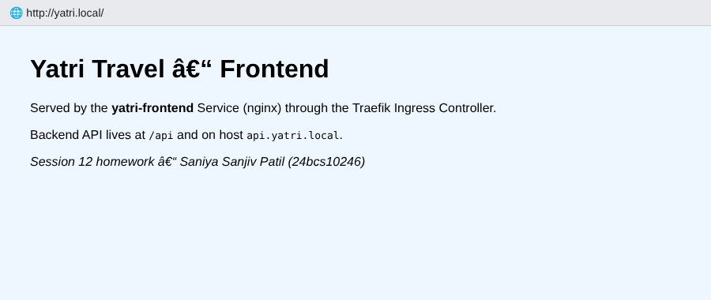
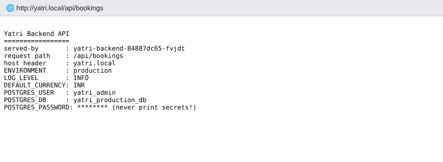
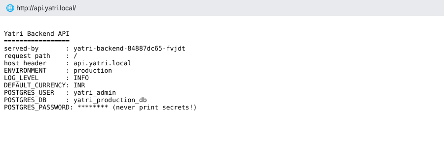

# Session 12 – Ingress, ConfigMaps & Secrets Homework

**Name:** Saniya Sanjiv Patil · **Roll No:** 24bcs10246 · **Batch:** B

All command output below is **real output** captured from my single-node **k3s** cluster (node `saniya-k8s`, Kubernetes v1.30).
k3s ships with the **Traefik** ingress controller (listening on port 80 of the node), so the Ingress uses `ingressClassName: traefik`
instead of `nginx` like the minikube reference in [`devops-heros/session-12-ingress-configmaps-secrets`](https://github.com/Nency-Ravaliya/devops-heros/tree/main/session-12-ingress-configmaps-secrets) — everything else is adapted from that reference folder.

## Folder structure

```text
session-12-ingress-configmaps-secrets/
├── README.md                     <- this file (Tasks 1-5)
├── namespace.yaml                <- namespace s12-demo
├── .gitignore                    <- keeps real secret files / .env out of Git
├── 01-configmap/
│   ├── app-config.yaml           <- ConfigMap (key/values + a config file)
│   └── configmap-pod.yaml        <- Pod using it as env vars AND as a volume
├── 02-secret/
│   ├── db-secret.yaml            <- Secret (demo credentials, base64)
│   └── secret-pod.yaml           <- Pod using it as env vars AND as a volume
├── 03-ingress/
│   ├── frontend.yaml             <- nginx Deployment + Service (page from a ConfigMap)
│   ├── backend.yaml              <- Python API Deployment + Service (reads ConfigMap + Secret)
│   └── ingress.yaml              <- Traefik Ingress: host + path based routing
├── ingress-vs-controller/
│   └── README.md                 <- Task 4: Ingress vs Ingress Controller
├── troubleshooting/
│   ├── README.md                 <- Task 5: 3 broken scenarios, debugged & fixed
│   ├── 01-secret-base64-newline/
│   ├── 02-ingress-wrong-class/
│   └── 03-configmap-missing-key/
└── screenshots/
```

## Setup

```console
saniya@saniya-devops:~/devops-homework/session-12-ingress-configmaps-secrets$ kubectl apply -f namespace.yaml
namespace/s12-demo created
```

```console
saniya@saniya-devops:~/devops-homework/session-12-ingress-configmaps-secrets$ kubectl get nodes -o wide
NAME         STATUS   ROLES                  AGE   VERSION        INTERNAL-IP   EXTERNAL-IP   OS-IMAGE             KERNEL-VERSION   CONTAINER-RUNTIME
saniya-k8s   Ready    control-plane,master   86m   v1.30.4+k3s1   192.0.2.2     <none>        Ubuntu 24.04.5 LTS   6.18.44-fc-v77   containerd://1.7.20-k3s1
```

---

## Task 1 – ConfigMap

A **ConfigMap** stores **non-sensitive** configuration (log level, port, feature flags, config files) **outside the container image**,
so the same image can run in dev / staging / prod with different settings (12-factor app). It can be consumed as
**environment variables** (`envFrom` / `configMapKeyRef`) or as **files** (volume mount).

### 1.1 The ConfigMap – [`01-configmap/app-config.yaml`](./01-configmap/app-config.yaml)

```yaml
# ConfigMap – non-sensitive application configuration
# Adapted from devops-heros/session-12-ingress-configmaps-secrets/01-configmap/app-config.yaml
apiVersion: v1
kind: ConfigMap
metadata:
  name: yatri-app-config
  namespace: s12-demo
  labels:
    app: yatri-backend
data:
  # simple key/value pairs -> consumed as environment variables
  ENVIRONMENT: "production"
  LOG_LEVEL: "INFO"
  PORT: "5000"
  DEFAULT_CURRENCY: "INR"
  MAX_BOOKING_DAYS: "30"
  # a whole file -> consumed through a volume mount
  app.properties: |
    app.name=yatri-booking
    app.owner=Saniya Sanjiv Patil
    feature.payments=true
    feature.dark-mode=false
```

```console
saniya@saniya-devops:~/devops-homework/session-12-ingress-configmaps-secrets$ kubectl apply -f 01-configmap/app-config.yaml
configmap/yatri-app-config created
```

```console
saniya@saniya-devops:~/devops-homework/session-12-ingress-configmaps-secrets$ kubectl get configmap -n s12-demo
NAME               DATA   AGE
kube-root-ca.crt   1      0s
yatri-app-config   6      0s
```

```console
saniya@saniya-devops:~/devops-homework/session-12-ingress-configmaps-secrets$ kubectl describe configmap yatri-app-config -n s12-demo
Name:         yatri-app-config
Namespace:    s12-demo
Labels:       app=yatri-backend
Annotations:  <none>

Data
====
DEFAULT_CURRENCY:
----
INR

ENVIRONMENT:
----
production

LOG_LEVEL:
----
INFO

MAX_BOOKING_DAYS:
----
30

PORT:
----
5000

app.properties:
----
app.name=yatri-booking
app.owner=Saniya Sanjiv Patil
feature.payments=true
feature.dark-mode=false


BinaryData
====

Events:  <none>
```

The same ConfigMap could also be created imperatively (shown with `--dry-run` so it does not clash with the one above):

```console
saniya@saniya-devops:~/devops-homework/session-12-ingress-configmaps-secrets$ kubectl create configmap demo-cm --from-literal=LOG_LEVEL=DEBUG --from-literal=PORT=8080 -n s12-demo --dry-run=client -o yaml
apiVersion: v1
data:
  LOG_LEVEL: DEBUG
  PORT: "8080"
kind: ConfigMap
metadata:
  creationTimestamp: null
  name: demo-cm
  namespace: s12-demo
```

### 1.2 Inject it into a Pod (env vars + volume mount) – [`01-configmap/configmap-pod.yaml`](./01-configmap/configmap-pod.yaml)

```yaml
# Pod that consumes the ConfigMap in BOTH ways:
#   1. envFrom      -> every key becomes an environment variable
#   2. volumeMount  -> every key becomes a file under /etc/yatri
apiVersion: v1
kind: Pod
metadata:
  name: configmap-demo
  namespace: s12-demo
  labels:
    app: configmap-demo
spec:
  containers:
    - name: app
      image: busybox:1.36
      command: ["sh", "-c", "echo \"Starting in $ENVIRONMENT mode, log level $LOG_LEVEL\"; sleep 3600"]
      envFrom:
        - configMapRef:
            name: yatri-app-config
      env:
        # single key picked explicitly (and renamed)
        - name: CURRENCY
          valueFrom:
            configMapKeyRef:
              name: yatri-app-config
              key: DEFAULT_CURRENCY
      volumeMounts:
        - name: config-volume
          mountPath: /etc/yatri
          readOnly: true
      resources:
        requests: { cpu: 10m, memory: 16Mi }
        limits:   { cpu: 50m, memory: 32Mi }
  volumes:
    - name: config-volume
      configMap:
        name: yatri-app-config
```

```console
saniya@saniya-devops:~/devops-homework/session-12-ingress-configmaps-secrets$ kubectl apply -f 01-configmap/configmap-pod.yaml
pod/configmap-demo created
```

```console
saniya@saniya-devops:~/devops-homework/session-12-ingress-configmaps-secrets$ kubectl get pod configmap-demo -n s12-demo
NAME             READY   STATUS    RESTARTS   AGE
configmap-demo   1/1     Running   0          21s
```

### 1.3 Verify the values inside the container

**As environment variables** (`envFrom` + the renamed single key `CURRENCY`):

```console
saniya@saniya-devops:~/devops-homework/session-12-ingress-configmaps-secrets$ kubectl exec configmap-demo -n s12-demo -- env | grep -E 'ENVIRONMENT|LOG_LEVEL|PORT|CURRENCY|MAX_BOOKING' | sort
E1007 14:26:56.531585    4412 websocket.go:296] Unknown stream id 1, discarding message
CURRENCY=INR
DEFAULT_CURRENCY=INR
ENVIRONMENT=production
KUBERNETES_PORT=tcp://10.43.0.1:443
KUBERNETES_PORT_443_TCP=tcp://10.43.0.1:443
KUBERNETES_PORT_443_TCP_ADDR=10.43.0.1
KUBERNETES_PORT_443_TCP_PORT=443
KUBERNETES_PORT_443_TCP_PROTO=tcp
KUBERNETES_SERVICE_PORT=443
KUBERNETES_SERVICE_PORT_HTTPS=443
LOG_LEVEL=INFO
MAX_BOOKING_DAYS=30
PORT=5000
```

```console
saniya@saniya-devops:~/devops-homework/session-12-ingress-configmaps-secrets$ kubectl logs configmap-demo -n s12-demo
Error from server: Get "https://192.0.2.2:10250/containerLogs/s12-demo/configmap-demo/app": EOF
```

**As files** – every key of the ConfigMap became a file under `/etc/yatri`:

```console
saniya@saniya-devops:~/devops-homework/session-12-ingress-configmaps-secrets$ kubectl exec configmap-demo -n s12-demo -- ls -l /etc/yatri/
total 0
lrwxrwxrwx    1 root     root            23 Oct  7 14:26 DEFAULT_CURRENCY -> ..data/DEFAULT_CURRENCY
lrwxrwxrwx    1 root     root            18 Oct  7 14:26 ENVIRONMENT -> ..data/ENVIRONMENT
lrwxrwxrwx    1 root     root            16 Oct  7 14:26 LOG_LEVEL -> ..data/LOG_LEVEL
lrwxrwxrwx    1 root     root            23 Oct  7 14:26 MAX_BOOKING_DAYS -> ..data/MAX_BOOKING_DAYS
lrwxrwxrwx    1 root     root            11 Oct  7 14:26 PORT -> ..data/PORT
lrwxrwxrwx    1 root     root            21 Oct  7 14:26 app.properties -> ..data/app.properties
```

```console
saniya@saniya-devops:~/devops-homework/session-12-ingress-configmaps-secrets$ kubectl exec configmap-demo -n s12-demo -- cat /etc/yatri/app.properties
app.name=yatri-booking
app.owner=Saniya Sanjiv Patil
feature.payments=true
feature.dark-mode=false
```

```console
saniya@saniya-devops:~/devops-homework/session-12-ingress-configmaps-secrets$ kubectl exec configmap-demo -n s12-demo -- cat /etc/yatri/LOG_LEVEL; echo
INFO
```

### 1.4 Bonus – updating a ConfigMap

Mounted files are refreshed automatically by the kubelet (after its sync period, up to ~1 min), but **environment variables are only read when the container starts**:

```console
saniya@saniya-devops:~/devops-homework/session-12-ingress-configmaps-secrets$ kubectl patch configmap yatri-app-config -n s12-demo --type merge -p '{"data":{"LOG_LEVEL":"DEBUG"}}'
configmap/yatri-app-config patched
```

```console
saniya@saniya-devops:~/devops-homework/session-12-ingress-configmaps-secrets$ kubectl exec configmap-demo -n s12-demo -- sh -c 'echo "file  : $(cat /etc/yatri/LOG_LEVEL)"; echo "envvar: $LOG_LEVEL"'
file  : DEBUG
envvar: INFO
```

**Observation:** The volume-mounted file already shows `DEBUG`, while the env var still shows the old `INFO` value — a Pod must be restarted
(e.g. `kubectl rollout restart deployment/...`) to pick up new env values. (I set it back to `INFO` afterwards.)

---

## Task 2 – Secret

A **Secret** holds **sensitive** data (passwords, tokens, keys). It is consumed exactly like a ConfigMap (env vars or files),
but Kubernetes treats it more carefully: it is not shown by `kubectl describe`, it can be restricted separately with RBAC,
secret volumes are mounted on `tmpfs` (RAM, never written to the node's disk) and it can be encrypted at rest in etcd.

### 2.1 The Secret – [`02-secret/db-secret.yaml`](./02-secret/db-secret.yaml)

Values under `data:` must be base64-encoded. Always use `echo -n` (see the troubleshooting section for why):

```console
saniya@saniya-devops:~/devops-homework/session-12-ingress-configmaps-secrets$ echo -n 'yatri_admin' | base64; echo -n 'Saniya@123' | base64; echo -n 'yatri_production_db' | base64
eWF0cmlfYWRtaW4=
U2FuaXlhQDEyMw==
eWF0cmlfcHJvZHVjdGlvbl9kYg==
```

```yaml
# Secret – sensitive values (DEMO credentials only, never commit real ones!)
# Adapted from devops-heros/session-12-ingress-configmaps-secrets/02-secret/db-secret.yaml
# Values under `data:` must be base64 encoded:  echo -n 'value' | base64
apiVersion: v1
kind: Secret
metadata:
  name: yatri-db-secret
  namespace: s12-demo
  labels:
    app: yatri-backend
type: Opaque
data:
  POSTGRES_USER: eWF0cmlfYWRtaW4=              # echo -n 'yatri_admin' | base64
  POSTGRES_PASSWORD: U2FuaXlhQDEyMw==          # echo -n 'Saniya@123' | base64
  POSTGRES_DB: eWF0cmlfcHJvZHVjdGlvbl9kYg==    # echo -n 'yatri_production_db' | base64
```

```console
saniya@saniya-devops:~/devops-homework/session-12-ingress-configmaps-secrets$ kubectl apply -f 02-secret/db-secret.yaml
secret/yatri-db-secret created
```

```console
saniya@saniya-devops:~/devops-homework/session-12-ingress-configmaps-secrets$ kubectl get secret yatri-db-secret -n s12-demo
NAME              TYPE     DATA   AGE
yatri-db-secret   Opaque   3      1s
```

`describe` only shows the sizes in bytes, never the values:

```console
saniya@saniya-devops:~/devops-homework/session-12-ingress-configmaps-secrets$ kubectl describe secret yatri-db-secret -n s12-demo
Name:         yatri-db-secret
Namespace:    s12-demo
Labels:       app=yatri-backend
Annotations:  <none>

Type:  Opaque

Data
====
POSTGRES_DB:        19 bytes
POSTGRES_PASSWORD:  10 bytes
POSTGRES_USER:      11 bytes
```

### 2.2 Inject it into a Pod – [`02-secret/secret-pod.yaml`](./02-secret/secret-pod.yaml)

```yaml
# Pod that consumes the Secret as env vars (secretKeyRef) AND as files (secret volume)
apiVersion: v1
kind: Pod
metadata:
  name: secret-demo
  namespace: s12-demo
  labels:
    app: secret-demo
spec:
  containers:
    - name: app
      image: busybox:1.36
      command: ["sh", "-c", "echo \"Connecting as $DB_USER to $DB_NAME\"; sleep 3600"]
      env:
        - name: DB_USER
          valueFrom:
            secretKeyRef:
              name: yatri-db-secret
              key: POSTGRES_USER
        - name: DB_PASSWORD
          valueFrom:
            secretKeyRef:
              name: yatri-db-secret
              key: POSTGRES_PASSWORD
        - name: DB_NAME
          valueFrom:
            secretKeyRef:
              name: yatri-db-secret
              key: POSTGRES_DB
      volumeMounts:
        - name: db-creds
          mountPath: /etc/db-creds
          readOnly: true
      resources:
        requests: { cpu: 10m, memory: 16Mi }
        limits:   { cpu: 50m, memory: 32Mi }
  volumes:
    - name: db-creds
      secret:
        secretName: yatri-db-secret
        defaultMode: 0400      # files readable only by the owner
```

```console
saniya@saniya-devops:~/devops-homework/session-12-ingress-configmaps-secrets$ kubectl apply -f 02-secret/secret-pod.yaml
pod/secret-demo created
```

```console
saniya@saniya-devops:~/devops-homework/session-12-ingress-configmaps-secrets$ kubectl get pod secret-demo -n s12-demo
NAME          READY   STATUS    RESTARTS   AGE
secret-demo   1/1     Running   0          1s
```

### 2.3 Verify inside the container

Inside the container the values are already **decoded** (plain text) – the app never deals with base64:

```console
saniya@saniya-devops:~/devops-homework/session-12-ingress-configmaps-secrets$ kubectl exec secret-demo -n s12-demo -- env | grep DB_ | sort
DB_NAME=yatri_production_db
DB_PASSWORD=Saniya@123
DB_USER=yatri_admin
```

```console
saniya@saniya-devops:~/devops-homework/session-12-ingress-configmaps-secrets$ kubectl logs secret-demo -n s12-demo
Error from server: Get "https://192.0.2.2:10250/containerLogs/s12-demo/secret-demo/app": EOF
```

```console
saniya@saniya-devops:~/devops-homework/session-12-ingress-configmaps-secrets$ kubectl exec secret-demo -n s12-demo -- ls -l /etc/db-creds/
total 0
lrwxrwxrwx    1 root     root            18 Oct  7 14:28 POSTGRES_DB -> ..data/POSTGRES_DB
lrwxrwxrwx    1 root     root            24 Oct  7 14:28 POSTGRES_PASSWORD -> ..data/POSTGRES_PASSWORD
lrwxrwxrwx    1 root     root            20 Oct  7 14:28 POSTGRES_USER -> ..data/POSTGRES_USER
```

```console
saniya@saniya-devops:~/devops-homework/session-12-ingress-configmaps-secrets$ kubectl exec secret-demo -n s12-demo -- cat /etc/db-creds/POSTGRES_USER; echo
yatri_admin
```

The secret volume is an in-memory `tmpfs`, not the node disk:

```console
saniya@saniya-devops:~/devops-homework/session-12-ingress-configmaps-secrets$ kubectl exec secret-demo -n s12-demo -- sh -c 'mount | grep db-creds'
tmpfs on /etc/db-creds type tmpfs (ro,relatime,size=32768k)
```

### 2.4 Base64 is **encoding**, not **encryption**

Anyone who can read the Secret object (or the YAML file in Git) gets the password back with one command — no key needed:

```console
saniya@saniya-devops:~/devops-homework/session-12-ingress-configmaps-secrets$ kubectl get secret yatri-db-secret -n s12-demo -o yaml
apiVersion: v1
data:
  POSTGRES_DB: eWF0cmlfcHJvZHVjdGlvbl9kYg==
  POSTGRES_PASSWORD: U2FuaXlhQDEyMw==
  POSTGRES_USER: eWF0cmlfYWRtaW4=
kind: Secret
metadata:
  annotations:
    kubectl.kubernetes.io/last-applied-configuration: |
      {"apiVersion":"v1","data":{"POSTGRES_DB":"eWF0cmlfcHJvZHVjdGlvbl9kYg==","POSTGRES_PASSWORD":"U2FuaXlhQDEyMw==","POSTGRES_USER":"eWF0cmlfYWRtaW4="},"kind":"Secret","metadata":{"annotations":{},"labels":{"app":"yatri-backend"},"name":"yatri-db-secret","namespace":"s12-demo"},"type":"Opaque"}
  creationTimestamp: "2026-10-07T14:28:01Z"
  labels:
    app: yatri-backend
  name: yatri-db-secret
  namespace: s12-demo
  resourceVersion: "5040"
  uid: de2a7e09-e038-4d72-8f79-4dc9c022f1c5
type: Opaque
```

```console
saniya@saniya-devops:~/devops-homework/session-12-ingress-configmaps-secrets$ kubectl get secret yatri-db-secret -n s12-demo -o jsonpath='{.data.POSTGRES_PASSWORD}' | base64 -d; echo
Saniya@123
```

```console
saniya@saniya-devops:~/devops-homework/session-12-ingress-configmaps-secrets$ echo 'U2FuaXlhQDEyMw==' | base64 -d; echo
Saniya@123
```

```console
saniya@saniya-devops:~/devops-homework/session-12-ingress-configmaps-secrets$ kubectl get secret yatri-db-secret -n s12-demo -o go-template='{{range $k,$v := .data}}{{$k}} = {{$v | base64decode}}{{"\n"}}{{end}}'
POSTGRES_DB = yatri_production_db
POSTGRES_PASSWORD = Saniya@123
POSTGRES_USER = yatri_admin
```

**Observation:** base64 only turns bytes into printable characters so binary data can live inside YAML/JSON. It is fully reversible
and provides **zero confidentiality**. Note also that `kubectl apply` stores the whole manifest (including the data) in the
`kubectl.kubernetes.io/last-applied-configuration` annotation.

### 2.5 Why Secrets must NOT be committed to Git

| Risk | Explanation |
|---|---|
| Base64 is reversible | Anyone with read access to the repo (or any fork/clone/CI log) can decode the password in one command. |
| Git never forgets | Even if you delete the file in a later commit, it stays in the **history** forever (needs `git filter-repo` + credential rotation). |
| Repos get shared | Public repos, forks, laptops, CI runners and backups all multiply the number of copies of the secret. |
| Bots scan GitHub | Automated scanners find leaked keys on public GitHub within minutes. |
| No access control / audit | Git has no per-file RBAC or audit log of who *read* a secret. |

**What to do instead**

| Tool | How it works |
|---|---|
| **Sealed Secrets** (Bitnami) | `kubeseal` encrypts the Secret with the controller's public key → the `SealedSecret` is safe to commit; only the in-cluster controller can decrypt it. |
| **External Secrets Operator** | Git only contains an `ExternalSecret` *reference*; the operator fetches the real value from AWS Secrets Manager / GCP Secret Manager / Azure Key Vault / Vault and creates the Secret. |
| **SOPS** (+ age/KMS) | Encrypts only the *values* in the YAML file; Flux/Argo CD or `sops -d` decrypts at deploy time. |
| **HashiCorp Vault** | Central secret store with dynamic, short-lived credentials; injected via the Vault Agent sidecar or CSI driver. |
| **CI/CD secret variables** | e.g. GitHub Actions secrets → `kubectl create secret ... --from-literal` at deploy time. |
| **Encryption at rest + RBAC** | Enable `EncryptionConfiguration` for etcd and restrict `get/list` on `secrets`. |

In this repo I also added a [`.gitignore`](./.gitignore) so that real secret manifests and env files are never committed
(the `db-secret.yaml` here only contains a throw-away demo password):

```gitignore
# Never commit real secrets. Real secret manifests / env files stay local.
*.secret.yaml
*-secret.local.yaml
.env
*.env
*.pem
*.key
```

The safe pattern is to create real Secrets imperatively from a local file / CI variable instead of storing YAML in Git:

```console
saniya@saniya-devops:~/devops-homework/session-12-ingress-configmaps-secrets$ kubectl create secret generic demo-secret --from-literal=API_TOKEN=not-a-real-token -n s12-demo --dry-run=client -o yaml
apiVersion: v1
data:
  API_TOKEN: bm90LWEtcmVhbC10b2tlbg==
kind: Secret
metadata:
  creationTimestamp: null
  name: demo-secret
  namespace: s12-demo
```

---

## Task 3 – Ingress (host- and path-based routing)

Two different applications, each behind its own **ClusterIP** Service (not reachable from outside), and **one Ingress** in front:

```text
                              curl / browser  (port 80 of the node)
                                       │
                         ┌─────────────▼──────────────┐
                         │ Traefik Ingress Controller │  (kube-system)
                         └─────────────┬──────────────┘
                 reads rules from      │  Ingress "yatri-ingress" (s12-demo)
        ┌──────────────────────────────┼───────────────────────────────┐
        │ Host: yatri.local  path: /   │ Host: yatri.local  path: /api │ Host: api.yatri.local
        ▼                              ▼                               ▼
 yatri-frontend-service        yatri-backend-service  ◄────────────────┘
   (nginx x2)                    (python API x2, reads ConfigMap + Secret)
```

### 3.1 Deploy the applications and Services

- [`03-ingress/frontend.yaml`](./03-ingress/frontend.yaml) – nginx Deployment (2 replicas) whose `index.html` comes from a ConfigMap + ClusterIP Service
- [`03-ingress/backend.yaml`](./03-ingress/backend.yaml) – Python API Deployment (2 replicas) that reads the ConfigMap (`envFrom: configMapRef`) and the Secret (`envFrom: secretRef`) from Tasks 1 & 2 + ClusterIP Service

```console
saniya@saniya-devops:~/devops-homework/session-12-ingress-configmaps-secrets$ kubectl apply -f 03-ingress/frontend.yaml -f 03-ingress/backend.yaml
configmap/frontend-html created
deployment.apps/yatri-frontend created
service/yatri-frontend-service created
deployment.apps/yatri-backend created
service/yatri-backend-service created
```

```console
saniya@saniya-devops:~/devops-homework/session-12-ingress-configmaps-secrets$ kubectl get deploy,pods,svc -n s12-demo -o wide
NAME                             READY   UP-TO-DATE   AVAILABLE   AGE   CONTAINERS   IMAGES               SELECTOR
deployment.apps/yatri-backend    2/2     2            2           15s   backend      python:3.12-alpine   app=yatri-backend
deployment.apps/yatri-frontend   2/2     2            2           15s   frontend     nginx:1.27-alpine    app=yatri-frontend

NAME                                  READY   STATUS    RESTARTS   AGE    IP           NODE
pod/configmap-demo                    1/1     Running   0          112s   10.42.0.24   saniya-k8s
pod/secret-demo                       1/1     Running   0          25s    10.42.0.46   saniya-k8s
pod/yatri-backend-84887dc65-fvjdt     1/1     Running   0          15s    10.42.0.51   saniya-k8s
pod/yatri-backend-84887dc65-xbpft     1/1     Running   0          15s    10.42.0.50   saniya-k8s
pod/yatri-frontend-7bb746446b-7h6wd   1/1     Running   0          15s    10.42.0.49   saniya-k8s
pod/yatri-frontend-7bb746446b-hhf5g   1/1     Running   0          15s    10.42.0.48   saniya-k8s

NAME                             TYPE        CLUSTER-IP      EXTERNAL-IP   PORT(S)   AGE   SELECTOR
service/yatri-backend-service    ClusterIP   10.43.154.44    <none>        80/TCP    15s   app=yatri-backend
service/yatri-frontend-service   ClusterIP   10.43.146.223   <none>        80/TCP    15s   app=yatri-frontend
```

```console
saniya@saniya-devops:~/devops-homework/session-12-ingress-configmaps-secrets$ kubectl get endpoints -n s12-demo
NAME                     ENDPOINTS                         AGE
yatri-backend-service    10.42.0.50:5000,10.42.0.51:5000   15s
yatri-frontend-service   10.42.0.48:80,10.42.0.49:80       15s
```

### 3.2 Create the Ingress – [`03-ingress/ingress.yaml`](./03-ingress/ingress.yaml)

```yaml
# Ingress – one entry point (Traefik on port 80) routing to two different backends
#   * path-based : yatri.local/      -> yatri-frontend-service
#                  yatri.local/api   -> yatri-backend-service
#   * host-based : api.yatri.local/  -> yatri-backend-service
# Adapted from devops-heros/session-12-ingress-configmaps-secrets/03-ingress/path-based.yml
# k3s ships the Traefik controller, so ingressClassName is "traefik" (not "nginx" as in the minikube reference).
apiVersion: networking.k8s.io/v1
kind: Ingress
metadata:
  name: yatri-ingress
  namespace: s12-demo
spec:
  ingressClassName: traefik
  rules:
    - host: yatri.local
      http:
        paths:
          - path: /api
            pathType: Prefix
            backend:
              service:
                name: yatri-backend-service
                port:
                  number: 80
          - path: /
            pathType: Prefix
            backend:
              service:
                name: yatri-frontend-service
                port:
                  number: 80
    - host: api.yatri.local
      http:
        paths:
          - path: /
            pathType: Prefix
            backend:
              service:
                name: yatri-backend-service
                port:
                  number: 80
```

```console
saniya@saniya-devops:~/devops-homework/session-12-ingress-configmaps-secrets$ kubectl apply -f 03-ingress/ingress.yaml
ingress.networking.k8s.io/yatri-ingress created
```

```console
saniya@saniya-devops:~/devops-homework/session-12-ingress-configmaps-secrets$ kubectl get ingress -n s12-demo
NAME            CLASS     HOSTS                         ADDRESS     PORTS   AGE
yatri-ingress   traefik   yatri.local,api.yatri.local   192.0.2.2   80      8s
```

```console
saniya@saniya-devops:~/devops-homework/session-12-ingress-configmaps-secrets$ kubectl describe ingress yatri-ingress -n s12-demo
Name:             yatri-ingress
Labels:           <none>
Namespace:        s12-demo
Address:          192.0.2.2
Ingress Class:    traefik
Default backend:  <default>
Rules:
  Host             Path  Backends
  ----             ----  --------
  yatri.local      
                   /api   yatri-backend-service:80 (10.42.0.50:5000,10.42.0.51:5000)
                   /      yatri-frontend-service:80 (10.42.0.49:80,10.42.0.48:80)
  api.yatri.local  
                   /   yatri-backend-service:80 (10.42.0.50:5000,10.42.0.51:5000)
Annotations:       <none>
Events:            <none>
```

### 3.3 Access the apps through the Ingress

There is no DNS for `yatri.local`, so I send the `Host` header explicitly with curl (equivalent to adding `127.0.0.1 yatri.local api.yatri.local` to `/etc/hosts`).

**Path `/` on `yatri.local` → frontend (nginx):**

```console
saniya@saniya-devops:~/devops-homework/session-12-ingress-configmaps-secrets$ curl -s -H 'Host: yatri.local' http://localhost/
<!DOCTYPE html>
<html>
<head><title>Yatri Frontend</title></head>
<body style="font-family:sans-serif;background:#eef6ff;padding:30px">
  <h1>Yatri Travel – Frontend</h1>
  <p>Served by the <b>yatri-frontend</b> Service (nginx) through the Traefik Ingress Controller.</p>
  <p>Backend API lives at <code>/api</code> and on host <code>api.yatri.local</code>.</p>
  <p><i>Session 12 homework – Saniya Sanjiv Patil (24bcs10246)</i></p>
</body>
</html>
```

```console
saniya@saniya-devops:~/devops-homework/session-12-ingress-configmaps-secrets$ curl -sI -H 'Host: yatri.local' http://localhost/
HTTP/1.1 200 OK
Accept-Ranges: bytes
Content-Length: 453
Content-Type: text/html
Date: Wed, 07 Oct 2026 14:28:35 GMT
Etag: "6ac656fc-1c5"
Last-Modified: Wed, 07 Oct 2026 14:28:12 GMT
Server: nginx/1.27.5

```

**Path `/api` on `yatri.local` → backend (Python API)** – note the ConfigMap and Secret values injected into the backend:

```console
saniya@saniya-devops:~/devops-homework/session-12-ingress-configmaps-secrets$ curl -s -H 'Host: yatri.local' http://localhost/api/bookings
Yatri Backend API
=================
served-by       : yatri-backend-84887dc65-xbpft
request path    : /api/bookings
host header     : yatri.local
ENVIRONMENT     : production
LOG_LEVEL       : INFO
DEFAULT_CURRENCY: INR
POSTGRES_USER   : yatri_admin
POSTGRES_DB     : yatri_production_db
POSTGRES_PASSWORD: ******** (never print secrets!)
```

**Host-based routing: `api.yatri.local` → backend:**

```console
saniya@saniya-devops:~/devops-homework/session-12-ingress-configmaps-secrets$ curl -s -H 'Host: api.yatri.local' http://localhost/health
Yatri Backend API
=================
served-by       : yatri-backend-84887dc65-xbpft
request path    : /health
host header     : api.yatri.local
ENVIRONMENT     : production
LOG_LEVEL       : INFO
DEFAULT_CURRENCY: INR
POSTGRES_USER   : yatri_admin
POSTGRES_DB     : yatri_production_db
POSTGRES_PASSWORD: ******** (never print secrets!)
```

**Load balancing across the 2 backend pods** (the `served-by` field changes):

```console
saniya@saniya-devops:~/devops-homework/session-12-ingress-configmaps-secrets$ for i in 1 2 3 4 5 6; do curl -s -H 'Host: api.yatri.local' http://localhost/ | grep served-by; done
served-by       : yatri-backend-84887dc65-fvjdt
served-by       : yatri-backend-84887dc65-xbpft
served-by       : yatri-backend-84887dc65-fvjdt
served-by       : yatri-backend-84887dc65-xbpft
served-by       : yatri-backend-84887dc65-fvjdt
served-by       : yatri-backend-84887dc65-xbpft
```

**A host that has no rule** → Traefik answers `404` (no backend matches):

```console
saniya@saniya-devops:~/devops-homework/session-12-ingress-configmaps-secrets$ curl -s -o /dev/null -w 'HTTP %{http_code}\n' -H 'Host: unknown.local' http://localhost/
HTTP 404
```

Summary of what was verified:

| Request | Matched rule | Backend that answered |
|---|---|---|
| `Host: yatri.local` `GET /` | host `yatri.local`, path `/` (Prefix) | `yatri-frontend-service` (nginx HTML page) |
| `Host: yatri.local` `GET /api/bookings` | host `yatri.local`, path `/api` (Prefix, longest match wins) | `yatri-backend-service` (Python API) |
| `Host: api.yatri.local` `GET /health` | host `api.yatri.local`, path `/` | `yatri-backend-service` |
| `Host: unknown.local` | none | Traefik 404 |

### 3.4 Screenshots (browser → Traefik on port 80)

The headless browser was started with a host-resolver rule mapping `*.local` to `127.0.0.1` (same effect as an `/etc/hosts` entry), so the browser sends the real `Host` header:







**Observation:** Only **one** entry point (port 80 of the node, owned by Traefik) serves two different applications. The Services stay
`ClusterIP` (internal); the Ingress rules decide by **Host header** and **URL path** which Service receives the request.
The backend output proves the ConfigMap (`ENVIRONMENT`, `LOG_LEVEL`, `DEFAULT_CURRENCY`) and Secret (`POSTGRES_USER`, `POSTGRES_DB`) were injected.

---

## Task 4 – Ingress vs Ingress Controller

Full write-up with real output from the cluster: **[`ingress-vs-controller/README.md`](./ingress-vs-controller/README.md)**

| | **Ingress** | **Ingress Controller** |
|---|---|---|
| What is it? | A Kubernetes **API object** (YAML) – a set of routing **rules** | A **running program** (Pods) – a reverse proxy / load balancer |
| Example | `yatri-ingress` in namespace `s12-demo` | `traefik` Deployment in `kube-system` (k3s default); others: ingress-nginx, HAProxy, AWS ALB controller |
| Does it handle traffic? | ❌ No – it is only configuration stored in etcd | ✅ Yes – listens on 80/443 and proxies requests |
| Who creates it? | Application developer (per app) | Cluster admin (once per cluster, usually via Helm/add-on) |
| Linked by | `spec.ingressClassName: traefik` | `IngressClass` `traefik` → `controller: traefik.io/ingress-controller` |

**Why both are required:** the Ingress is like a *signboard with directions*, the controller is the *traffic police* that reads the
signboard and actually directs the cars. An Ingress without a matching controller does nothing (proved in
[troubleshooting scenario 2](./troubleshooting/README.md#scenario-2--ingress-returns-404-wrong-ingressclassname)); a controller without Ingress
objects has no rules and returns 404 for everything.

---

## Task 5 – Troubleshooting

Full documentation (problem → commands → root cause → fix → before/after output): **[`troubleshooting/README.md`](./troubleshooting/README.md)**

| # | Scenario | Symptom | Root cause | Fix |
|---|---|---|---|---|
| 1 | [Secret base64 trailing newline](./troubleshooting/README.md#scenario-1--secret-base64-trailing-newline-gotcha) (from the reference `secret-base64-gotcha.md`) | `password authentication failed` | `echo "pw" \| base64` encoded a hidden `\n` | re-encode with `echo -n`, restart pods |
| 2 | [Ingress returns 404](./troubleshooting/README.md#scenario-2--ingress-returns-404-wrong-ingressclassname) | `404 page not found`, no ADDRESS | `ingressClassName: nginx` but cluster runs Traefik | `ingressClassName: traefik` |
| 3 | [Pod stuck in CreateContainerConfigError](./troubleshooting/README.md#scenario-3--pod-stuck-in-createcontainerconfigerror) | Pod never starts | `configMapKeyRef` points to a key that doesn't exist | correct the key name |

---

## Cleanup

```console
saniya@saniya-devops:~/devops-homework/session-12-ingress-configmaps-secrets$ kubectl delete namespace s12-demo
namespace "s12-demo" deleted
```

## Key learnings

- **ConfigMap** = non-secret config, **Secret** = sensitive config; both decouple configuration from the image and can be used as env vars or files.
- Env vars are read only at container start; mounted files are updated live.
- **base64 ≠ encryption** – protect Secrets with RBAC, encryption at rest and tools like Sealed Secrets / External Secrets / SOPS / Vault, and never commit them to Git.
- An **Ingress** is just rules; the **Ingress Controller** (Traefik here) is the proxy that enforces them. `ingressClassName` connects the two.
- Host- and path-based routing lets one IP/port serve many applications.
