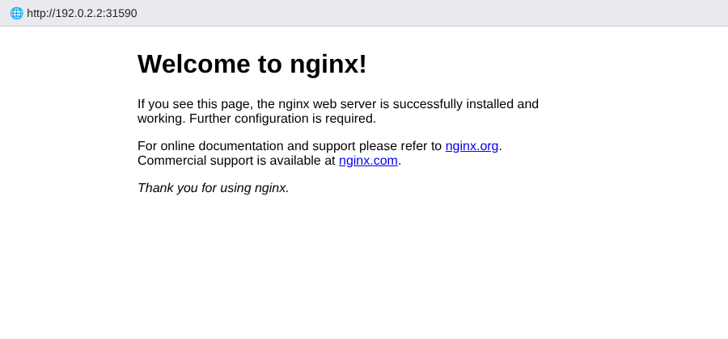

# Session 15 – Helm Homework

**Name:** Saniya Sanjiv Patil · **Roll No:** 24bcs10246 · **Batch:** B

All command output below is **real output** captured on my single-node k3s cluster (`saniya-k8s`, Kubernetes v1.30) with Helm v3.16.
Starting material: the instructor's `devops-heros/session-15-helm` folder (`07-install-upgrade/app-chart`, `08-rollback`, `mini-project/notes-chart`), copied and adapted.

## Folder layout

| Folder | What is inside |
|---|---|
| [`01-helm-commands/saniya-web/`](./01-helm-commands/saniya-web) | chart generated with `helm create` (Task 1) |
| [`02-rollback-workflow/rollback-chart/`](./02-rollback-workflow/rollback-chart) | chart for the install → upgrade → upgrade → rollback workflow, with `values.yaml`, `values-v2.yaml`, `values-v3.yaml` (Task 2) |
| [`03-mini-project/notes-chart/`](./03-mini-project/notes-chart) | Notes app chart from the reference mini project: `Chart.yaml`, `values.yaml`, `values-prod.yaml`, `templates/` (Task 3) |

## Key concepts

| Term | Meaning |
|---|---|
| **Chart** | package of templated Kubernetes YAML (`Chart.yaml`, `values.yaml`, `templates/`) – the recipe |
| **Values** | variables that customise the chart (`values.yaml`, `-f file`, `--set key=val`) – the ingredients |
| **Release** | one installed instance of a chart in a namespace – the cooked meal |
| **Revision** | every install/upgrade/rollback creates a new numbered revision (stored as a Secret in the namespace) |
| **Repository** | HTTP server hosting packaged charts (`index.yaml` + `.tgz`) |

---

## Task 1 – Helm commands hands-on

```console
saniya@saniya-devops:~/devops-homework/session-15-helm/01-helm-commands$ helm version
version.BuildInfo{Version:"v3.16.2", GitCommit:"13654a52f7c70a143b1dd51416d633e1071faffb", GitTreeState:"clean", GoVersion:"go1.22.7"}
```

> Prints the client version – Helm 3 has no server-side component (no Tiller).

### `helm create` – scaffold a new chart

```console
saniya@saniya-devops:~/devops-homework/session-15-helm/01-helm-commands$ helm create saniya-web
Creating saniya-web
```

```console
saniya@saniya-devops:~/devops-homework/session-15-helm/01-helm-commands$ find saniya-web | sort
saniya-web
saniya-web/.helmignore
saniya-web/Chart.yaml
saniya-web/charts
saniya-web/templates
saniya-web/templates/NOTES.txt
saniya-web/templates/_helpers.tpl
saniya-web/templates/deployment.yaml
saniya-web/templates/hpa.yaml
saniya-web/templates/ingress.yaml
saniya-web/templates/service.yaml
saniya-web/templates/serviceaccount.yaml
saniya-web/templates/tests
saniya-web/templates/tests/test-connection.yaml
saniya-web/values.yaml
```

> Generates a complete, working chart: `Chart.yaml` (metadata), `values.yaml` (defaults), `templates/` (Deployment, Service, Ingress, HPA, ServiceAccount, helpers, NOTES.txt and a test hook).

```console
saniya@saniya-devops:~/devops-homework/session-15-helm/01-helm-commands$ cat saniya-web/Chart.yaml | grep -v '^#' | grep -v '^$'
apiVersion: v2
name: saniya-web
description: A Helm chart for Kubernetes
type: application
version: 0.1.0
appVersion: "1.16.0"
```

```console
saniya@saniya-devops:~/devops-homework/session-15-helm/01-helm-commands$ grep -A4 -E '^(replicaCount|image|service):' saniya-web/values.yaml
replicaCount: 1

# This sets the container image more information can be found here: https://kubernetes.io/docs/concepts/containers/images/
image:
  repository: nginx
  # This sets the pull policy for images.
  pullPolicy: IfNotPresent
  # Overrides the image tag whose default is the chart appVersion.
--
service:
  # This sets the service type more information can be found here: https://kubernetes.io/docs/concepts/services-networking/service/#publishing-services-service-types
  type: ClusterIP
  # This sets the ports more information can be found here: https://kubernetes.io/docs/concepts/services-networking/service/#field-spec-ports
  port: 80
```

### `helm lint` and `helm template` – validate and render locally

```console
saniya@saniya-devops:~/devops-homework/session-15-helm/01-helm-commands$ helm lint ./saniya-web
==> Linting ./saniya-web
[INFO] Chart.yaml: icon is recommended

1 chart(s) linted, 0 chart(s) failed
```

```console
saniya@saniya-devops:~/devops-homework/session-15-helm/01-helm-commands$ helm template myweb ./saniya-web --show-only templates/deployment.yaml
---
# Source: saniya-web/templates/deployment.yaml
apiVersion: apps/v1
kind: Deployment
metadata:
  name: myweb-saniya-web
  labels:
    helm.sh/chart: saniya-web-0.1.0
    app.kubernetes.io/name: saniya-web
    app.kubernetes.io/instance: myweb
    app.kubernetes.io/version: "1.16.0"
    app.kubernetes.io/managed-by: Helm
spec:
  replicas: 1
  selector:
    matchLabels:
      app.kubernetes.io/name: saniya-web
      app.kubernetes.io/instance: myweb
  template:
    metadata:
      labels:
        helm.sh/chart: saniya-web-0.1.0
        app.kubernetes.io/name: saniya-web
        app.kubernetes.io/instance: myweb
        app.kubernetes.io/version: "1.16.0"
        app.kubernetes.io/managed-by: Helm
    spec:
      serviceAccountName: myweb-saniya-web
      securityContext:
        {}
      containers:
        - name: saniya-web
          securityContext:
            {}
          image: "nginx:1.16.0"
          imagePullPolicy: IfNotPresent
          ports:
            - name: http
              containerPort: 80
              protocol: TCP
          livenessProbe:
            httpGet:
              path: /
              port: http
          readinessProbe:
```

> `lint` checks the chart for errors/best practices; `template` renders the YAML **without a cluster**, so I can see exactly what will be applied (first 45 lines shown).

### `helm install`

```console
saniya@saniya-devops:~/devops-homework/session-15-helm/01-helm-commands$ helm install myweb ./saniya-web -n s15-basics --create-namespace
NAME: myweb
LAST DEPLOYED: Wed Oct  7 16:42:08 2026
NAMESPACE: s15-basics
STATUS: deployed
REVISION: 1
NOTES:
1. Get the application URL by running these commands:
  export POD_NAME=$(kubectl get pods --namespace s15-basics -l "app.kubernetes.io/name=saniya-web,app.kubernetes.io/instance=myweb" -o jsonpath="{.items[0].metadata.name}")
  export CONTAINER_PORT=$(kubectl get pod --namespace s15-basics $POD_NAME -o jsonpath="{.spec.containers[0].ports[0].containerPort}")
  echo "Visit http://127.0.0.1:8080 to use your application"
  kubectl --namespace s15-basics port-forward $POD_NAME 8080:$CONTAINER_PORT
```

> Creates release `myweb`, revision 1. The NOTES are printed from `templates/NOTES.txt`.

```console
saniya@saniya-devops:~/devops-homework/session-15-helm/01-helm-commands$ kubectl get all -n s15-basics
NAME                                  READY   STATUS    RESTARTS   AGE
pod/myweb-saniya-web-c56cf7c8-bnj8n   1/1     Running   0          96s

NAME                       TYPE        CLUSTER-IP     EXTERNAL-IP   PORT(S)   AGE
service/myweb-saniya-web   ClusterIP   10.43.236.24   <none>        80/TCP    96s

NAME                               READY   UP-TO-DATE   AVAILABLE   AGE
deployment.apps/myweb-saniya-web   1/1     1            1           96s

NAME                                        DESIRED   CURRENT   READY   AGE
replicaset.apps/myweb-saniya-web-c56cf7c8   1         1         1       96s
```

### `helm list`

```console
saniya@saniya-devops:~/devops-homework/session-15-helm/01-helm-commands$ helm list -n s15-basics
NAME 	NAMESPACE 	REVISION	UPDATED                                	STATUS  	CHART           	APP VERSION
myweb	s15-basics	1       	2026-10-07 16:42:08.376994353 +0000 UTC	deployed	saniya-web-0.1.0	1.16.0     
```

```console
saniya@saniya-devops:~/devops-homework/session-15-helm/01-helm-commands$ helm list -A
NAME       	NAMESPACE  	REVISION	UPDATED                                	STATUS  	CHART                      	APP VERSION
myweb      	s15-basics 	1       	2026-10-07 16:42:08.376994353 +0000 UTC	deployed	saniya-web-0.1.0           	1.16.0     
taskboard  	s21-final  	5       	2026-10-07 16:42:53.604685331 +0000 UTC	deployed	taskboard-1.1.0            	1.0.0      
traefik    	kube-system	3       	2026-10-07 16:29:06.651917401 +0000 UTC	deployed	traefik-25.0.3+up25.0.0    	v2.10.5    
traefik-crd	kube-system	3       	2026-10-07 16:29:06.683123826 +0000 UTC	deployed	traefik-crd-25.0.3+up25.0.0	v2.10.5    
```

> Lists releases (namespace, revision, status, chart and app version). `-A` shows all namespaces – here also k3s' own Traefik release and other releases on the shared cluster.

### `helm status`

```console
saniya@saniya-devops:~/devops-homework/session-15-helm/01-helm-commands$ helm status myweb -n s15-basics
NAME: myweb
LAST DEPLOYED: Wed Oct  7 16:42:08 2026
NAMESPACE: s15-basics
STATUS: deployed
REVISION: 1
NOTES:
1. Get the application URL by running these commands:
  export POD_NAME=$(kubectl get pods --namespace s15-basics -l "app.kubernetes.io/name=saniya-web,app.kubernetes.io/instance=myweb" -o jsonpath="{.items[0].metadata.name}")
  export CONTAINER_PORT=$(kubectl get pod --namespace s15-basics $POD_NAME -o jsonpath="{.spec.containers[0].ports[0].containerPort}")
  echo "Visit http://127.0.0.1:8080 to use your application"
  kubectl --namespace s15-basics port-forward $POD_NAME 8080:$CONTAINER_PORT
```

> Current state of the release + its notes.

### `helm get` – values, manifest, notes

```console
saniya@saniya-devops:~/devops-homework/session-15-helm/01-helm-commands$ helm get values myweb -n s15-basics
USER-SUPPLIED VALUES:
null
```

> `null` = no user-supplied values yet (only chart defaults used).

```console
saniya@saniya-devops:~/devops-homework/session-15-helm/01-helm-commands$ helm get values myweb -n s15-basics --all
COMPUTED VALUES:
affinity: {}
autoscaling:
  enabled: false
  maxReplicas: 100
  minReplicas: 1
  targetCPUUtilizationPercentage: 80
fullnameOverride: ""
image:
  pullPolicy: IfNotPresent
  repository: nginx
  tag: ""
imagePullSecrets: []
ingress:
  annotations: {}
  className: ""
  enabled: false
  hosts:
  - host: chart-example.local
    paths:
```

```console
saniya@saniya-devops:~/devops-homework/session-15-helm/01-helm-commands$ helm get manifest myweb -n s15-basics
kind: Service
metadata:
  name: myweb-saniya-web
  labels:
    helm.sh/chart: saniya-web-0.1.0
    app.kubernetes.io/name: saniya-web
    app.kubernetes.io/instance: myweb
    app.kubernetes.io/version: "1.16.0"
    app.kubernetes.io/managed-by: Helm
spec:
  type: ClusterIP
  ports:
    - port: 80
      targetPort: http
      protocol: TCP
      name: http
  selector:
    app.kubernetes.io/name: saniya-web
    app.kubernetes.io/instance: myweb
---
```

> The exact YAML Helm applied for this revision (only the Service part shown).

```console
saniya@saniya-devops:~/devops-homework/session-15-helm/01-helm-commands$ helm get notes myweb -n s15-basics
NOTES:
1. Get the application URL by running these commands:
  export POD_NAME=$(kubectl get pods --namespace s15-basics -l "app.kubernetes.io/name=saniya-web,app.kubernetes.io/instance=myweb" -o jsonpath="{.items[0].metadata.name}")
  export CONTAINER_PORT=$(kubectl get pod --namespace s15-basics $POD_NAME -o jsonpath="{.spec.containers[0].ports[0].containerPort}")
  echo "Visit http://127.0.0.1:8080 to use your application"
  kubectl --namespace s15-basics port-forward $POD_NAME 8080:$CONTAINER_PORT

```

### `helm upgrade`

```console
saniya@saniya-devops:~/devops-homework/session-15-helm/01-helm-commands$ helm upgrade myweb ./saniya-web -n s15-basics --set replicaCount=2 --set image.tag=1.27-alpine
Release "myweb" has been upgraded. Happy Helming!
NAME: myweb
LAST DEPLOYED: Wed Oct  7 16:43:45 2026
NAMESPACE: s15-basics
STATUS: deployed
REVISION: 2
NOTES:
1. Get the application URL by running these commands:
  export POD_NAME=$(kubectl get pods --namespace s15-basics -l "app.kubernetes.io/name=saniya-web,app.kubernetes.io/instance=myweb" -o jsonpath="{.items[0].metadata.name}")
  export CONTAINER_PORT=$(kubectl get pod --namespace s15-basics $POD_NAME -o jsonpath="{.spec.containers[0].ports[0].containerPort}")
  echo "Visit http://127.0.0.1:8080 to use your application"
  kubectl --namespace s15-basics port-forward $POD_NAME 8080:$CONTAINER_PORT
```

```console
saniya@saniya-devops:~/devops-homework/session-15-helm/01-helm-commands$ helm get values myweb -n s15-basics
USER-SUPPLIED VALUES:
image:
  tag: 1.27-alpine
replicaCount: 2
```

```console
saniya@saniya-devops:~/devops-homework/session-15-helm/01-helm-commands$ kubectl get deploy -n s15-basics -o wide
NAME               READY   UP-TO-DATE   AVAILABLE   AGE     CONTAINERS   IMAGES              SELECTOR
myweb-saniya-web   2/2     1            2           4m40s   saniya-web   nginx:1.27-alpine   app.kubernetes.io/instance=myweb,app.kubernetes.io/name=saniya-web
```

> Upgrade applies the changed values → revision 2: 2 replicas running `nginx:1.27-alpine`.

### `helm history`

```console
saniya@saniya-devops:~/devops-homework/session-15-helm/01-helm-commands$ helm history myweb -n s15-basics
REVISION	UPDATED                 	STATUS    	CHART           	APP VERSION	DESCRIPTION     
1       	Wed Oct  7 16:42:08 2026	superseded	saniya-web-0.1.0	1.16.0     	Install complete
2       	Wed Oct  7 16:43:45 2026	deployed  	saniya-web-0.1.0	1.16.0     	Upgrade complete
```

### `helm rollback`

```console
saniya@saniya-devops:~/devops-homework/session-15-helm/01-helm-commands$ helm rollback myweb 1 -n s15-basics
Rollback was a success! Happy Helming!
```

```console
saniya@saniya-devops:~/devops-homework/session-15-helm/01-helm-commands$ helm history myweb -n s15-basics
REVISION	UPDATED                 	STATUS    	CHART           	APP VERSION	DESCRIPTION     
1       	Wed Oct  7 16:42:08 2026	superseded	saniya-web-0.1.0	1.16.0     	Install complete
2       	Wed Oct  7 16:43:45 2026	superseded	saniya-web-0.1.0	1.16.0     	Upgrade complete
3       	Wed Oct  7 16:46:49 2026	deployed  	saniya-web-0.1.0	1.16.0     	Rollback to 1   
```

```console
saniya@saniya-devops:~/devops-homework/session-15-helm/01-helm-commands$ kubectl get deploy -n s15-basics -o wide
NAME               READY   UP-TO-DATE   AVAILABLE   AGE     CONTAINERS   IMAGES         SELECTOR
myweb-saniya-web   1/1     1            1           4m44s   saniya-web   nginx:1.16.0   app.kubernetes.io/instance=myweb,app.kubernetes.io/name=saniya-web
```

> Rollback re-applies revision 1's manifest **as a new revision 3** (history is never rewritten): back to 1 replica and `nginx:1.16.0` (the chart's `appVersion`).

### `helm repo` – add / update / list

```console
saniya@saniya-devops:~/devops-homework/session-15-helm/01-helm-commands$ helm repo add bitnami https://charts.bitnami.com/bitnami
"bitnami" has been added to your repositories
```

```console
saniya@saniya-devops:~/devops-homework/session-15-helm/01-helm-commands$ helm repo add prometheus-community https://prometheus-community.github.io/helm-charts
"prometheus-community" has been added to your repositories
```

```console
saniya@saniya-devops:~/devops-homework/session-15-helm/01-helm-commands$ helm repo update
Hang tight while we grab the latest from your chart repositories...
...Successfully got an update from the "prometheus-community" chart repository
...Successfully got an update from the "bitnami" chart repository
Update Complete. ⎈Happy Helming!⎈
```

```console
saniya@saniya-devops:~/devops-homework/session-15-helm/01-helm-commands$ helm repo list
NAME                	URL                                               
bitnami             	https://charts.bitnami.com/bitnami                
prometheus-community	https://prometheus-community.github.io/helm-charts
```

> `add` registers a chart repository, `update` downloads the latest `index.yaml` of every repo into the local cache, `list` shows them.

### `helm search` – repo and hub

```console
saniya@saniya-devops:~/devops-homework/session-15-helm/01-helm-commands$ helm search repo nginx
NAME                                          	CHART VERSION	APP VERSION	DESCRIPTION                                       
bitnami/nginx                                 	25.2.1       	1.31.6     	NGINX Open Source is a web server that can be a...
bitnami/nginx-ingress-controller              	12.0.7       	1.13.1     	NGINX Ingress Controller is an Ingress controll...
bitnami/nginx-intel                           	2.1.15       	0.4.9      	DEPRECATED NGINX Open Source for Intel is a lig...
prometheus-community/prometheus-nginx-exporter	1.23.1       	1.5.3      	A Helm chart for NGINX Prometheus Exporter        
```

```console
saniya@saniya-devops:~/devops-homework/session-15-helm/01-helm-commands$ helm search repo prometheus-community/prometheus --versions
NAME                                              	CHART VERSION	APP VERSION	DESCRIPTION                                       
prometheus-community/prometheus                   	29.36.0      	v3.15.0    	Prometheus is a monitoring system and time seri...
prometheus-community/prometheus                   	29.35.0      	v3.15.0    	Prometheus is a monitoring system and time seri...
prometheus-community/prometheus                   	29.34.0      	v3.15.0    	Prometheus is a monitoring system and time seri...
prometheus-community/prometheus                   	29.33.1      	v3.15.0    	Prometheus is a monitoring system and time seri...
```

> `search repo` searches only the repos I added (local cache).

```console
saniya@saniya-devops:~/devops-homework/session-15-helm/01-helm-commands$ helm search hub nginx --max-col-width 60
URL                                                         	CHART VERSION  	APP VERSION                                     	DESCRIPTION                                                 
https://artifacthub.io/packages/helm/cloudpirates-nginx/n...	0.16.12        	1.31.6                                          	Nginx is a high-performance HTTP server and reverse proxy.  
https://artifacthub.io/packages/helm/quench-nginx/nginx     	0.0.15         	1.30.5                                          	High-performance web server, reverse proxy, and load bala...
https://artifacthub.io/packages/helm/krakazyabra/nginx      	1.0.0          	1.19.0                                          	Nginx Helm chart for Kubernetes                             
https://artifacthub.io/packages/helm/dhinesh/nginx          	25.2.1         	1.31.6                                          	NGINX Open Source is a web server that can be also used a...
https://artifacthub.io/packages/helm/bitnami/nginx          	25.2.1         	1.31.6                                          	NGINX Open Source is a web server that can be also used a...
https://artifacthub.io/packages/helm/niceos/nginx           	1.31.1+niceos.2	1.31.1                                          	Bitnami-compatible NGINX Helm chart for NiceOS              
https://artifacthub.io/packages/helm/bitnami-aks/nginx      	13.2.12        	1.23.2                                          	NGINX Open Source is a web server that can be also used a...
```

> `search hub` queries **Artifact Hub** (artifacthub.io) – all public charts, no `repo add` needed.

```console
saniya@saniya-devops:~/devops-homework/session-15-helm/01-helm-commands$ helm show chart bitnami/nginx
Error: unexpected status from HEAD request to https://registry-1.docker.io/v2/bitnamicharts/nginx/manifests/25.2.1: 429 Too Many Requests
```

> `helm show chart|values|readme` inspects a repo chart before installing it.

### `helm uninstall`

```console
saniya@saniya-devops:~/devops-homework/session-15-helm/01-helm-commands$ helm uninstall myweb -n s15-basics
release "myweb" uninstalled
```

```console
saniya@saniya-devops:~/devops-homework/session-15-helm/01-helm-commands$ helm list -n s15-basics
NAME	NAMESPACE	REVISION	UPDATED	STATUS	CHART	APP VERSION
```

```console
saniya@saniya-devops:~/devops-homework/session-15-helm/01-helm-commands$ kubectl get all -n s15-basics
No resources found in s15-basics namespace.
```

> Removes every resource of the release and its history.

| Command | Purpose |
|---|---|
| `helm create` | scaffold a new chart |
| `helm lint` / `helm template` | validate / render locally |
| `helm install` | create a release (revision 1) |
| `helm list` | list releases |
| `helm status` | state + notes of a release |
| `helm get values/manifest/notes` | what was deployed in a revision |
| `helm upgrade` | apply new chart/values → new revision |
| `helm history` | all revisions of a release |
| `helm rollback` | redeploy an old revision as a new one |
| `helm uninstall` | delete the release |
| `helm repo add/update/list` | manage chart repositories |
| `helm search repo/hub` | find charts locally added / on Artifact Hub |

---

## Task 2 – Complete rollback workflow

Chart: [`02-rollback-workflow/rollback-chart/`](./02-rollback-workflow/rollback-chart) (adapted from ref `07-install-upgrade/app-chart`, added a ConfigMap-based web page and a Service so every revision is visible from the outside).

| File | replicaCount | image.tag | message |
|---|---|---|---|
| [`values.yaml`](./02-rollback-workflow/rollback-chart/values.yaml) (rev 1) | 1 | 1.24 | Hello from version 1 |
| [`values-v2.yaml`](./02-rollback-workflow/rollback-chart/values-v2.yaml) (rev 2) | 2 | 1.25 | Hello from version 2 |
| [`values-v3.yaml`](./02-rollback-workflow/rollback-chart/values-v3.yaml) (rev 3) | 3 | 1.26 | Hello from version 3 |

```text
Install (rev1) → Upgrade (rev2) → Verify → Upgrade (rev3) → Verify → Rollback to 2 (rev4) → Verify
```

### Templates

`templates/deployment.yaml`

```yaml
apiVersion: apps/v1
kind: Deployment
metadata:
  name: {{ .Release.Name }}-app
  labels:
    app: {{ .Release.Name }}
    chart: {{ .Chart.Name }}-{{ .Chart.Version }}
spec:
  replicas: {{ .Values.replicaCount }}
  selector:
    matchLabels:
      app: {{ .Release.Name }}
  template:
    metadata:
      labels:
        app: {{ .Release.Name }}
      annotations:
        # roll the pods whenever the page content changes
        checksum/html: {{ include (print $.Template.BasePath "/configmap.yaml") . | sha256sum }}
    spec:
      containers:
        - name: app
          image: "{{ .Values.image.repository }}:{{ .Values.image.tag }}"
          ports:
            - containerPort: 80
          resources:
            requests: { cpu: 10m, memory: 16Mi }
            limits: { cpu: 100m, memory: 64Mi }
          volumeMounts:
            - name: html
              mountPath: /usr/share/nginx/html
      volumes:
        - name: html
          configMap:
            name: {{ .Release.Name }}-html
```

`templates/configmap.yaml`

```yaml
apiVersion: v1
kind: ConfigMap
metadata:
  name: {{ .Release.Name }}-html
  labels:
    app: {{ .Release.Name }}
    chart: {{ .Chart.Name }}-{{ .Chart.Version }}
data:
  index.html: |
    <h1>{{ .Values.message }}</h1>
    <p>release={{ .Release.Name }} revision={{ .Release.Revision }} image={{ .Values.image.repository }}:{{ .Values.image.tag }} replicas={{ .Values.replicaCount }}</p>
```

`templates/service.yaml`

```yaml
apiVersion: v1
kind: Service
metadata:
  name: {{ .Release.Name }}-svc
  labels:
    app: {{ .Release.Name }}
spec:
  type: {{ .Values.service.type }}
  selector:
    app: {{ .Release.Name }}
  ports:
    - port: {{ .Values.service.port }}
      targetPort: 80
```

The `checksum/html` annotation makes the pods roll whenever the page content changes.

```console
saniya@saniya-devops:~/devops-homework/session-15-helm/02-rollback-workflow$ helm lint ./rollback-chart
==> Linting ./rollback-chart
[INFO] Chart.yaml: icon is recommended

1 chart(s) linted, 0 chart(s) failed
```

```console
saniya@saniya-devops:~/devops-homework/session-15-helm/02-rollback-workflow$ helm template webapp ./rollback-chart -f rollback-chart/values-v2.yaml
# Source: rollback-chart/templates/configmap.yaml
    <h1>Hello from version 2</h1>
    <p>release=webapp revision=1 image=nginx:1.25 replicas=2</p>
# Source: rollback-chart/templates/service.yaml
# Source: rollback-chart/templates/deployment.yaml
  replicas: 2
          image: "nginx:1.25"
```

> Rendering with `values-v2.yaml` locally already shows 2 replicas and `nginx:1.25`.

### Step 1 – Install (revision 1)

```console
saniya@saniya-devops:~/devops-homework/session-15-helm/02-rollback-workflow$ helm install webapp ./rollback-chart -n s15-rollback --create-namespace
NAME: webapp
LAST DEPLOYED: Wed Oct  7 16:47:23 2026
NAMESPACE: s15-rollback
STATUS: deployed
REVISION: 1
TEST SUITE: None
NOTES:
webapp is deployed (revision 1).
Image: nginx:1.24  Replicas: 1
Check it:  kubectl get pods -n s15-rollback -l app=webapp
```

**Verify**

```console
saniya@saniya-devops:~/devops-homework/session-15-helm/02-rollback-workflow$ helm get values webapp -n s15-rollback
USER-SUPPLIED VALUES:
null
```

```console
saniya@saniya-devops:~/devops-homework/session-15-helm/02-rollback-workflow$ kubectl get deploy webapp-app -n s15-rollback -o wide
NAME         READY   UP-TO-DATE   AVAILABLE   AGE   CONTAINERS   IMAGES       SELECTOR
webapp-app   1/1     1            1           10s   app          nginx:1.24   app=webapp
```

```console
saniya@saniya-devops:~/devops-homework/session-15-helm/02-rollback-workflow$ kubectl get pods -n s15-rollback -l app=webapp
NAME                          READY   STATUS    RESTARTS   AGE
webapp-app-776b6f9669-2l2jc   1/1     Running   0          10s
```

```console
saniya@saniya-devops:~/devops-homework/session-15-helm/02-rollback-workflow$ curl -s http://10.43.210.38
<h1>Hello from version 1</h1>
<p>release=webapp revision=1 image=nginx:1.24 replicas=1</p>
```

### Step 2 – Upgrade (revision 2)

```console
saniya@saniya-devops:~/devops-homework/session-15-helm/02-rollback-workflow$ helm upgrade webapp ./rollback-chart -n s15-rollback -f rollback-chart/values-v2.yaml
Release "webapp" has been upgraded. Happy Helming!
NAME: webapp
LAST DEPLOYED: Wed Oct  7 16:47:33 2026
NAMESPACE: s15-rollback
STATUS: deployed
REVISION: 2
TEST SUITE: None
NOTES:
webapp is deployed (revision 2).
Image: nginx:1.25  Replicas: 2
Check it:  kubectl get pods -n s15-rollback -l app=webapp
```

**Verify** – 2 replicas, `nginx:1.25`, version 2 page:

```console
saniya@saniya-devops:~/devops-homework/session-15-helm/02-rollback-workflow$ helm get values webapp -n s15-rollback
USER-SUPPLIED VALUES:
image:
  tag: "1.25"
message: Hello from version 2
replicaCount: 2
```

```console
saniya@saniya-devops:~/devops-homework/session-15-helm/02-rollback-workflow$ kubectl get deploy webapp-app -n s15-rollback -o wide
NAME         READY   UP-TO-DATE   AVAILABLE   AGE   CONTAINERS   IMAGES       SELECTOR
webapp-app   2/2     2            2           66s   app          nginx:1.25   app=webapp
```

```console
saniya@saniya-devops:~/devops-homework/session-15-helm/02-rollback-workflow$ kubectl get pods -n s15-rollback -l app=webapp
NAME                          READY   STATUS    RESTARTS   AGE
webapp-app-56495cbd79-gk9c7   1/1     Running   0          56s
webapp-app-56495cbd79-hsgtk   1/1     Running   0          10s
```

```console
saniya@saniya-devops:~/devops-homework/session-15-helm/02-rollback-workflow$ curl -s http://10.43.210.38
<h1>Hello from version 2</h1>
<p>release=webapp revision=2 image=nginx:1.25 replicas=2</p>
```

### Step 3 – Upgrade again (revision 3)

```console
saniya@saniya-devops:~/devops-homework/session-15-helm/02-rollback-workflow$ helm upgrade webapp ./rollback-chart -n s15-rollback -f rollback-chart/values-v3.yaml
Release "webapp" has been upgraded. Happy Helming!
NAME: webapp
LAST DEPLOYED: Wed Oct  7 16:48:29 2026
NAMESPACE: s15-rollback
STATUS: deployed
REVISION: 3
TEST SUITE: None
NOTES:
webapp is deployed (revision 3).
Image: nginx:1.26  Replicas: 3
Check it:  kubectl get pods -n s15-rollback -l app=webapp
```

**Verify** – 3 replicas, `nginx:1.26`, version 3 page:

```console
saniya@saniya-devops:~/devops-homework/session-15-helm/02-rollback-workflow$ helm get values webapp -n s15-rollback
USER-SUPPLIED VALUES:
image:
  tag: "1.26"
message: Hello from version 3
replicaCount: 3
```

```console
saniya@saniya-devops:~/devops-homework/session-15-helm/02-rollback-workflow$ kubectl get deploy webapp-app -n s15-rollback -o wide
NAME         READY   UP-TO-DATE   AVAILABLE   AGE   CONTAINERS   IMAGES       SELECTOR
webapp-app   3/3     3            3           97s   app          nginx:1.26   app=webapp
```

```console
saniya@saniya-devops:~/devops-homework/session-15-helm/02-rollback-workflow$ kubectl get pods -n s15-rollback -l app=webapp
NAME                         READY   STATUS    RESTARTS   AGE
webapp-app-6b7ff9b8f-254k9   1/1     Running   0          10s
webapp-app-6b7ff9b8f-2v8qf   1/1     Running   0          31s
webapp-app-6b7ff9b8f-ph2lc   1/1     Running   0          12s
```

```console
saniya@saniya-devops:~/devops-homework/session-15-helm/02-rollback-workflow$ curl -s http://10.43.210.38
<h1>Hello from version 3</h1>
<p>release=webapp revision=3 image=nginx:1.26 replicas=3</p>
```

```console
saniya@saniya-devops:~/devops-homework/session-15-helm/02-rollback-workflow$ helm history webapp -n s15-rollback
REVISION	UPDATED                 	STATUS    	CHART               	APP VERSION	DESCRIPTION     
1       	Wed Oct  7 16:47:23 2026	superseded	rollback-chart-0.1.0	1.0        	Install complete
2       	Wed Oct  7 16:47:33 2026	superseded	rollback-chart-0.1.0	1.0        	Upgrade complete
3       	Wed Oct  7 16:48:29 2026	deployed  	rollback-chart-0.1.0	1.0        	Upgrade complete
```

### Step 4 – Rollback to revision 2

Assume version 3 has a problem – go back to the last good revision:

```console
saniya@saniya-devops:~/devops-homework/session-15-helm/02-rollback-workflow$ helm rollback webapp 2 -n s15-rollback
Rollback was a success! Happy Helming!
```

**Verify** – back to 2 replicas, `nginx:1.25`, version 2 page:

```console
saniya@saniya-devops:~/devops-homework/session-15-helm/02-rollback-workflow$ helm get values webapp -n s15-rollback
USER-SUPPLIED VALUES:
image:
  tag: "1.25"
message: Hello from version 2
replicaCount: 2
```

```console
saniya@saniya-devops:~/devops-homework/session-15-helm/02-rollback-workflow$ kubectl get deploy webapp-app -n s15-rollback -o wide
NAME         READY   UP-TO-DATE   AVAILABLE   AGE    CONTAINERS   IMAGES       SELECTOR
webapp-app   2/2     2            2           112s   app          nginx:1.25   app=webapp
```

```console
saniya@saniya-devops:~/devops-homework/session-15-helm/02-rollback-workflow$ kubectl get pods -n s15-rollback -l app=webapp
NAME                          READY   STATUS    RESTARTS   AGE
webapp-app-56495cbd79-b2hlw   1/1     Running   0          15s
webapp-app-56495cbd79-hg7qj   1/1     Running   0          13s
```

```console
saniya@saniya-devops:~/devops-homework/session-15-helm/02-rollback-workflow$ curl -s http://10.43.210.38
<h1>Hello from version 2</h1>
<p>release=webapp revision=2 image=nginx:1.25 replicas=2</p>
```

```console
saniya@saniya-devops:~/devops-homework/session-15-helm/02-rollback-workflow$ helm history webapp -n s15-rollback
REVISION	UPDATED                 	STATUS    	CHART               	APP VERSION	DESCRIPTION     
1       	Wed Oct  7 16:47:23 2026	superseded	rollback-chart-0.1.0	1.0        	Install complete
2       	Wed Oct  7 16:47:33 2026	superseded	rollback-chart-0.1.0	1.0        	Upgrade complete
3       	Wed Oct  7 16:48:29 2026	superseded	rollback-chart-0.1.0	1.0        	Upgrade complete
4       	Wed Oct  7 16:49:00 2026	deployed  	rollback-chart-0.1.0	1.0        	Rollback to 2   
```

```console
saniya@saniya-devops:~/devops-homework/session-15-helm/02-rollback-workflow$ kubectl rollout history deploy/webapp-app -n s15-rollback
deployment.apps/webapp-app 
REVISION  CHANGE-CAUSE
1         <none>
3         <none>
4         <none>

```

```console
saniya@saniya-devops:~/devops-homework/session-15-helm/02-rollback-workflow$ kubectl get secrets -n s15-rollback -l owner=helm
NAME                           TYPE                 DATA   AGE
sh.helm.release.v1.webapp.v1   helm.sh/release.v1   1      112s
sh.helm.release.v1.webapp.v2   helm.sh/release.v1   1      102s
sh.helm.release.v1.webapp.v3   helm.sh/release.v1   1      46s
sh.helm.release.v1.webapp.v4   helm.sh/release.v1   1      15s
```

**Observation:**
- Every `install`/`upgrade`/`rollback` produced a new revision; the rollback became **revision 4** with description `Rollback to 2`, and revision 3 is now `superseded`.
- Image tag, replica count and the page content all went back to the revision-2 values, proving that Helm restores the full set of values + manifests, not just the image.
- Helm stores each revision as a Secret `sh.helm.release.v1.<release>.v<N>` in the release namespace – that is what `history` and `rollback` read.

### Bonus – automatic rollback with `--atomic`

A bad upgrade (non-existent image tag) with `--atomic` is rolled back by Helm itself when the pods don't become ready within the timeout:

```console
saniya@saniya-devops:~/devops-homework/session-15-helm/02-rollback-workflow$ helm upgrade webapp ./rollback-chart -n s15-rollback -f rollback-chart/values-v2.yaml --set image.tag=doesnotexist --atomic --timeout 60s
Error: UPGRADE FAILED: release webapp failed, and has been rolled back due to atomic being set: context deadline exceeded
```

```console
saniya@saniya-devops:~/devops-homework/session-15-helm/02-rollback-workflow$ helm history webapp -n s15-rollback
REVISION	UPDATED                 	STATUS    	CHART               	APP VERSION	DESCRIPTION                                       
1       	Wed Oct  7 16:47:23 2026	superseded	rollback-chart-0.1.0	1.0        	Install complete                                  
2       	Wed Oct  7 16:47:33 2026	superseded	rollback-chart-0.1.0	1.0        	Upgrade complete                                  
3       	Wed Oct  7 16:48:29 2026	superseded	rollback-chart-0.1.0	1.0        	Upgrade complete                                  
4       	Wed Oct  7 16:49:00 2026	superseded	rollback-chart-0.1.0	1.0        	Rollback to 2                                     
5       	Wed Oct  7 16:49:16 2026	failed    	rollback-chart-0.1.0	1.0        	Upgrade "webapp" failed: context deadline exceeded
6       	Wed Oct  7 16:50:16 2026	deployed  	rollback-chart-0.1.0	1.0        	Rollback to 4                                     
```

```console
saniya@saniya-devops:~/devops-homework/session-15-helm/02-rollback-workflow$ kubectl get deploy webapp-app -n s15-rollback -o wide
NAME         READY   UP-TO-DATE   AVAILABLE   AGE     CONTAINERS   IMAGES       SELECTOR
webapp-app   2/2     2            2           2m57s   app          nginx:1.25   app=webapp
```

> Revision 5 failed, Helm automatically created revision 6 (`Rollback to 4`) – the app never left the last good state.

```console
saniya@saniya-devops:~/devops-homework/session-15-helm/02-rollback-workflow$ helm uninstall webapp -n s15-rollback
release "webapp" uninstalled
```


---

## Task 3 – Mini project: Notes App with Helm

Chart [`03-mini-project/notes-chart/`](./03-mini-project/notes-chart) – from the reference mini project. Changes: `service.nodePort` set to **31590** (my port range) and a `templates/NOTES.txt` added.

```text
notes-chart/
  Chart.yaml
  values.yaml          # dev: 1 replica, nginx:1.24
  values-prod.yaml     # prod: 3 replicas, nginx:1.25
  templates/
    configmap.yaml     # APP_NAME / ENVIRONMENT
    deployment.yaml    # envFrom the ConfigMap
    service.yaml       # NodePort
    NOTES.txt
```

`Chart.yaml`

```yaml
apiVersion: v2
name: notes-chart
description: A simple Notes application Helm chart
type: application
version: 0.1.0
appVersion: "1.0"
```

`values.yaml`

```yaml
replicaCount: 1

image:
  repository: nginx
  tag: "1.24"

service:
  port: 80
  nodePort: 31590

app:
  name: notes-app
  environment: development
```

`values-prod.yaml`

```yaml
replicaCount: 3

image:
  repository: nginx
  tag: "1.25"

service:
  port: 80
  nodePort: 31590

app:
  name: notes-app
  environment: production
```

`templates/configmap.yaml`

```yaml
apiVersion: v1
kind: ConfigMap
metadata:
  name: {{ .Release.Name }}-config
data:
  APP_NAME: {{ .Values.app.name | quote }}
  ENVIRONMENT: {{ .Values.app.environment | quote }}
```

`templates/deployment.yaml`

```yaml
apiVersion: apps/v1
kind: Deployment
metadata:
  name: {{ .Release.Name }}-deploy
  labels:
    app: {{ .Release.Name }}
    environment: {{ .Values.app.environment }}
spec:
  replicas: {{ .Values.replicaCount }}
  selector:
    matchLabels:
      app: {{ .Release.Name }}
  template:
    metadata:
      labels:
        app: {{ .Release.Name }}
    spec:
      containers:
        - name: notes
          image: "{{ .Values.image.repository }}:{{ .Values.image.tag }}"
          ports:
            - containerPort: {{ .Values.service.port }}
          envFrom:
            - configMapRef:
                name: {{ .Release.Name }}-config
```

`templates/service.yaml`

```yaml
apiVersion: v1
kind: Service
metadata:
  name: {{ .Release.Name }}-svc
spec:
  type: NodePort
  selector:
    app: {{ .Release.Name }}
  ports:
    - port: {{ .Values.service.port }}
      targetPort: {{ .Values.service.port }}
      nodePort: {{ .Values.service.nodePort }}
```

### Step 8 – Lint

```console
saniya@saniya-devops:~/devops-homework/session-15-helm/03-mini-project$ helm lint notes-chart
==> Linting notes-chart
[INFO] Chart.yaml: icon is recommended

1 chart(s) linted, 0 chart(s) failed
```

### Step 9 – Render locally

```console
saniya@saniya-devops:~/devops-homework/session-15-helm/03-mini-project$ helm template notes-dev notes-chart
---
# Source: notes-chart/templates/configmap.yaml
apiVersion: v1
kind: ConfigMap
metadata:
  name: notes-dev-config
data:
  APP_NAME: "notes-app"
  ENVIRONMENT: "development"
---
# Source: notes-chart/templates/service.yaml
apiVersion: v1
kind: Service
metadata:
  name: notes-dev-svc
spec:
  type: NodePort
  selector:
    app: notes-dev
  ports:
    - port: 80
      targetPort: 80
      nodePort: 31590
---
# Source: notes-chart/templates/deployment.yaml
apiVersion: apps/v1
kind: Deployment
metadata:
  name: notes-dev-deploy
  labels:
    app: notes-dev
    environment: development
spec:
  replicas: 1
  selector:
    matchLabels:
      app: notes-dev
  template:
    metadata:
      labels:
        app: notes-dev
    spec:
      containers:
        - name: notes
          image: "nginx:1.24"
          ports:
            - containerPort: 80
          envFrom:
            - configMapRef:
                name: notes-dev-config
```

All `{{ }}` are replaced (release name `notes-dev`, values from `values.yaml`).

### Step 10 – Install (development)

```console
saniya@saniya-devops:~/devops-homework/session-15-helm/03-mini-project$ helm install notes-dev notes-chart -n s15-notes --create-namespace
NAME: notes-dev
LAST DEPLOYED: Wed Oct  7 16:50:21 2026
NAMESPACE: s15-notes
STATUS: deployed
REVISION: 1
TEST SUITE: None
NOTES:
Notes app "notes-app" (development) deployed as release notes-dev, revision 1.
Image: nginx:1.24, replicas: 1
Open:  http://<node-ip>:31590
```

```console
saniya@saniya-devops:~/devops-homework/session-15-helm/03-mini-project$ kubectl get pods,services,configmaps -n s15-notes
NAME                                   READY   STATUS    RESTARTS   AGE
pod/notes-dev-deploy-dd5d57db9-xz26l   1/1     Running   0          6s

NAME                    TYPE       CLUSTER-IP      EXTERNAL-IP   PORT(S)        AGE
service/notes-dev-svc   NodePort   10.43.202.196   <none>        80:31590/TCP   6s

NAME                         DATA   AGE
configmap/kube-root-ca.crt   1      6s
configmap/notes-dev-config   2      6s
```

```console
saniya@saniya-devops:~/devops-homework/session-15-helm/03-mini-project$ kubectl exec notes-dev-deploy-dd5d57db9-xz26l -n s15-notes -- env
APP_NAME=notes-app
ENVIRONMENT=development
```

```console
saniya@saniya-devops:~/devops-homework/session-15-helm/03-mini-project$ curl -sI http://192.0.2.2:31590
HTTP/1.1 200 OK
Server: nginx/1.24.0
Date: Wed, 07 Oct 2026 16:50:30 GMT
```



### Step 11 – Upgrade to production values

```console
saniya@saniya-devops:~/devops-homework/session-15-helm/03-mini-project$ helm upgrade notes-dev notes-chart -n s15-notes -f notes-chart/values-prod.yaml
Release "notes-dev" has been upgraded. Happy Helming!
NAME: notes-dev
LAST DEPLOYED: Wed Oct  7 16:50:32 2026
NAMESPACE: s15-notes
STATUS: deployed
REVISION: 2
TEST SUITE: None
NOTES:
Notes app "notes-app" (production) deployed as release notes-dev, revision 2.
Image: nginx:1.25, replicas: 3
Open:  http://<node-ip>:31590
```

```console
saniya@saniya-devops:~/devops-homework/session-15-helm/03-mini-project$ kubectl get pods -n s15-notes
NAME                                READY   STATUS    RESTARTS   AGE
notes-dev-deploy-86f65b8898-mm2jl   1/1     Running   0          10s
notes-dev-deploy-86f65b8898-tq4qz   1/1     Running   0          12s
notes-dev-deploy-86f65b8898-xl8tw   1/1     Running   0          9s
```

```console
saniya@saniya-devops:~/devops-homework/session-15-helm/03-mini-project$ kubectl get deploy notes-dev-deploy -n s15-notes -o wide --show-labels
NAME               READY   UP-TO-DATE   AVAILABLE   AGE   CONTAINERS   IMAGES       SELECTOR        LABELS
notes-dev-deploy   3/3     3            3           23s   notes        nginx:1.25   app=notes-dev   app.kubernetes.io/managed-by=Helm,app=notes-dev,environment=production
```

```console
saniya@saniya-devops:~/devops-homework/session-15-helm/03-mini-project$ kubectl exec notes-dev-deploy-86f65b8898-mm2jl -n s15-notes -- env
ENVIRONMENT=production
APP_NAME=notes-app
```

```console
saniya@saniya-devops:~/devops-homework/session-15-helm/03-mini-project$ curl -sI http://192.0.2.2:31590
HTTP/1.1 200 OK
Server: nginx/1.25.5
Date: Wed, 07 Oct 2026 16:50:46 GMT
```

### Step 12 – Release history

```console
saniya@saniya-devops:~/devops-homework/session-15-helm/03-mini-project$ helm history notes-dev -n s15-notes
REVISION	UPDATED                 	STATUS    	CHART            	APP VERSION	DESCRIPTION     
1       	Wed Oct  7 16:50:21 2026	superseded	notes-chart-0.1.0	1.0        	Install complete
2       	Wed Oct  7 16:50:32 2026	deployed  	notes-chart-0.1.0	1.0        	Upgrade complete
```

### Step 13 – Simulate a bad upgrade

I keep the prod values file and only break the image tag (with plain `--set` and no `-f`, Helm would also reset the other values to the chart defaults):

```console
saniya@saniya-devops:~/devops-homework/session-15-helm/03-mini-project$ helm upgrade notes-dev notes-chart -n s15-notes -f notes-chart/values-prod.yaml --set image.tag=broken-tag-does-not-exist
Release "notes-dev" has been upgraded. Happy Helming!
NAME: notes-dev
LAST DEPLOYED: Wed Oct  7 16:50:46 2026
NAMESPACE: s15-notes
STATUS: deployed
REVISION: 3
TEST SUITE: None
NOTES:
Notes app "notes-app" (production) deployed as release notes-dev, revision 3.
Image: nginx:broken-tag-does-not-exist, replicas: 3
Open:  http://<node-ip>:31590
```

```console
saniya@saniya-devops:~/devops-homework/session-15-helm/03-mini-project$ kubectl get pods -n s15-notes
NAME                                READY   STATUS         RESTARTS   AGE
notes-dev-deploy-5f8dcf9c68-jhl2t   0/1     ErrImagePull   0          40s
notes-dev-deploy-86f65b8898-mm2jl   1/1     Running        0          51s
notes-dev-deploy-86f65b8898-tq4qz   1/1     Running        0          53s
notes-dev-deploy-86f65b8898-xl8tw   1/1     Running        0          50s
```

```console
saniya@saniya-devops:~/devops-homework/session-15-helm/03-mini-project$ kubectl describe pod notes-dev-deploy-5f8dcf9c68-jhl2t -n s15-notes
Events:
  Type     Reason     Age                From               Message
  ----     ------     ----               ----               -------
  Normal   Scheduled  40s                default-scheduler  Successfully assigned s15-notes/notes-dev-deploy-5f8dcf9c68-jhl2t to saniya-k8s
  Warning  Failed     39s                kubelet            Failed to pull image "nginx:broken-tag-does-not-exist": rpc error: code = NotFound desc = failed to pull and unpack image "docker.io/library/nginx:broken-tag-does-not-exist": failed to resolve reference "docker.io/library/nginx:broken-tag-does-not-exist": docker.io/library/nginx:broken-tag-does-not-exist: not found
  Normal   Pulling    26s (x2 over 39s)  kubelet            Pulling image "nginx:broken-tag-does-not-exist"
  Warning  Failed     25s (x2 over 39s)  kubelet            Error: ErrImagePull
  Warning  Failed     25s                kubelet            Failed to pull image "nginx:broken-tag-does-not-exist": failed to pull and unpack image "docker.io/library/nginx:broken-tag-does-not-exist": failed to resolve reference "docker.io/library/nginx:broken-tag-does-not-exist": unexpected status from HEAD request to https://registry-1.docker.io/v2/library/nginx/manifests/broken-tag-does-not-exist: 429 Too Many Requests
  Normal   BackOff    11s (x2 over 39s)  kubelet            Back-off pulling image "nginx:broken-tag-does-not-exist"
  Warning  Failed     11s (x2 over 39s)  kubelet            Error: ImagePullBackOff
```

```console
saniya@saniya-devops:~/devops-homework/session-15-helm/03-mini-project$ helm history notes-dev -n s15-notes
REVISION	UPDATED                 	STATUS    	CHART            	APP VERSION	DESCRIPTION     
1       	Wed Oct  7 16:50:21 2026	superseded	notes-chart-0.1.0	1.0        	Install complete
2       	Wed Oct  7 16:50:32 2026	superseded	notes-chart-0.1.0	1.0        	Upgrade complete
3       	Wed Oct  7 16:50:46 2026	deployed  	notes-chart-0.1.0	1.0        	Upgrade complete
```

> The new pod is stuck in `ErrImagePull`/`ImagePullBackOff`. Thanks to the Deployment's rolling-update strategy (maxUnavailable 25% of 3 → 0) the 3 old pods keep serving traffic, but the release (revision 3) is broken.

### Step 14 – Rollback to revision 2

```console
saniya@saniya-devops:~/devops-homework/session-15-helm/03-mini-project$ helm rollback notes-dev 2 -n s15-notes
Rollback was a success! Happy Helming!
```

```console
saniya@saniya-devops:~/devops-homework/session-15-helm/03-mini-project$ kubectl get pods -n s15-notes
NAME                                READY   STATUS    RESTARTS   AGE
notes-dev-deploy-86f65b8898-mm2jl   1/1     Running   0          63s
notes-dev-deploy-86f65b8898-tq4qz   1/1     Running   0          65s
notes-dev-deploy-86f65b8898-xl8tw   1/1     Running   0          62s
```

```console
saniya@saniya-devops:~/devops-homework/session-15-helm/03-mini-project$ kubectl get deploy notes-dev-deploy -n s15-notes -o wide
NAME               READY   UP-TO-DATE   AVAILABLE   AGE   CONTAINERS   IMAGES       SELECTOR
notes-dev-deploy   3/3     3            3           76s   notes        nginx:1.25   app=notes-dev
```

```console
saniya@saniya-devops:~/devops-homework/session-15-helm/03-mini-project$ helm history notes-dev -n s15-notes
REVISION	UPDATED                 	STATUS    	CHART            	APP VERSION	DESCRIPTION     
1       	Wed Oct  7 16:50:21 2026	superseded	notes-chart-0.1.0	1.0        	Install complete
2       	Wed Oct  7 16:50:32 2026	superseded	notes-chart-0.1.0	1.0        	Upgrade complete
3       	Wed Oct  7 16:50:46 2026	superseded	notes-chart-0.1.0	1.0        	Upgrade complete
4       	Wed Oct  7 16:51:26 2026	deployed  	notes-chart-0.1.0	1.0        	Rollback to 2   
```

```console
saniya@saniya-devops:~/devops-homework/session-15-helm/03-mini-project$ helm get values notes-dev -n s15-notes
USER-SUPPLIED VALUES:
app:
  environment: production
  name: notes-app
image:
  repository: nginx
  tag: "1.25"
replicaCount: 3
service:
  nodePort: 31590
  port: 80
```

```console
saniya@saniya-devops:~/devops-homework/session-15-helm/03-mini-project$ curl -sI http://192.0.2.2:31590
HTTP/1.1 200 OK
Server: nginx/1.25.5
Date: Wed, 07 Oct 2026 16:51:38 GMT
```

### Step 15 – Clean up

```console
saniya@saniya-devops:~/devops-homework/session-15-helm/03-mini-project$ helm uninstall notes-dev -n s15-notes
release "notes-dev" uninstalled
```

```console
saniya@saniya-devops:~/devops-homework/session-15-helm/03-mini-project$ kubectl get pods,services -n s15-notes
No resources found in s15-notes namespace.
```

```console
saniya@saniya-devops:~/devops-homework/session-15-helm/03-mini-project$ helm list -A
NAME       	NAMESPACE     	REVISION	UPDATED                                	STATUS  	CHART                      	APP VERSION
```

### What I practised

```text
[PASS] Created a Helm chart (helm create + notes-chart from scratch)
[PASS] Used values.yaml and values-prod.yaml (and --set overrides)
[PASS] Linted and rendered charts locally (helm lint / helm template)
[PASS] Deployed with helm install
[PASS] Upgraded the release with different values (replicas, image, config)
[PASS] Simulated a bad upgrade (broken image tag)
[PASS] Rolled back to a healthy revision (manual + automatic with --atomic)
[PASS] Used chart repositories (repo add/update/list, search repo/hub)
[PASS] Cleaned up with helm uninstall
```

## Notes
- Long outputs are trimmed with `head`/`sed`/`grep` to the relevant lines; nothing else is edited.
- `helm search hub` and `helm repo add/update` reach the internet through my network proxy.
