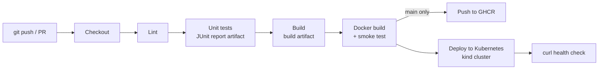
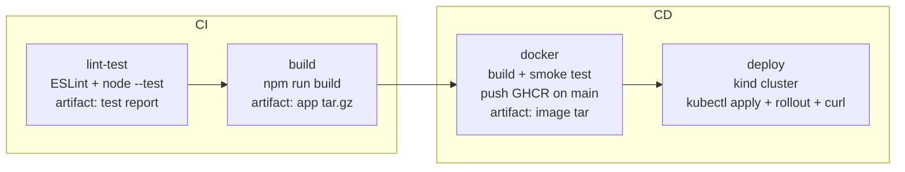
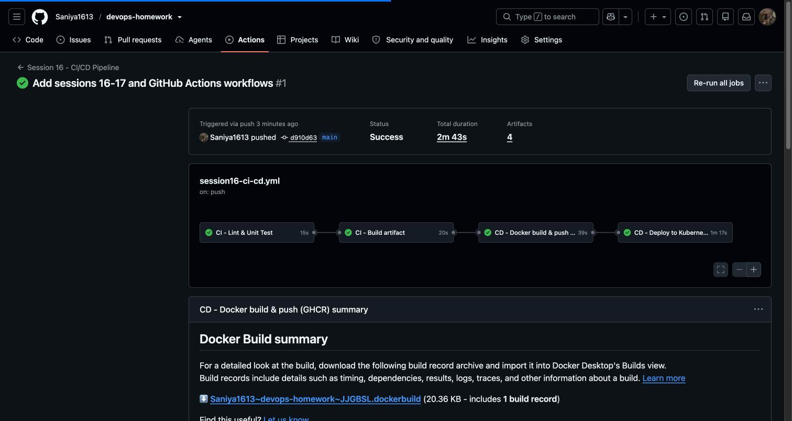

# Session 16 – CI/CD with GitHub Actions Homework

**Name:** Saniya Sanjiv Patil · **Roll No:** 24bcs10246 · **Batch:** B

In this homework I built a complete **CI/CD demo project**: a small Node.js (Express) REST API with unit tests, a Dockerfile, Kubernetes manifests and a **GitHub Actions workflow** that does CI (lint → test → build, with artifacts) and CD (Docker image → GitHub Container Registry → deployment to a Kubernetes cluster).

> Reference: instructor repo `devops-heros/session-16-github-actions` (folders `01-ci-vs-cd` … `09-build-test-pipeline` and `10-final-cicd-pipeline`). I kept the same flow (test → build → artifact, `needs:` ordering) and extended it with Docker, GHCR and a real Kubernetes deployment.

| Item | Where |
|---|---|
| Workflow file (must live at the repo root to run) | [`.github/workflows/session16-ci-cd.yml`](../.github/workflows/session16-ci-cd.yml) |
| App source | [`src/app.js`](./src/app.js), [`src/server.js`](./src/server.js) |
| Unit tests | [`test/app.test.js`](./test/app.test.js) |
| Build script (creates the build artifact) | [`scripts/build.sh`](./scripts/build.sh) |
| Dockerfile (multi-stage, non-root) | [`Dockerfile`](./Dockerfile) |
| Kubernetes manifests | [`k8s/`](./k8s) |

## Contents
1. [Concepts](#1-concepts)
2. [The demo application](#2-the-demo-application)
3. [The GitHub Actions workflow](#3-the-github-actions-workflow)
4. [Local run of every pipeline stage](#4-local-run-of-every-pipeline-stage)
5. [Failure scenario – a broken test stops the pipeline](#5-failure-scenario--a-broken-test-stops-the-pipeline)
6. [Pipeline execution on GitHub Actions](#pipeline-execution-on-github-actions)

---

## 1. Concepts

### CI vs CD

| | **Continuous Integration (CI)** | **Continuous Delivery / Deployment (CD)** |
|---|---|---|
| Goal | Every change is merged often and **verified automatically** | Every verified change is **packaged and released automatically** |
| Typical steps | checkout, install, lint, unit test, build | build image, push to registry, deploy to an environment |
| Output | "is this commit good?" + build artifacts | a running new version (staging/production) |
| In my workflow | jobs `lint-test` and `build` | jobs `docker` (build + push to GHCR) and `deploy` (Kubernetes) |

*Continuous **Delivery*** = always in a releasable state, the final production release may need a manual approval. *Continuous **Deployment*** = every green commit on `main` is deployed automatically (what my `deploy` job does).

### CI/CD pipeline
A pipeline is the automated chain of stages a commit passes through. If any stage fails, the later stages do not run:



### GitHub Actions vocabulary

| Term | Meaning | In my workflow |
|---|---|---|
| **Workflow** | A YAML file in `.github/workflows/` describing an automated process | `session16-ci-cd.yml` ("Session 16 - CI/CD Pipeline") |
| **Event / trigger** | What starts the workflow (`on:`) | `push` to `main`, `pull_request` to `main` (both filtered with `paths:` to this session folder) and manual `workflow_dispatch` |
| **Job** | A group of steps that runs on **one runner**; jobs run in parallel unless linked with `needs:` | `lint-test` → `build` → `docker` → `deploy` |
| **Step** | A single shell command (`run:`) or a reusable action (`uses:`) inside a job | `npm ci`, `npm test`, `actions/upload-artifact@v4`, … |
| **Action** | Reusable building block from the Marketplace | `actions/checkout@v4`, `actions/setup-node@v4`, `docker/build-push-action@v6`, `docker/login-action@v3`, `helm/kind-action@v1` |
| **Runner** | The machine that executes a job. GitHub-hosted (`ubuntu-latest`, fresh VM per job) or self-hosted (`runs-on: self-hosted`) | all jobs use the GitHub-hosted `ubuntu-latest` |
| **Secrets** | Encrypted values injected at run time, masked as `***` in logs | `secrets.GITHUB_TOKEN` to log in to GHCR |
| **Artifacts** | Files produced by a job and stored with the run (downloadable, or passed to later jobs) | `session16-test-report`, `session16-app-build`, `session16-docker-image` |
| **`needs:`** | Job dependency → sequential jobs + gate | `build` needs `lint-test`, so a failing test stops the build |
| **`defaults.run.working-directory`** | Default folder for every `run:` step | `session-16-cicd-github-actions` (the repo contains many session folders) |

### Secrets
* **`GITHUB_TOKEN`** – created automatically for every workflow run, expires when the job ends. Its rights are controlled with the `permissions:` key. My `docker` job asks for `packages: write` so the token can push images to **ghcr.io** – no personal token needed.
* **Adding your own repository secret** (e.g. `DOCKERHUB_TOKEN`, `KUBECONFIG`): *Repo → Settings → Secrets and variables → Actions → **New repository secret*** → name + value → *Add secret*. Use it as `${{ secrets.DOCKERHUB_TOKEN }}`. Secrets are never printed (masked) and are **not** passed to workflows triggered from forks.
* **Environment secrets** (Settings → Environments) add protection rules such as required reviewers before a production deploy.
* Never commit secrets to the repo – Session 17 adds automatic secret scanning (gitleaks) for that.

### Build, test and artifacts
* **Test** – `npm test` runs 8 unit tests with Node's built-in test runner and also writes a JUnit XML report (`reports/junit.xml`), uploaded with `actions/upload-artifact@v4` even when tests fail (`if: always()`), so the report can be downloaded from the run page.
* **Build** – `npm run build` ([`scripts/build.sh`](./scripts/build.sh)) packages the app (`dist/` + `build-info.txt` with commit SHA and date) into `session16-app.tar.gz`, uploaded as the `session16-app-build` artifact.
* **Docker image** – built with `docker/build-push-action@v6`, smoke-tested with `curl`, pushed to `ghcr.io/saniya1613/session16-cicd-demo:<sha>` and `:latest` **only on `main`** (pull requests just build). The image is also saved as an artifact and downloaded by the `deploy` job (artifacts are the way to hand files from one job/runner to another).
* **Deploy** – the `deploy` job creates a throw-away **kind** (Kubernetes-in-Docker) cluster inside the runner, loads the image, applies [`k8s/`](./k8s), waits for `kubectl rollout status` and calls the service through `kubectl port-forward` – a real Kubernetes deployment that needs no cloud credentials.

---

## 2. The demo application

`session16-cicd-demo` – a tiny task-tracker API (Express 5):

| Method | Route | Description |
|---|---|---|
| GET | `/` | app info + version |
| GET | `/health` | health check (used by Docker HEALTHCHECK and the k8s probes) |
| GET | `/api/add?a=&b=` | adds two numbers |
| GET / POST | `/api/tasks` | list / create tasks |
| PATCH | `/api/tasks/:id/done` | mark a task as done |

```console
saniya@saniya-devops:~/devops-homework/session-16-cicd-github-actions$ tree -a -I 'node_modules|screenshots' .
.dockerignore
.gitignore
Dockerfile
README.md
eslint.config.js
k8s
k8s/deployment.yaml
k8s/namespace.yaml
k8s/service.yaml
package-lock.json
package.json
scripts
scripts/build.sh
src
src/app.js
src/server.js
test
test/app.test.js
```

`package.json` scripts used by the pipeline:

```console
saniya@saniya-devops:~/devops-homework/session-16-cicd-github-actions$ npm pkg get scripts
{
  "start": "node src/server.js",
  "lint": "eslint .",
  "test": "node --test --test-reporter=spec --test-reporter-destination=stdout --test-reporter=junit --test-reporter-destination=reports/junit.xml test/*.test.js",
  "build": "sh scripts/build.sh",
  "pretest": "node -e \"require('fs').mkdirSync('reports',{recursive:true})\""
}
```

**[Dockerfile](./Dockerfile)** – multi-stage: production deps are installed in a builder stage; the runtime image is `node:22-alpine` without npm/yarn, runs as the non-root `node` user and has a HEALTHCHECK.

```dockerfile
# ---- Stage 1: install production dependencies only ----
FROM node:22-alpine AS deps
WORKDIR /app
COPY package.json package-lock.json ./
RUN npm ci --omit=dev --ignore-scripts && npm cache clean --force

# ---- Stage 2: small runtime image ----
FROM node:22-alpine
ENV NODE_ENV=production PORT=3000
WORKDIR /app
# npm/yarn/corepack are not needed at runtime -> remove them (smaller image, fewer CVEs)
RUN rm -rf /usr/local/lib/node_modules/npm /usr/local/lib/node_modules/corepack \
           /usr/local/bin/npm /usr/local/bin/npx /usr/local/bin/corepack /opt/yarn* \
           /usr/local/bin/yarn /usr/local/bin/yarnpkg
COPY --from=deps /app/node_modules ./node_modules
COPY package.json ./
COPY src ./src
USER node
EXPOSE 3000
HEALTHCHECK --interval=30s --timeout=3s CMD wget -qO- http://127.0.0.1:3000/health || exit 1
CMD ["node", "src/server.js"]
```

---

## 3. The GitHub Actions workflow

File: [`.github/workflows/session16-ci-cd.yml`](../.github/workflows/session16-ci-cd.yml) (GitHub only runs workflows from the **repository root** `.github/workflows/`, so the file is there and uses `paths:` filters + `working-directory` to target this folder).



```yaml
# Session 16 – CI/CD with GitHub Actions
# Saniya Sanjiv Patil (24bcs10246)
#
# CI : lint -> unit tests (+ JUnit report artifact) -> build (+ build artifact)
# CD : docker image -> push to GHCR (only on main) -> deploy to a Kubernetes (kind) cluster inside the runner
name: Session 16 - CI/CD Pipeline

on:
  push:
    branches: [main]
    paths:
      - "session-16-cicd-github-actions/**"
      - ".github/workflows/session16-ci-cd.yml"
  pull_request:
    branches: [main]
    paths:
      - "session-16-cicd-github-actions/**"
      - ".github/workflows/session16-ci-cd.yml"
  workflow_dispatch:

permissions:
  contents: read

concurrency:
  group: session16-${{ github.ref }}
  cancel-in-progress: true

env:
  APP_DIR: session-16-cicd-github-actions
  IMAGE_NAME: session16-cicd-demo
  NODE_VERSION: "22"

defaults:
  run:
    working-directory: session-16-cicd-github-actions

jobs:
  # ---------------------------------------------------------------- CI
  lint-test:
    name: CI - Lint & Unit Test
    runs-on: ubuntu-latest
    steps:
      - name: Checkout code
        uses: actions/checkout@v4

      - name: Setup Node.js ${{ env.NODE_VERSION }}
        uses: actions/setup-node@v4
        with:
          node-version: ${{ env.NODE_VERSION }}
          cache: npm
          cache-dependency-path: session-16-cicd-github-actions/package-lock.json

      - name: Install dependencies (npm ci)
        run: npm ci

      - name: Lint (ESLint)
        run: npm run lint

      - name: Unit tests (node --test)
        run: npm test

      - name: Upload test report
        if: always()
        uses: actions/upload-artifact@v4
        with:
          name: session16-test-report
          path: session-16-cicd-github-actions/reports/junit.xml
          retention-days: 7

  build:
    name: CI - Build artifact
    runs-on: ubuntu-latest
    needs: lint-test
    steps:
      - uses: actions/checkout@v4
      - uses: actions/setup-node@v4
        with:
          node-version: ${{ env.NODE_VERSION }}
          cache: npm
          cache-dependency-path: session-16-cicd-github-actions/package-lock.json
      - name: Install production dependencies
        run: npm ci --omit=dev
      - name: Build
        run: npm run build
      - name: Upload build artifact
        uses: actions/upload-artifact@v4
        with:
          name: session16-app-build
          path: session-16-cicd-github-actions/session16-app.tar.gz
          retention-days: 7

  # ---------------------------------------------------------------- CD
  docker:
    name: CD - Docker build & push (GHCR)
    runs-on: ubuntu-latest
    needs: build
    permissions:
      contents: read
      packages: write
    steps:
      - uses: actions/checkout@v4

      - name: Compute image name (GHCR needs lowercase)
        run: echo "IMAGE=ghcr.io/${GITHUB_REPOSITORY_OWNER,,}/${IMAGE_NAME}" >> "$GITHUB_ENV"

      - name: Build image
        uses: docker/build-push-action@v6
        with:
          context: session-16-cicd-github-actions
          load: true
          push: false
          tags: |
            ${{ env.IMAGE }}:${{ github.sha }}
            ${{ env.IMAGE }}:latest
          labels: |
            org.opencontainers.image.source=${{ github.server_url }}/${{ github.repository }}
            org.opencontainers.image.revision=${{ github.sha }}

      - name: Smoke test the container
        run: |
          docker run -d --name smoke -p 3000:3000 "$IMAGE:${GITHUB_SHA}"
          for _ in $(seq 1 15); do curl -fsS http://localhost:3000/health && break; sleep 1; done
          curl -fsS http://localhost:3000/
          docker rm -f smoke

      - name: Log in to GHCR (main only)
        if: github.event_name != 'pull_request' && github.ref == 'refs/heads/main'
        uses: docker/login-action@v3
        with:
          registry: ghcr.io
          username: ${{ github.actor }}
          password: ${{ secrets.GITHUB_TOKEN }}

      - name: Push image to GHCR (main only)
        if: github.event_name != 'pull_request' && github.ref == 'refs/heads/main'
        run: |
          docker push "$IMAGE:${GITHUB_SHA}"
          docker push "$IMAGE:latest"

      - name: Save image as artifact (handed to the deploy job)
        run: docker save "$IMAGE:${GITHUB_SHA}" -o /tmp/session16-image.tar

      - uses: actions/upload-artifact@v4
        with:
          name: session16-docker-image
          path: /tmp/session16-image.tar
          retention-days: 1

  deploy:
    name: CD - Deploy to Kubernetes (kind)
    runs-on: ubuntu-latest
    needs: docker
    if: github.event_name != 'pull_request'
    steps:
      - uses: actions/checkout@v4

      - name: Compute image name
        run: echo "IMAGE=ghcr.io/${GITHUB_REPOSITORY_OWNER,,}/${IMAGE_NAME}:${GITHUB_SHA}" >> "$GITHUB_ENV"

      - name: Download image artifact
        uses: actions/download-artifact@v4
        with:
          name: session16-docker-image
          path: /tmp

      - name: Create kind cluster
        uses: helm/kind-action@v1
        with:
          cluster_name: s16-kind

      - name: Load image into kind
        run: |
          docker load -i /tmp/session16-image.tar
          kind load docker-image "$IMAGE" --name s16-kind

      - name: Deploy manifests
        run: |
          kubectl apply -f k8s/namespace.yaml
          sed "s#image: session16-cicd-demo:1.0.0#image: ${IMAGE}#" k8s/deployment.yaml | kubectl apply -f -
          kubectl apply -f k8s/service.yaml
          kubectl -n s16-cicd rollout status deployment/session16-app --timeout=120s
          kubectl -n s16-cicd get deploy,pods,svc -o wide

      - name: Verify the service (port-forward + curl)
        run: |
          kubectl -n s16-cicd port-forward svc/session16-app 8080:80 >/tmp/pf.log 2>&1 &
          for _ in $(seq 1 20); do curl -fsS http://localhost:8080/health && break; sleep 1; done
          echo
          curl -fsS http://localhost:8080/
          echo
          curl -fsS "http://localhost:8080/api/add?a=16&b=26"
```

Key points:
* **Triggers:** `push`/`pull_request` on `main` limited by `paths:` to this session folder + the workflow file, and `workflow_dispatch` (Run workflow button).
* **Jobs & order:** `lint-test` → `build` → `docker` → `deploy` via `needs:`. Each job runs on a fresh `ubuntu-latest` runner, so files are passed between jobs with artifacts.
* **Least privilege:** workflow-wide `permissions: contents: read`; only the `docker` job gets `packages: write`.
* **Push only from `main`:** `if: github.event_name != 'pull_request' && github.ref == 'refs/heads/main'`; pull requests still build and test.
* **`concurrency`** cancels an older run of the same branch when a new commit arrives.

The workflow file was validated with **actionlint** (official linter for GitHub Actions workflows) – no output means no problems:

```console
saniya@saniya-devops:~/devops-homework//mnt/user-data/outputs/devops-homework$ docker run --rm -v "$PWD":/repo -w /repo rhysd/actionlint:latest -color .github/workflows/session16-ci-cd.yml && echo 'actionlint: OK'
actionlint: OK
```

---

## 4. Local run of every pipeline stage

> **Local run:** before pushing, I ran the same commands the workflow runs on my machine (Node 22, Docker, Kubernetes – namespace `s16-cicd`, NodePort `31600`). The output below is the real output.

### CI – install, lint, unit tests
```console
saniya@saniya-devops:~/devops-homework/session-16-cicd-github-actions$ npm ci
npm warn deprecated eslint@9.39.5: This version is no longer supported. Please see https://eslint.org/version-support for other options.

added 153 packages, and audited 154 packages in 6s

52 packages are looking for funding
  run `npm fund` for details

found 0 vulnerabilities
```

```console
saniya@saniya-devops:~/devops-homework/session-16-cicd-github-actions$ npm run lint

> session16-cicd-demo@1.0.0 lint
> eslint .

```

```console
saniya@saniya-devops:~/devops-homework/session-16-cicd-github-actions$ npm test

> session16-cicd-demo@1.0.0 pretest
> node -e "require('fs').mkdirSync('reports',{recursive:true})"


> session16-cicd-demo@1.0.0 test
> node --test --test-reporter=spec --test-reporter-destination=stdout --test-reporter=junit --test-reporter-destination=reports/junit.xml test/*.test.js

✔ GET / returns app info (324.262319ms)
✔ GET /health returns ok (64.051328ms)
✔ GET /api/add adds two numbers (102.872281ms)
✔ GET /api/add rejects non-numbers (5.045534ms)
✔ POST /api/tasks creates a task (14.496765ms)
✔ POST /api/tasks without title returns 400 (3.636823ms)
✔ PATCH /api/tasks/:id/done marks a task done (3.21045ms)
✔ PATCH unknown task returns 404 (2.607433ms)
ℹ tests 8
ℹ suites 0
ℹ pass 8
ℹ fail 0
ℹ cancelled 0
ℹ skipped 0
ℹ todo 0
ℹ duration_ms 1973.468189
```

The JUnit report that the workflow uploads as the `session16-test-report` artifact:

```console
saniya@saniya-devops:~/devops-homework/session-16-cicd-github-actions$ head -6 reports/junit.xml
<?xml version="1.0" encoding="utf-8"?>
<testsuites>
	<testcase name="GET / returns app info" time="0.324262" classname="test"/>
	<testcase name="GET /health returns ok" time="0.064051" classname="test"/>
	<testcase name="GET /api/add adds two numbers" time="0.102872" classname="test"/>
	<testcase name="GET /api/add rejects non-numbers" time="0.005046" classname="test"/>
```

### CI – build (artifact)

```console
saniya@saniya-devops:~/devops-homework/session-16-cicd-github-actions$ npm run build

> session16-cicd-demo@1.0.0 build
> sh scripts/build.sh

Build OK -> dist/ and session16-app.tar.gz
-rw-r--r-- 1 root root 18816 Oct  7 16:29 session16-app.tar.gz

dist:
total 80
-rw-r--r-- 1 root root    95 Oct  7 16:29 build-info.txt
-rw-r--r-- 1 root root 69369 Oct  7 16:29 package-lock.json
-rw-r--r-- 1 root root   786 Oct  7 16:29 package.json
drwxr-xr-x 2 root root  4096 Oct  7 16:29 src
```

```console
saniya@saniya-devops:~/devops-homework/session-16-cicd-github-actions$ cat dist/build-info.txt && tar -tzf session16-app.tar.gz | head
app=session16-cicd-demo
version=1.0.0
commit=local
built_at=2026-10-07T16:29:40Z
node=v22.22.0
./
./src/
./src/app.js
./src/server.js
./build-info.txt
./package-lock.json
./package.json
```

### CD – Docker image

```console
saniya@saniya-devops:~/devops-homework/session-16-cicd-github-actions$ docker build -t session16-cicd-demo:1.0.0 .
#1 [internal] load build definition from Dockerfile
#1 DONE 0.4s
#2 [internal] load metadata for docker.io/library/node:22-alpine
#2 DONE 1.2s
#3 [internal] load .dockerignore
#3 DONE 0.0s
#4 [internal] load build context
#4 DONE 0.0s
#5 [deps 1/4] FROM docker.io/library/node:22-alpine@sha256:0a7108bf6c7bf5de370ffb1a3ed6be93d405b43ff159f681a8d18c0e2bc2e402
#5 DONE 0.1s
#6 [deps 2/4] WORKDIR /app
#7 [deps 3/4] COPY package.json package-lock.json ./
#8 [stage-1 4/6] COPY --from=deps /app/node_modules ./node_modules
#9 [stage-1 3/6] RUN rm -rf /usr/local/lib/node_modules/npm /usr/local/lib/node_modules/corepack            /usr/local/bin/npm /usr/local/bin/npx /usr/local/bin/corepack /opt/yarn*            /usr/local/bin/yarn /usr/local/bin/yarnpkg
#10 [deps 4/4] RUN npm ci --omit=dev --ignore-scripts && npm cache clean --force
#11 [stage-1 5/6] COPY package.json ./
#12 [stage-1 6/6] COPY src ./src
#13 naming to docker.io/library/session16-cicd-demo:1.0.0
#13 naming to docker.io/library/session16-cicd-demo:1.0.0 done
#13 DONE 14.0s
```

```console
saniya@saniya-devops:~/devops-homework/session-16-cicd-github-actions$ docker images session16-cicd-demo
IMAGE                       ID             DISK USAGE   CONTENT SIZE   EXTRA
session16-cicd-demo:1.0.0   18558e75a8c0        243MB         61.4MB        
```

Smoke test (same as the `Smoke test the container` step):

```console
saniya@saniya-devops:~/devops-homework/session-16-cicd-github-actions$ docker run -d --name s16-app -p 31601:3000 session16-cicd-demo:1.0.0
71bbb61ac79e47242e073edd30f81c82a9e17b77c376b8ed7635af26042e38bf
```

```console
saniya@saniya-devops:~/devops-homework/session-16-cicd-github-actions$ curl -s localhost:31601/health; echo; curl -s localhost:31601/; echo; curl -s 'localhost:31601/api/add?a=16&b=26'
{"status":"ok","uptime_s":3}
{"app":"session16-cicd-demo","message":"Hello from the Session 16 CI/CD pipeline!","author":"Saniya Sanjiv Patil","version":"1.0.0"}
{"a":16,"b":26,"result":42}
```

```console
saniya@saniya-devops:~/devops-homework/session-16-cicd-github-actions$ docker exec s16-app id && docker exec s16-app sh -c 'which npm || echo npm not present in runtime image'
uid=1000(node) gid=1000(node) groups=1000(node)
npm not present in runtime image
```

> **Push to GHCR** needs GitHub's `GITHUB_TOKEN`, so it only happens inside GitHub Actions (see the run below) – it was not executed locally.

### CD – deploy to Kubernetes
Target: my local k3s cluster. The image is imported into the cluster's container runtime (on the runner the workflow uses `kind load docker-image` for the same purpose):

```console
saniya@saniya-devops:~/devops-homework/session-16-cicd-github-actions$ docker save session16-cicd-demo:1.0.0 | k3s ctr images import -
unpacking docker.io/library/session16-cicd-demo:1.0.0 (sha256:18558e75a8c0d1bec18685f195ff26f361441db45b7504ca2f40965457637429)...done
```

```console
saniya@saniya-devops:~/devops-homework/session-16-cicd-github-actions$ kubectl apply -f k8s/namespace.yaml && kubectl apply -f k8s/deployment.yaml -f k8s/service.yaml
namespace/s16-cicd created
deployment.apps/session16-app created
service/session16-app created
```

```console
saniya@saniya-devops:~/devops-homework/session-16-cicd-github-actions$ kubectl -n s16-cicd rollout status deployment/session16-app --timeout=120s
Waiting for deployment "session16-app" rollout to finish: 0 out of 2 new replicas have been updated...
Waiting for deployment "session16-app" rollout to finish: 0 of 2 updated replicas are available...
Waiting for deployment "session16-app" rollout to finish: 1 of 2 updated replicas are available...
deployment "session16-app" successfully rolled out
```

```console
saniya@saniya-devops:~/devops-homework/session-16-cicd-github-actions$ kubectl -n s16-cicd get deploy,pods,svc -o wide
NAME                            READY   UP-TO-DATE   AVAILABLE   AGE   CONTAINERS   IMAGES                      SELECTOR
deployment.apps/session16-app   2/2     2            2           6s    app          session16-cicd-demo:1.0.0   app=session16-app

NAME                                READY   STATUS    RESTARTS   AGE   IP            NODE         NOMINATED NODE   READINESS GATES
pod/session16-app-59674b9c7-7zkjq   1/1     Running   0          6s    10.42.0.191   saniya-k8s   <none>           <none>
pod/session16-app-59674b9c7-qd7sj   1/1     Running   0          6s    10.42.0.192   saniya-k8s   <none>           <none>

NAME                    TYPE       CLUSTER-IP      EXTERNAL-IP   PORT(S)        AGE   SELECTOR
service/session16-app   NodePort   10.43.101.254   <none>        80:31600/TCP   6s    app=session16-app
```

Verify through the NodePort and through `kubectl port-forward` (as in the workflow):

```console
saniya@saniya-devops:~/devops-homework/session-16-cicd-github-actions$ curl -s http://192.0.2.2:31600/health; echo; curl -s http://192.0.2.2:31600/
{"status":"ok","uptime_s":5}
{"app":"session16-cicd-demo","message":"Hello from the Session 16 CI/CD pipeline!","author":"Saniya Sanjiv Patil","version":"1.0.0"}
```

```console
saniya@saniya-devops:~/devops-homework/session-16-cicd-github-actions$ kubectl -n s16-cicd port-forward svc/session16-app 31602:80 >/dev/null & sleep 3; curl -s 'localhost:31602/api/add?a=16&b=26'; echo; kill %1
{"a":16,"b":26,"result":42}
```

**Observation:** the pipeline stages work locally: lint is clean, all 8 tests pass, the build artifact and the JUnit report are produced, the image builds, runs as non-root and answers on `/health`, and the Kubernetes Deployment rolls out 2 ready replicas reachable through the Service.


---

## 5. Failure scenario – a broken test stops the pipeline

To show the "gate" behaviour of CI, I introduced a bug in a **throw-away copy** of the project (`a + b` → `a + b + 1`) and ran the test stage:

```console
saniya@saniya-devops:~/devops-homework/session-16-cicd-github-actions$ sed -i 's/result: a + b })/result: a + b + 1 })/' src/app.js && npm test; echo "exit code: $?"
✔ GET / returns app info (54.122393ms)
✔ GET /health returns ok (4.29649ms)
✖ GET /api/add adds two numbers (7.139619ms)
✔ GET /api/add rejects non-numbers (4.748729ms)
✔ POST /api/tasks creates a task (14.14349ms)
✔ POST /api/tasks without title returns 400 (3.835649ms)
✔ PATCH /api/tasks/:id/done marks a task done (3.180845ms)
✔ PATCH unknown task returns 404 (3.170486ms)
ℹ tests 8
ℹ pass 7
ℹ fail 1
✖ failing tests:
✖ GET /api/add adds two numbers (7.139619ms)
exit code: 1
```

`npm test` exits with a non-zero code → the `run:` step fails → the `lint-test` job fails → because of `needs: lint-test` the `build`, `docker` and `deploy` jobs are **skipped**, so a broken version is never pushed or deployed. (The JUnit report is still uploaded thanks to `if: always()`.)

---

## Pipeline execution on GitHub Actions

✅ **Real run on GitHub Actions – [run #1](https://github.com/Saniya1613/devops-homework/actions/runs/37653425649): Status Success, 4/4 jobs green (CI - Lint & Unit Test → CI - Build artifact → CD - Docker build & push (GHCR) → CD - Deploy to Kubernetes (kind)), 4 artifacts, total 2m 43s.**



---

## Summary
* **CI** (`lint-test`, `build`): ESLint, 8 unit tests with a JUnit report artifact, and a build artifact.
* **CD** (`docker`, `deploy`): multi-stage non-root image, smoke test, push to **GHCR** with the built-in `GITHUB_TOKEN` (only from `main`), and an automatic deployment to a Kubernetes (kind) cluster with rollout check and `curl` verification.
* The same stages were executed locally first (output above).
