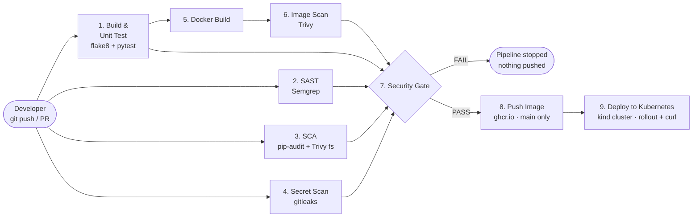
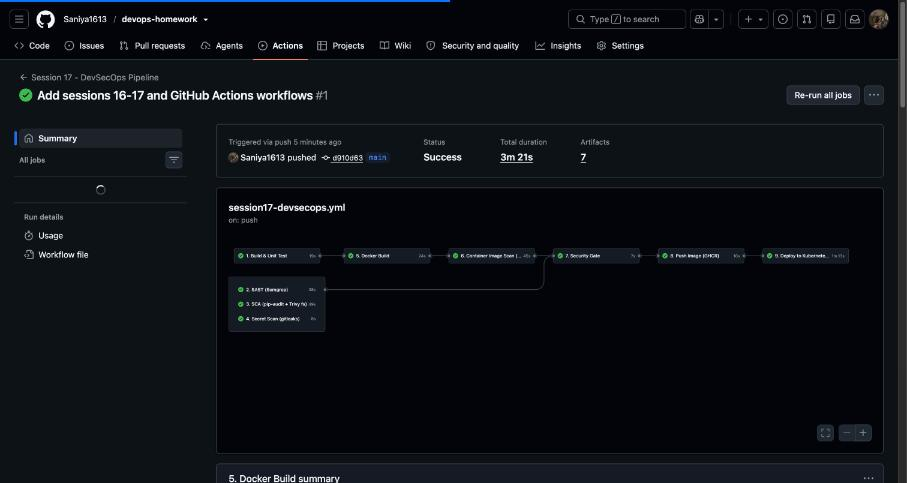

# Session 17 – DevSecOps Homework

**Name:** Saniya Sanjiv Patil · **Roll No:** 24bcs10246 · **Batch:** B

A complete **CI/CD + DevSecOps pipeline** for a Python Flask app ("DevSecOps Dashboard", adapted from the instructor demo `devops-heros/session-17-devsecops/demo`). Security is built into every stage ("shift left"): the code, the dependencies, the repository and the container image are scanned automatically, and a **security gate** decides whether the image may be pushed and deployed to Kubernetes.

```
Code → Build → Unit Test → SAST → SCA → Secret Scan → Docker Build → Image Scan → Security Gate → Push Image → Deploy to Kubernetes
```

| Item | File |
|---|---|
| GitHub Actions workflow (repo root, required by GitHub) | [`.github/workflows/session17-devsecops.yml`](../.github/workflows/session17-devsecops.yml) |
| Flask app + UI | [`app/app.py`](./app/app.py), [`app/templates/`](./app/templates), [`app/static/`](./app/static) |
| Unit tests | [`tests/test_app.py`](./tests/test_app.py) |
| Dockerfile (alpine, non-root, no pip) | [`Dockerfile`](./Dockerfile) |
| Kubernetes manifests | [`k8s/namespace.yaml`](./k8s/namespace.yaml), [`k8s/deployment.yaml`](./k8s/deployment.yaml), [`k8s/service.yaml`](./k8s/service.yaml) |
| SAST rules (Semgrep) | [`.semgrep.yml`](./.semgrep.yml) |
| Secret-scan config (gitleaks) | [`.gitleaks.toml`](./.gitleaks.toml) |
| Accepted vulnerabilities (Trivy) | [`.trivyignore`](./.trivyignore) |
| Security gate policy | [`scripts/security_gate.py`](./scripts/security_gate.py) |

## Contents
1. [Pipeline flow](#1-pipeline-flow)
2. [Security stages explained](#2-security-stages-explained)
3. [Kubernetes manifests (secure deployment)](#3-kubernetes-manifests-secure-deployment)
4. [The GitHub Actions workflow](#4-the-github-actions-workflow)
5. [Local run of the whole pipeline](#5-local-run-of-the-whole-pipeline)
6. [Proof that the gate blocks insecure code](#6-proof-that-the-gate-blocks-insecure-code)
7. [Pipeline execution on GitHub Actions](#pipeline-execution-on-github-actions)

---

## 1. Pipeline flow



* Jobs 1–4 run **in parallel** (fast feedback); the image is built once (job 5), scanned (job 6), and the **same tested image** (passed between jobs as an artifact) is pushed and deployed.
* Every scanner writes a JSON report that is uploaded as an artifact. The **gate** downloads all reports and applies one policy – a scan *finds* problems, the gate *decides*.
* The push and deploy jobs depend on the gate (`needs: security-gate` / `needs: push`), so an insecure build can never reach the registry or the cluster.

---

## 2. Security stages explained

| # | Stage | Tool | What it finds | Policy in the gate |
|---|---|---|---|---|
| 1 | Build & Unit Test | flake8, pytest + coverage | style errors, broken functionality | job must pass (it is a `needs:` of the gate) |
| 2 | **SAST** – Static Application Security Testing | **Semgrep** (`p/python`, `p/flask`, `p/secrets` + my [`.semgrep.yml`](./.semgrep.yml)) | insecure **source code**: `debug=True`, `shell=True`, `eval`, hard-coded passwords, disabled TLS verification … | block on any `ERROR` finding |
| 3 | **SCA** – Software Composition Analysis | **pip-audit** (PyPI advisory DB) + **Trivy fs** | known CVEs in **third-party dependencies** (`requirements.txt`) | block on any pip-audit vuln / Trivy HIGH-CRITICAL with a fix |
| 4 | **Secret scanning** | **gitleaks** ([`.gitleaks.toml`](./.gitleaks.toml)) | committed **credentials**: AWS keys, GitHub tokens, private keys, passwords | block on any secret |
| 5 | Docker Build | `docker/build-push-action@v6` | – (creates the image: `python:3.12-alpine`, pip removed, non-root UID 10001) | – |
| 6 | **Container image scanning** | **Trivy image** | CVEs in the **OS packages** (alpine apk) and the Python packages **inside the image** | block on HIGH/CRITICAL with a fix |
| 7 | **Security gate** | [`scripts/security_gate.py`](./scripts/security_gate.py) | reads all reports, prints a summary table | exit 1 = pipeline stops; a missing report also fails |
| 8 | Push image | GHCR with `GITHUB_TOKEN` (`packages: write`) | – | only on `main`, only after the gate passed |
| 9 | Deploy | kind cluster in the runner, `kubectl apply`, rollout, curl | – | hardened manifests (see §3) |

**Why both pip-audit and Trivy fs?** They use different vulnerability databases (PyPI/OSV vs. Aqua's DB), so together they miss less. **Why `--ignore-unfixed`?** The gate should only block on problems the developer can actually fix by upgrading; unfixed CVEs are tracked in the reports and, if accepted, documented in `.trivyignore` with a reason.

**Hardening done so the gate passes (instead of ignoring findings):**
* `python:3.12-alpine` base (small, few packages) and **pip uninstalled** from the final image (pip is not needed at runtime and often carries CVEs).
* Every dependency pinned, including transitive ones ([`requirements.txt`](./requirements.txt)), so scan results are reproducible.
* Flask `debug=True` removed from the original demo (the Werkzeug debugger = remote code execution); production server is **gunicorn**.
* Container runs as UID 10001, no shell secrets, configuration through environment variables.

---

## 3. Kubernetes manifests (secure deployment)

**[`k8s/deployment.yaml`](./k8s/deployment.yaml)**

```yaml
apiVersion: apps/v1
kind: Deployment
metadata:
  name: session17-devsecops
  namespace: s17-devsecops
  labels:
    app: session17-devsecops
spec:
  replicas: 2
  selector:
    matchLabels:
      app: session17-devsecops
  template:
    metadata:
      labels:
        app: session17-devsecops
    spec:
      automountServiceAccountToken: false     # the app never talks to the k8s API
      securityContext:
        runAsNonRoot: true
        runAsUser: 10001
        runAsGroup: 10001
        fsGroup: 10001
        seccompProfile:
          type: RuntimeDefault
      containers:
        - name: app
          # CI replaces this with the scanned image of the current commit
          image: session17-devsecops:1.0.0
          imagePullPolicy: IfNotPresent
          ports:
            - name: http
              containerPort: 5001
          env:
            - name: APP_VERSION
              value: "2.0.0"
          securityContext:
            allowPrivilegeEscalation: false
            readOnlyRootFilesystem: true
            capabilities:
              drop: ["ALL"]
          readinessProbe:
            httpGet:
              path: /health
              port: http
            initialDelaySeconds: 3
            periodSeconds: 5
          livenessProbe:
            httpGet:
              path: /health
              port: http
            initialDelaySeconds: 10
            periodSeconds: 10
            failureThreshold: 3
          resources:
            requests:
              cpu: 50m
              memory: 64Mi
            limits:
              cpu: 250m
              memory: 192Mi
          volumeMounts:
            - name: tmp               # gunicorn worker heartbeat files (root fs is read-only)
              mountPath: /tmp
      volumes:
        - name: tmp
          emptyDir:
            medium: Memory
            sizeLimit: 16Mi
```

**[`k8s/service.yaml`](./k8s/service.yaml)** and **[`k8s/namespace.yaml`](./k8s/namespace.yaml)** (Pod Security Admission `restricted` – the API server itself rejects pods that are not hardened):

```yaml
apiVersion: v1
kind: Service
metadata:
  name: session17-devsecops
  namespace: s17-devsecops
spec:
  type: NodePort
  selector:
    app: session17-devsecops
  ports:
    - name: http
      port: 80
      targetPort: http
      nodePort: 31700
---
apiVersion: v1
kind: Namespace
metadata:
  name: s17-devsecops
  labels:
    session: "17"
    # Pod Security Admission: reject pods that do not follow the "restricted" profile
    pod-security.kubernetes.io/enforce: restricted
    pod-security.kubernetes.io/enforce-version: latest
```

| Setting | Why |
|---|---|
| `runAsNonRoot: true`, `runAsUser: 10001` | container cannot run as root even if the image were changed |
| `allowPrivilegeEscalation: false`, `capabilities.drop: [ALL]` | no setuid / no Linux capabilities |
| `readOnlyRootFilesystem: true` + `emptyDir` on `/tmp` | an attacker cannot modify the app files; gunicorn only writes heartbeat files to `/tmp` |
| `seccompProfile: RuntimeDefault` | filters dangerous syscalls |
| `automountServiceAccountToken: false` | no Kubernetes API token inside the pod |
| readiness + liveness probes on `/health` | traffic only to ready pods, hung pods are restarted |
| requests/limits | protects the node from a runaway pod |

---

## 4. The GitHub Actions workflow

File: [`.github/workflows/session17-devsecops.yml`](../.github/workflows/session17-devsecops.yml). Triggers: `push`/`pull_request` on `main` filtered with `paths:` to this folder, plus `workflow_dispatch`. All `run:` steps default to `working-directory: session-17-devsecops`. Scanners are pinned versions (Semgrep 1.179.0, pip-audit 2.10.1, `aquasec/trivy:0.75.0`, `zricethezav/gitleaks:v8.30.1`) – exactly the versions I used locally, so local and CI results match. No secrets are needed: the push uses the automatic `GITHUB_TOKEN`.

```yaml
# Session 17 – DevSecOps pipeline
# Saniya Sanjiv Patil (24bcs10246)
#
# Code -> Build & Unit Test -> SAST (Semgrep) -> SCA (pip-audit + Trivy fs) -> Secret scan (gitleaks)
#      -> Docker build -> Image scan (Trivy) -> SECURITY GATE -> Push (GHCR, main only) -> Deploy (Kubernetes / kind)
name: Session 17 - DevSecOps Pipeline

on:
  push:
    branches: [main]
    paths:
      - "session-17-devsecops/**"
      - ".github/workflows/session17-devsecops.yml"
  pull_request:
    branches: [main]
    paths:
      - "session-17-devsecops/**"
      - ".github/workflows/session17-devsecops.yml"
  workflow_dispatch:

permissions:
  contents: read

concurrency:
  group: session17-${{ github.ref }}
  cancel-in-progress: true

env:
  APP_DIR: session-17-devsecops
  IMAGE_NAME: session17-devsecops
  PYTHON_VERSION: "3.12"
  TRIVY_IMAGE: aquasec/trivy:0.75.0
  GITLEAKS_IMAGE: zricethezav/gitleaks:v8.30.1
  SEMGREP_VERSION: "1.179.0"
  PIP_AUDIT_VERSION: "2.10.1"

defaults:
  run:
    working-directory: session-17-devsecops

jobs:
  # ------------------------------------------------------------------ 1. Build & unit test
  build-test:
    name: 1. Build & Unit Test
    runs-on: ubuntu-latest
    steps:
      - name: Checkout code
        uses: actions/checkout@v4
      - name: Setup Python
        uses: actions/setup-python@v5
        with:
          python-version: ${{ env.PYTHON_VERSION }}
          cache: pip
          cache-dependency-path: session-17-devsecops/requirements-dev.txt
      - name: Install dependencies
        run: pip install -r requirements-dev.txt
      - name: Lint (flake8)
        run: flake8 .
      - name: Unit tests + coverage
        run: pytest -v --cov=app --cov-report=term --junitxml=reports/junit.xml
      - name: Upload test report
        if: always()
        uses: actions/upload-artifact@v4
        with:
          name: s17-test-report
          path: session-17-devsecops/reports/junit.xml

  # ------------------------------------------------------------------ 2. SAST
  sast:
    name: 2. SAST (Semgrep)
    runs-on: ubuntu-latest
    permissions:
      contents: read
      security-events: write      # upload SARIF to the Security tab (Code scanning)
    steps:
      - uses: actions/checkout@v4
      - uses: actions/setup-python@v5
        with:
          python-version: ${{ env.PYTHON_VERSION }}
      - name: Install Semgrep
        run: pip install "semgrep==${SEMGREP_VERSION}"
      - name: Semgrep scan
        run: |
          mkdir -p reports
          semgrep scan --metrics=off --exclude tests \
            --config p/python --config p/flask --config p/secrets --config .semgrep.yml \
            --json -o reports/semgrep.json --sarif-output=reports/semgrep.sarif
          semgrep scan --metrics=off --exclude tests \
            --config p/python --config p/flask --config p/secrets --config .semgrep.yml
      - name: Upload SARIF to GitHub code scanning
        if: always()
        continue-on-error: true   # code scanning may be unavailable on some repos – the gate uses the JSON report
        uses: github/codeql-action/upload-sarif@v3
        with:
          sarif_file: session-17-devsecops/reports/semgrep.sarif
          category: semgrep
      - uses: actions/upload-artifact@v4
        if: always()
        with:
          name: s17-report-sast
          path: session-17-devsecops/reports/semgrep.json

  # ------------------------------------------------------------------ 3. SCA
  sca:
    name: 3. SCA (pip-audit + Trivy fs)
    runs-on: ubuntu-latest
    steps:
      - uses: actions/checkout@v4
      - uses: actions/setup-python@v5
        with:
          python-version: ${{ env.PYTHON_VERSION }}
      - name: pip-audit (PyPI advisory database)
        run: |
          pip install "pip-audit==${PIP_AUDIT_VERSION}"
          mkdir -p reports
          pip-audit -r requirements.txt -f json -o reports/pip-audit.json || true
          pip-audit -r requirements.txt || true
      - name: Trivy filesystem scan (dependencies)
        run: |
          docker run --rm -v "$PWD":/src -w /src "$TRIVY_IMAGE" fs --quiet --scanners vuln \
            --severity HIGH,CRITICAL --ignore-unfixed --format json -o reports/trivy-fs.json .
          docker run --rm -v "$PWD":/src -w /src "$TRIVY_IMAGE" fs --quiet --scanners vuln \
            --severity HIGH,CRITICAL --ignore-unfixed .
      - uses: actions/upload-artifact@v4
        if: always()
        with:
          name: s17-report-sca
          path: |
            session-17-devsecops/reports/pip-audit.json
            session-17-devsecops/reports/trivy-fs.json

  # ------------------------------------------------------------------ 4. Secret scanning
  secret-scan:
    name: 4. Secret Scan (gitleaks)
    runs-on: ubuntu-latest
    steps:
      - uses: actions/checkout@v4
      - name: gitleaks
        run: |
          mkdir -p reports
          docker run --rm -v "$PWD":/src -w /src "$GITLEAKS_IMAGE" dir . \
            --config .gitleaks.toml --redact --verbose \
            --report-format json --report-path reports/gitleaks.json --exit-code 0
      - uses: actions/upload-artifact@v4
        if: always()
        with:
          name: s17-report-secrets
          path: session-17-devsecops/reports/gitleaks.json

  # ------------------------------------------------------------------ 5. Docker build
  docker-build:
    name: 5. Docker Build
    runs-on: ubuntu-latest
    needs: build-test
    steps:
      - uses: actions/checkout@v4
      - name: Compute image name (GHCR needs lowercase)
        run: echo "IMAGE=ghcr.io/${GITHUB_REPOSITORY_OWNER,,}/${IMAGE_NAME}:${GITHUB_SHA}" >> "$GITHUB_ENV"
      - name: Build image
        uses: docker/build-push-action@v6
        with:
          context: session-17-devsecops
          load: true
          push: false
          tags: ${{ env.IMAGE }}
          labels: |
            org.opencontainers.image.source=${{ github.server_url }}/${{ github.repository }}
            org.opencontainers.image.revision=${{ github.sha }}
      - name: Save image
        run: docker save "$IMAGE" -o /tmp/s17-image.tar
      - uses: actions/upload-artifact@v4
        with:
          name: s17-docker-image
          path: /tmp/s17-image.tar
          retention-days: 1

  # ------------------------------------------------------------------ 6. Container image scan
  image-scan:
    name: 6. Container Image Scan (Trivy)
    runs-on: ubuntu-latest
    needs: docker-build
    steps:
      - uses: actions/checkout@v4
      - run: echo "IMAGE=ghcr.io/${GITHUB_REPOSITORY_OWNER,,}/${IMAGE_NAME}:${GITHUB_SHA}" >> "$GITHUB_ENV"
      - uses: actions/download-artifact@v4
        with:
          name: s17-docker-image
          path: /tmp
      - name: Load image
        run: docker load -i /tmp/s17-image.tar
      - name: Trivy image scan
        run: |
          mkdir -p reports
          docker run --rm -v /var/run/docker.sock:/var/run/docker.sock -v "$PWD":/src -w /src "$TRIVY_IMAGE" \
            image --quiet --scanners vuln --severity HIGH,CRITICAL --ignore-unfixed \
            --format json -o reports/trivy-image.json "$IMAGE"
          docker run --rm -v /var/run/docker.sock:/var/run/docker.sock "$TRIVY_IMAGE" \
            image --quiet --scanners vuln --severity HIGH,CRITICAL --ignore-unfixed "$IMAGE"
      - uses: actions/upload-artifact@v4
        if: always()
        with:
          name: s17-report-image
          path: session-17-devsecops/reports/trivy-image.json

  # ------------------------------------------------------------------ 7. Security gate
  security-gate:
    name: 7. Security Gate
    runs-on: ubuntu-latest
    needs: [build-test, sast, sca, secret-scan, image-scan]
    steps:
      - uses: actions/checkout@v4
      - name: Download all security reports
        uses: actions/download-artifact@v4
        with:
          pattern: s17-report-*
          merge-multiple: true
          path: session-17-devsecops/reports
      - name: Evaluate policy (fail on HIGH/CRITICAL, secrets, SAST errors)
        run: python3 scripts/security_gate.py reports

  # ------------------------------------------------------------------ 8. Push image
  push:
    name: 8. Push Image (GHCR)
    runs-on: ubuntu-latest
    needs: security-gate
    if: github.event_name != 'pull_request' && github.ref == 'refs/heads/main'
    permissions:
      contents: read
      packages: write
    steps:
      - run: echo "IMAGE=ghcr.io/${GITHUB_REPOSITORY_OWNER,,}/${IMAGE_NAME}" >> "$GITHUB_ENV"
        working-directory: .
      - uses: actions/download-artifact@v4
        with:
          name: s17-docker-image
          path: /tmp
      - name: Load image
        run: docker load -i /tmp/s17-image.tar
        working-directory: .
      - name: Log in to GHCR
        uses: docker/login-action@v3
        with:
          registry: ghcr.io
          username: ${{ github.actor }}
          password: ${{ secrets.GITHUB_TOKEN }}
      - name: Push (commit SHA + latest)
        working-directory: .
        run: |
          docker tag "$IMAGE:${GITHUB_SHA}" "$IMAGE:latest"
          docker push "$IMAGE:${GITHUB_SHA}"
          docker push "$IMAGE:latest"

  # ------------------------------------------------------------------ 9. Deploy
  deploy:
    name: 9. Deploy to Kubernetes (kind)
    runs-on: ubuntu-latest
    needs: push
    steps:
      - uses: actions/checkout@v4
      - run: echo "IMAGE=ghcr.io/${GITHUB_REPOSITORY_OWNER,,}/${IMAGE_NAME}:${GITHUB_SHA}" >> "$GITHUB_ENV"
      - uses: actions/download-artifact@v4
        with:
          name: s17-docker-image
          path: /tmp
      - name: Create kind cluster
        uses: helm/kind-action@v1
        with:
          cluster_name: s17-kind
      - name: Load the scanned image into kind
        run: |
          docker load -i /tmp/s17-image.tar
          kind load docker-image "$IMAGE" --name s17-kind
      - name: Deploy
        run: |
          kubectl apply -f k8s/namespace.yaml
          sed "s#image: session17-devsecops:1.0.0#image: ${IMAGE}#" k8s/deployment.yaml | kubectl apply -f -
          kubectl apply -f k8s/service.yaml
          kubectl -n s17-devsecops rollout status deployment/session17-devsecops --timeout=180s
          kubectl -n s17-devsecops get deploy,pods,svc -o wide
      - name: Verify (port-forward + curl)
        run: |
          kubectl -n s17-devsecops port-forward svc/session17-devsecops 8080:80 >/tmp/pf.log 2>&1 &
          for _ in $(seq 1 20); do curl -fsS http://localhost:8080/health && break; sleep 1; done
          echo
          curl -fsS http://localhost:8080/api/status
          echo
          kubectl -n s17-devsecops get pod -l app=session17-devsecops \
            -o jsonpath='{range .items[*]}{.metadata.name}{"  runAsNonRoot="}{.spec.securityContext.runAsNonRoot}{"  readOnlyRootFilesystem="}{.spec.containers[0].securityContext.readOnlyRootFilesystem}{"\n"}{end}'
```

Workflow validated with **actionlint**:

```console
saniya@saniya-devops:~/devops-homework//mnt/user-data/outputs/devops-homework$ docker run --rm -v "$PWD":/repo -w /repo rhysd/actionlint:latest .github/workflows/session17-devsecops.yml && echo 'actionlint: OK'
actionlint: OK
```

---

## 5. Local run of the whole pipeline

> **Local run:** I executed every stage on my machine with the same tools and versions as the workflow (Python 3.12 venv, Semgrep, pip-audit, Trivy 0.75.0 and gitleaks 8.30.1 via their official Docker images, Docker, Kubernetes). Output below is real. Kubernetes namespace `s17-devsecops`, NodePort `31700`.

### Tool versions
```console
saniya@saniya-devops:~/devops-homework/session-17-devsecops$ python --version; semgrep --version; pip-audit --version; trivy --version | head -1; gitleaks version
Python 3.12.3
1.179.0
pip-audit 2.10.1
Version: 0.75.0
v8.30.1
```

### Stage 1 – Build & unit test

```console
saniya@saniya-devops:~/devops-homework/session-17-devsecops$ pip install -q -r requirements-dev.txt && flake8 . && echo 'flake8: no issues'
flake8: no issues
```

```console
saniya@saniya-devops:~/devops-homework/session-17-devsecops$ pytest -v --cov=app --cov-report=term --junitxml=reports/junit.xml
============================= test session starts ==============================
testpaths: tests
collecting ... collected 10 items

tests/test_app.py::test_home PASSED                                      [ 10%]
tests/test_app.py::test_health PASSED                                    [ 20%]
tests/test_app.py::test_greet PASSED                                     [ 30%]
tests/test_app.py::test_add_numbers PASSED                               [ 40%]
tests/test_app.py::test_add_numbers_missing_fields PASSED                [ 50%]
tests/test_app.py::test_calculator_multiply PASSED                       [ 60%]
tests/test_app.py::test_calculator_divide_by_zero PASSED                 [ 70%]
tests/test_app.py::test_status PASSED                                    [ 80%]
tests/test_app.py::test_not_found PASSED                                 [ 90%]
tests/test_app.py::test_calculator_unknown_operation PASSED              [100%]

- generated xml file: /mnt/attach/outputs/devops-homework/session-17-devsecops/reports/junit.xml -
================================ tests coverage ================================
_______________ coverage: platform linux, python 3.12.3-final-0 ________________

Name              Stmts   Miss  Cover
-------------------------------------
app/__init__.py       0      0   100%
app/app.py          104     30    71%
-------------------------------------
TOTAL               104     30    71%
============================== 10 passed in 0.93s ==============================
```

### Stage 2 – SAST (Semgrep)

```console
saniya@saniya-devops:~/devops-homework/session-17-devsecops$ semgrep scan --metrics=off --exclude tests --config p/python --config p/flask --config p/secrets --config .semgrep.yml --json -o reports/semgrep.json
│ Scan Status │
└─────────────┘
  Scanning 23 files tracked by git with 207 Code rules:
  Language      Rules   Files          Origin      Rules                                                                
 ─────────────────────────────        ───────────────────                                                               
  <multilang>      36      23          Community     202                                                                
  yaml              1       4          Custom          5                                                                
  python          156       3                                                                                           
  js                5       1                                                                                           
┌──────────────┐
│ Scan Summary │
└──────────────┘
✅ Scan completed successfully.
 • Findings: 0 (0 blocking)
 • Rules run: 198
 • Targets scanned: 23
 • Parsed lines: ~100.0%
 • Scan skipped: 
   ◦ Matching --exclude patterns: 1
 • For a detailed list of skipped files and lines, run semgrep with the --verbose flag
Ran 198 rules on 23 files: 0 findings.
```

### Stage 3 – SCA (pip-audit + Trivy fs)

```console
saniya@saniya-devops:~/devops-homework/session-17-devsecops$ pip-audit -r requirements.txt -f json -o reports/pip-audit.json; pip-audit -r requirements.txt
No known vulnerabilities found
No known vulnerabilities found
```

```console
saniya@saniya-devops:~/devops-homework/session-17-devsecops$ trivy fs --quiet --scanners vuln --severity HIGH,CRITICAL --ignore-unfixed --format json -o reports/trivy-fs.json . && trivy fs --quiet --scanners vuln --severity HIGH,CRITICAL --ignore-unfixed .

Report Summary

┌──────────────────┬──────┬─────────────────┐
│      Target      │ Type │ Vulnerabilities │
├──────────────────┼──────┼─────────────────┤
│ requirements.txt │ pip  │        0        │
└──────────────────┴──────┴─────────────────┘
Legend:
- '-': Not scanned
- '0': Clean (no security findings detected)

```

### Stage 4 – Secret scan (gitleaks)

```console
saniya@saniya-devops:~/devops-homework/session-17-devsecops$ gitleaks dir . --config .gitleaks.toml --redact --report-format json --report-path reports/gitleaks.json --exit-code 0

    ○
    │╲
    │ ○
    ○ ░
    ░    gitleaks

4:31PM INF scanned ~99297 bytes (99.30 KB) in 115ms
4:31PM INF no leaks found
```

### Stage 5 – Docker build

```console
saniya@saniya-devops:~/devops-homework/session-17-devsecops$ docker build -t session17-devsecops:1.0.0 .
#1 [internal] load build definition from Dockerfile
#1 DONE 0.2s
#2 [internal] load metadata for docker.io/library/python:3.12-alpine
#2 DONE 0.0s
#3 [internal] load .dockerignore
#3 DONE 0.0s
#4 [1/6] FROM docker.io/library/python:3.12-alpine@sha256:1b668429b3511ab407d8e00648891631b0b1a4d7e15e3ca70f38ab5b91ad4ab4
#4 DONE 0.0s
#5 [internal] load build context
#5 DONE 0.3s
#6 [2/6] WORKDIR /app
#7 [3/6] COPY requirements.txt .
#8 [4/6] RUN pip install --no-cache-dir -r requirements.txt  && pip uninstall -y pip  && rm -rf /usr/local/lib/python3.12/ensurepip
#9 [5/6] COPY app ./app
#10 [6/6] RUN addgroup -S -g 10001 appgroup && adduser -S -D -H -u 10001 -G appgroup appuser
#11 naming to docker.io/library/session17-devsecops:1.0.0 done
#11 DONE 0.8s
```

```console
saniya@saniya-devops:~/devops-homework/session-17-devsecops$ docker images session17-devsecops
IMAGE                       ID             DISK USAGE   CONTENT SIZE   EXTRA
session17-devsecops:1.0.0   a7d52bbf5cbf       93.3MB         22.9MB        
```

```console
saniya@saniya-devops:~/devops-homework/session-17-devsecops$ docker run --rm --entrypoint sh session17-devsecops:1.0.0 -c 'id; which pip || echo "pip: not present"'
uid=10001(appuser) gid=10001(appgroup) groups=10001(appgroup)
pip: not present
```

### Stage 6 – Container image scan (Trivy)

```console
saniya@saniya-devops:~/devops-homework/session-17-devsecops$ trivy image --quiet --scanners vuln --severity HIGH,CRITICAL --ignore-unfixed --format json -o reports/trivy-image.json session17-devsecops:1.0.0 && trivy image --quiet --scanners vuln --severity HIGH,CRITICAL --ignore-unfixed session17-devsecops:1.0.0

Report Summary

┌──────────────────────────────────────────────────────────────────────────────┬────────────┬─────────────────┐
│                                    Target                                    │    Type    │ Vulnerabilities │
├──────────────────────────────────────────────────────────────────────────────┼────────────┼─────────────────┤
│ session17-devsecops:1.0.0 (alpine 3.24.2)                                    │   alpine   │        0        │
├──────────────────────────────────────────────────────────────────────────────┼────────────┼─────────────────┤
│ usr/local/lib/python3.12/site-packages/blinker-1.9.0.dist-info/METADATA      │ python-pkg │        0        │
├──────────────────────────────────────────────────────────────────────────────┼────────────┼─────────────────┤
│ usr/local/lib/python3.12/site-packages/click-8.5.0.dist-info/METADATA        │ python-pkg │        0        │
├──────────────────────────────────────────────────────────────────────────────┼────────────┼─────────────────┤
│ usr/local/lib/python3.12/site-packages/flask-3.1.3.dist-info/METADATA        │ python-pkg │        0        │
├──────────────────────────────────────────────────────────────────────────────┼────────────┼─────────────────┤
│ usr/local/lib/python3.12/site-packages/gunicorn-26.2.0.dist-info/METADATA    │ python-pkg │        0        │
├──────────────────────────────────────────────────────────────────────────────┼────────────┼─────────────────┤
│ usr/local/lib/python3.12/site-packages/itsdangerous-2.2.0.dist-info/METADATA │ python-pkg │        0        │
├──────────────────────────────────────────────────────────────────────────────┼────────────┼─────────────────┤
│ usr/local/lib/python3.12/site-packages/jinja2-3.1.6.dist-info/METADATA       │ python-pkg │        0        │
├──────────────────────────────────────────────────────────────────────────────┼────────────┼─────────────────┤
│ usr/local/lib/python3.12/site-packages/markupsafe-3.0.4.dist-info/METADATA   │ python-pkg │        0        │
├──────────────────────────────────────────────────────────────────────────────┼────────────┼─────────────────┤
│ usr/local/lib/python3.12/site-packages/werkzeug-3.1.9.dist-info/METADATA     │ python-pkg │        0        │
└──────────────────────────────────────────────────────────────────────────────┴────────────┴─────────────────┘
Legend:
- '-': Not scanned
- '0': Clean (no security findings detected)

```

For comparison, all severities (informational only – LOW/MEDIUM do not block):

```console
saniya@saniya-devops:~/devops-homework/session-17-devsecops$ trivy image --quiet --scanners vuln --format json session17-devsecops:1.0.0 | jq -c '[.Results[].Vulnerabilities[]? | {id: .VulnerabilityID, pkg: .PkgName, severity: .Severity, fixed: .FixedVersion}]'
[{"id":"CVE-2026-85091","pkg":"zlib","severity":"MEDIUM","fixed":"1.3.2-r1"}]
```

### Stage 7 – Security gate

```console
saniya@saniya-devops:~/devops-homework/session-17-devsecops$ ls reports/ && python3 scripts/security_gate.py reports; echo "exit code: $?"
gitleaks.json
junit.xml
pip-audit.json
semgrep.json
trivy-fs.json
trivy-image.json
Stage    Tool         Result  Details
------------------------------------------------------------------------
SAST     Semgrep      PASS    0 finding(s), 0 ERROR
SCA      pip-audit    PASS    8 package(s) audited, 0 vulnerable
SCA      Trivy fs     PASS    0 vulnerabilities
Secrets  gitleaks     PASS    0 secret(s) found
Image    Trivy image  PASS    0 vulnerabilities
------------------------------------------------------------------------
SECURITY GATE: PASSED - image may be pushed and deployed
exit code: 0
```

### Stage 8 – Push image
Pushing to `ghcr.io` uses the workflow's `GITHUB_TOKEN`, so it is executed only on GitHub Actions (see the run below), not locally.

### Stage 9 – Deploy to Kubernetes
Target: my local k3s cluster. The image is imported into the cluster's container runtime (on the runner the workflow uses `kind load docker-image` for the same purpose):

```console
saniya@saniya-devops:~/devops-homework/session-17-devsecops$ docker save session17-devsecops:1.0.0 | k3s ctr images import -
unpacking docker.io/library/session17-devsecops:1.0.0 (sha256:a7d52bbf5cbfa72aec9af71fee60dbfb5c113a6c523368508b9d1b78e95f56bb)...done
```

```console
saniya@saniya-devops:~/devops-homework/session-17-devsecops$ kubectl apply -f k8s/namespace.yaml && kubectl apply -f k8s/deployment.yaml -f k8s/service.yaml
namespace/s17-devsecops created
deployment.apps/session17-devsecops created
service/session17-devsecops created
```

```console
saniya@saniya-devops:~/devops-homework/session-17-devsecops$ kubectl -n s17-devsecops rollout status deployment/session17-devsecops --timeout=150s
Waiting for deployment "session17-devsecops" rollout to finish: 0 of 2 updated replicas are available...
Waiting for deployment "session17-devsecops" rollout to finish: 1 of 2 updated replicas are available...
deployment "session17-devsecops" successfully rolled out
```

```console
saniya@saniya-devops:~/devops-homework/session-17-devsecops$ kubectl -n s17-devsecops get deploy,pods,svc -o wide
NAME                                  READY   UP-TO-DATE   AVAILABLE   AGE   CONTAINERS   IMAGES                      SELECTOR
deployment.apps/session17-devsecops   2/2     2            2           6s    app          session17-devsecops:1.0.0   app=session17-devsecops

NAME                                       READY   STATUS    RESTARTS   AGE   IP            NODE         NOMINATED NODE   READINESS GATES
pod/session17-devsecops-7dc64fdfc8-jhxkx   1/1     Running   0          6s    10.42.0.209   saniya-k8s   <none>           <none>
pod/session17-devsecops-7dc64fdfc8-nhw8c   1/1     Running   0          6s    10.42.0.208   saniya-k8s   <none>           <none>

NAME                          TYPE       CLUSTER-IP      EXTERNAL-IP   PORT(S)        AGE   SELECTOR
service/session17-devsecops   NodePort   10.43.246.144   <none>        80:31700/TCP   6s    app=session17-devsecops
```

```console
saniya@saniya-devops:~/devops-homework/session-17-devsecops$ kubectl -n s17-devsecops get pod -l app=session17-devsecops -o jsonpath='{range .items[*]}{.metadata.name}{"  runAsNonRoot="}{.spec.securityContext.runAsNonRoot}{"  runAsUser="}{.spec.securityContext.runAsUser}{"  readOnlyRootFilesystem="}{.spec.containers[0].securityContext.readOnlyRootFilesystem}{"\n"}{end}'
session17-devsecops-7dc64fdfc8-jhxkx  runAsNonRoot=true  runAsUser=10001  readOnlyRootFilesystem=true
session17-devsecops-7dc64fdfc8-nhw8c  runAsNonRoot=true  runAsUser=10001  readOnlyRootFilesystem=true
```

```console
saniya@saniya-devops:~/devops-homework/session-17-devsecops$ kubectl -n s17-devsecops exec deploy/session17-devsecops -- sh -c 'id; touch /app/hacked || echo write to /app blocked'
uid=10001(appuser) gid=10001(appgroup) groups=10001(appgroup)
write to /app blocked
touch: /app/hacked: Read-only file system
```

```console
saniya@saniya-devops:~/devops-homework/session-17-devsecops$ curl -s http://192.0.2.2:31700/health; echo; curl -s http://192.0.2.2:31700/api/status; echo; curl -s http://192.0.2.2:31700/api/greet/Saniya
{"status":"healthy","timestamp":"2026-10-07T16:31:47.873492Z","uptime_seconds":0.7}

{"app":"DevSecOps Dashboard","platform":"Linux","python_version":"3.12.15","status":"running","timestamp":"2026-10-07T16:31:47.896718Z","total_requests":1,"uptime":"00h 00m 00s","version":"2.0.0"}

{"message":"What's up, Saniya! Happy coding! \ud83d\udcbb","name":"Saniya","timestamp":"2026-10-07T16:31:47.916509Z"}
```

```console
saniya@saniya-devops:~/devops-homework/session-17-devsecops$ kubectl -n s17-devsecops port-forward svc/session17-devsecops 31702:80 >/dev/null & sleep 3; curl -s -X POST localhost:31702/api/calculate -H 'Content-Type: application/json' -d '{"a":17,"b":3,"operation":"multiply"}'; echo
{"a":17.0,"b":3.0,"expression":"17.0 \u00d7 3.0 = 51.0","operation":"multiply","result":51.0,"symbol":"\u00d7"}

```

Pod Security Admission (`restricted`) in action – a root/privileged pod is rejected by the API server in this namespace:

```console
saniya@saniya-devops:~/devops-homework/session-17-devsecops$ kubectl -n s17-devsecops run root-test --image=nginx:1.27-alpine --overrides='{"spec":{"containers":[{"name":"root-test","image":"nginx:1.27-alpine","securityContext":{"privileged":true}}]}}'
Error from server (Forbidden): pods "root-test" is forbidden: violates PodSecurity "restricted:latest": privileged (container "root-test" must not set securityContext.privileged=true), allowPrivilegeEscalation != false (container "root-test" must set securityContext.allowPrivilegeEscalation=false), unrestricted capabilities (container "root-test" must set securityContext.capabilities.drop=["ALL"]), runAsNonRoot != true (pod or container "root-test" must set securityContext.runAsNonRoot=true), seccompProfile (pod or container "root-test" must set securityContext.seccompProfile.type to "RuntimeDefault" or "Localhost")
```

**Observation:** all security stages are clean (0 SAST errors, 0 vulnerable dependencies, 0 HIGH/CRITICAL in the image, 0 secrets), so the gate passes and the hardened image runs in Kubernetes as UID 10001 with a read-only root filesystem.

---

## 6. Proof that the gate blocks insecure code

A gate that always passes proves nothing. So I created a **throw-away insecure copy** of the app (not part of the repo) with typical mistakes:
* `requirements.txt` with old `Flask==2.2.0` / `Werkzeug==2.2.2`,
* `app.run(..., debug=True)`,
* `app/config.py` with a hard-coded password, a fake AWS access key and `subprocess.run(..., shell=True)`.

and ran the same scanners + gate on it:

```console
saniya@saniya-devops:~/devops-homework/session-17-devsecops$ cat app/config.py | sed -E 's/AKIA[0-9A-Z]{16}/AKIA****************/g; s/(PASSWORD|SECRET_ACCESS_KEY)( = ")[^"]+/\1\2********/g'   # (insecure copy)
import subprocess
DB_PASSWORD = "********"
AWS_ACCESS_KEY_ID = "AKIA****************"
AWS_SECRET_ACCESS_KEY = "********"


def ping(host):
    return subprocess.run("ping -c 1 " + host, shell=True)
```

```console
saniya@saniya-devops:~/devops-homework/session-17-devsecops$ semgrep scan --metrics=off --config p/python --config p/flask --config p/secrets --config .semgrep.yml --json -o reports/semgrep.json; semgrep scan --metrics=off --config p/python --config p/flask --config p/secrets --config .semgrep.yml | sed -E 's/AKIA[0-9A-Z]{16}/AKIA****************/g; s/(PASSWORD|SECRET_ACCESS_KEY)( = ")[^"]+/\1\2********/g'   # (insecure copy)
│ 9 Code Findings │
    app/app.py
   ❯❯❱ flask-debug-enabled
          ❰❰ Blocking ❱❱
          Flask app started with debug=True – the Werkzeug debugger allows remote code execution.
          244┆ app.run(host="0.0.0.0", port=5001, debug=True)
    ❯❱ python.flask.security.audit.app-run-param-config.avoid_app_run_with_bad_host
          ❰❰ Blocking ❱❱
          Running flask app with host 0.0.0.0 could expose the server publicly.
          244┆ app.run(host="0.0.0.0", port=5001, debug=True)
    ❯❱ python.flask.security.audit.debug-enabled.debug-enabled
          ❰❰ Blocking ❱❱
          Detected Flask app with debug=True. Do not deploy to production with this flag enabled as it will   
          leak sensitive information. Instead, consider using Flask configuration variables or setting 'debug'
          using system environment variables.                                                                 
          244┆ app.run(host="0.0.0.0", port=5001, debug=True)
    app/config.py
   ❯❯❱ hardcoded-secret-assignment
          ❰❰ Blocking ❱❱
          Possible hard-coded credential – load secrets from environment variables / Kubernetes Secrets.
            2┆ DB_PASSWORD = "********"
   ❯❯❱ generic.secrets.security.detected-aws-access-key-id-value.detected-aws-access-key-id-value
          ❰❰ Blocking ❱❱
          AWS Access Key ID Value detected. This is a sensitive credential and should not be hardcoded here.
          Instead, read this value from an environment variable or keep it in a separate, private file.     
            3┆ AWS_ACCESS_KEY_ID = "AKIA****************"
   ❯❯❱ generic.secrets.security.detected-aws-secret-access-key.detected-aws-secret-access-key
          ❰❰ Blocking ❱❱
          AWS Secret Access Key detected
            4┆ AWS_SECRET_ACCESS_KEY = "********"
   ❯❯❱ hardcoded-secret-assignment
          ❰❰ Blocking ❱❱
          Possible hard-coded credential – load secrets from environment variables / Kubernetes Secrets.
            4┆ AWS_SECRET_ACCESS_KEY = "********"
   ❯❯❱ subprocess-shell-true
          ❰❰ Blocking ❱❱
          subprocess called with shell=True – command injection risk.
            8┆ return subprocess.run("ping -c 1 " + host, shell=True)
   ❯❯❱ python.lang.security.audit.subprocess-shell-true.subprocess-shell-true
          ❰❰ Blocking ❱❱
          Found 'subprocess' function 'run' with 'shell=True'. This is dangerous because this call will spawn
          the command using a shell process. Doing so propagates current shell settings and variables, which 
          makes it much easier for a malicious actor to execute commands. Use 'shell=False' instead.         
           ▶▶┆ Autofix ▶ False
            8┆ return subprocess.run("ping -c 1 " + host, shell=True)
```

```console
saniya@saniya-devops:~/devops-homework/session-17-devsecops$ pip-audit -r requirements.txt -f json -o reports/pip-audit.json; pip-audit -r requirements.txt   # (insecure copy)
Found 23 known vulnerabilities in 2 packages
Name     Version ID              Fix Versions
-------- ------- --------------- ------------
flask    2.2.0   PYSEC-2023-62   2.2.5,2.3.2
flask    2.2.0   PYSEC-2023-62   2.2.5,2.3.2
flask    2.2.0   PYSEC-2026-2151 3.1.3
flask    2.2.0   PYSEC-2026-2151 3.1.3
werkzeug 2.2.2   PYSEC-2023-57   2.2.3
werkzeug 2.2.2   PYSEC-2023-58   2.2.3
werkzeug 2.2.2   PYSEC-2023-58   2.2.3
werkzeug 2.2.2   PYSEC-2023-57   2.2.3
werkzeug 2.2.2   PYSEC-2023-221  2.3.8,3.0.1
werkzeug 2.2.2   PYSEC-2023-221  2.3.8,3.0.1
werkzeug 2.2.2   PYSEC-2026-2043 3.0.3
werkzeug 2.2.2   PYSEC-2026-2045 3.0.6
werkzeug 2.2.2   PYSEC-2026-1860 3.0.6
werkzeug 2.2.2   PYSEC-2026-2046 3.1.4
werkzeug 2.2.2   PYSEC-2026-2044 3.1.5
werkzeug 2.2.2   PYSEC-2026-2320 3.1.6
werkzeug 2.2.2   PYSEC-2026-2046 3.1.4
werkzeug 2.2.2   PYSEC-2026-2045 3.0.6
werkzeug 2.2.2   PYSEC-2026-2044 3.1.5
werkzeug 2.2.2   PYSEC-2026-2043 3.0.3
werkzeug 2.2.2   PYSEC-2026-2320 3.1.6
werkzeug 2.2.2   PYSEC-2026-3417 3.0.6
werkzeug 2.2.2   CVE-2026-102598 3.1.9
```

```console
saniya@saniya-devops:~/devops-homework/session-17-devsecops$ trivy fs --quiet --scanners vuln --severity HIGH,CRITICAL --ignore-unfixed --format json -o reports/trivy-fs.json . && trivy fs --quiet --scanners vuln --severity HIGH,CRITICAL --ignore-unfixed --format table . | grep -E 'Total|CVE'   # (insecure copy)
Total: 3 (HIGH: 3, CRITICAL: 0)
│ Flask    │ CVE-2023-30861 │ HIGH     │ fixed  │ 2.2.0             │ 2.3.2, 2.2.5  │ flask: Possible disclosure of permanent session cookie due  │
│ Werkzeug │ CVE-2023-25577 │          │        │ 2.2.2             │ 2.2.3         │ python-werkzeug: high resource usage when parsing multipart │
│          │ CVE-2024-34069 │          │        │                   │ 3.0.3         │ python-werkzeug: user may execute code on a developer's     │
```

```console
saniya@saniya-devops:~/devops-homework/session-17-devsecops$ gitleaks dir . --config .gitleaks.toml --redact --report-format json --report-path reports/gitleaks.json --exit-code 0 -v | sed -E 's/AKIA[0-9A-Z]{16}/AKIA****************/g; s/(PASSWORD|SECRET_ACCESS_KEY)( = ")[^"]+/\1\2********/g'   # (insecure copy)
    ░    gitleaks
Finding:     ...WS_ACCESS_KEY_ID = "REDACTED
Secret:      REDACTED
RuleID:      aws-access-token
File:        app/config.py
Line:        3
Finding:     AWS_SECRET_ACCESS_KEY = "********"
Secret:      REDACTED
RuleID:      generic-api-key
File:        app/config.py
Line:        4
Finding:     DB_PASSWORD = "********"
Secret:      REDACTED
RuleID:      hardcoded-password-assignment
File:        app/config.py
Line:        2
4:32PM INF scanned ~43554 bytes (43.55 KB) in 23.1ms
4:32PM WRN leaks found: 3
```

The image of the insecure copy was not built, so its image report is missing – which the gate also treats as a failure:

```console
saniya@saniya-devops:~/devops-homework/session-17-devsecops$ python3 scripts/security_gate.py reports; echo "exit code: $?"   # (insecure copy)
Stage    Tool         Result  Details
------------------------------------------------------------------------
SAST     Semgrep      FAIL    9 finding(s), 7 ERROR
SCA      pip-audit    FAIL    6 package(s) audited, 23 vulnerable
SCA      Trivy fs     FAIL    HIGH=3
Secrets  gitleaks     FAIL    3 secret(s) found
Image    Trivy image  FAIL    report trivy-image.json missing -> scan did not run
------------------------------------------------------------------------
SECURITY GATE: FAILED - pipeline stopped, image will NOT be pushed or deployed
exit code: 1
```

**Result:** SAST, SCA and secret scanning all detect the planted problems and the gate exits with code `1`. In GitHub Actions this fails the `7. Security Gate` job, so `8. Push Image` and `9. Deploy` are skipped – the insecure version never reaches the registry or the cluster.

---

## Pipeline execution on GitHub Actions

✅ **Real run on GitHub Actions – [run #1](https://github.com/Saniya1613/devops-homework/actions/runs/37653425360): Status Success, all 9 jobs green (Build & Unit Test, SAST, SCA, Secret Scan → Docker Build → Container Image Scan → Security Gate → Push Image (GHCR) → Deploy to Kubernetes (kind)), 7 artifacts, total 3m 21s.**



---

## Summary
* 9-stage pipeline: build/test → SAST (Semgrep) → SCA (pip-audit, Trivy fs) → secret scan (gitleaks) → Docker build → image scan (Trivy) → **security gate** → push to GHCR → deploy to Kubernetes.
* Clean app passes every gate (local output above); an insecure copy is blocked by the same gate.
* Kubernetes deployment hardened: non-root, read-only root FS, dropped capabilities, seccomp, probes, resource limits, PSA `restricted` namespace.
