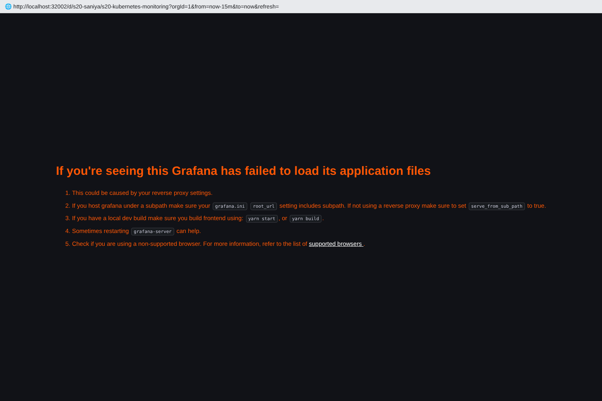
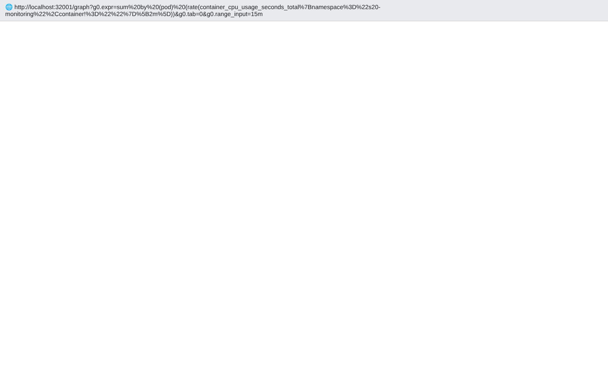
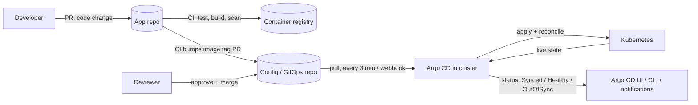

# Session 20 – Monitoring, Observability & GitOps Homework

**Name:** Saniya Sanjiv Patil · **Roll No:** 24bcs10246 · **Batch:** B

All command output below is real output from my terminal (single-node k3s cluster `saniya-k8s`). The reference material is the instructor's `session20-monitoring-observability-gitops` folder. I adapted the `08-mini-project` app manifests and the Argo CD `Application` from it.

| Folder / file | Purpose |
|---|---|
| [`monitoring/prometheus-values.yaml`](./monitoring/prometheus-values.yaml) | Helm values for a lightweight Prometheus with my **alert rules** |
| [`monitoring/grafana-values.yaml`](./monitoring/grafana-values.yaml) | Helm values for Grafana (Prometheus datasource pre-provisioned) |
| [`monitoring/sample-app.yaml`](./monitoring/sample-app.yaml) | Sample app (`podinfo`, with `/metrics` and probes) plus a `cpu-stress` pod used to trigger an alert |
| [`monitoring/grafana-dashboard.json`](./monitoring/grafana-dashboard.json) | Dashboard (CPU, memory, health, alerts), created through the Grafana HTTP API |
| [`gitops/argocd/guestbook-application.yaml`](./gitops/argocd/guestbook-application.yaml) | Argo CD Application used in the live demo |
| [`gitops/apps/`](./gitops/apps) + [`gitops/argocd/saniya-app-application.yaml`](./gitops/argocd/saniya-app-application.yaml) | My own GitOps app source, which Argo CD can use once this repo is on GitHub |
| [`screenshots/`](./screenshots) | Prometheus, Grafana and Argo CD UI screenshots |

---

## Task 1 – Monitoring

**Goal:** show metrics, logs, alerts, CPU utilization, memory utilization and application health for workloads running in Kubernetes.

**Stack (installed with Helm into namespace `s20-monitoring`):**

```
 podinfo pods ──/metrics──┐
 cAdvisor (kubelet) ──────┤
 node-exporter ───────────┼──► Prometheus server ──► alert rules (pending → firing)
 kube-state-metrics ──────┘          ▲
                                     │ PromQL
                                  Grafana dashboards
 kubectl logs  ◄── container stdout/stderr        kubectl top ◄── metrics-server
```

* **Prometheus** (`prometheus-community/prometheus` chart): the server, `kube-state-metrics` (object state such as pod ready and resource limits) and `node-exporter` (node CPU and RAM). I disabled Alertmanager and Pushgateway to keep the stack small. Prometheus still evaluates the alert rules and exposes them at `/alerts` and `/api/v1/alerts`.
* **Grafana** (`grafana/grafana` chart): Prometheus is provisioned as the default datasource. Anonymous *Viewer* access is enabled only so the dashboard can be screenshotted.
* Pods with the annotation `prometheus.io/scrape: "true"` are discovered automatically by the `kubernetes-pods` scrape job.

Alert rules (from `prometheus-values.yaml`):

| Alert | Expression (short) | Shows |
|---|---|---|
| `HighPodCPU` | `rate(container_cpu_usage_seconds_total[1m]) > 0.1` for 1m | CPU utilization |
| `HighPodMemory` | `container_memory_working_set_bytes > 200Mi` for 1m | memory utilization |
| `AppTargetDown` | `up{job="kubernetes-pods"} == 0` | app `/metrics` endpoint health |
| `PodNotReady` | `kube_pod_status_ready{condition="false"} == 1` | readiness-probe health |

### 1.1 Install Prometheus + Grafana with Helm

```console
saniya@saniya-devops:~/devops-homework/session-20-monitoring-observability-gitops$ helm repo add prometheus-community https://prometheus-community.github.io/helm-charts && helm repo add grafana https://grafana.github.io/helm-charts && helm repo update
WARNING: Kubernetes configuration file is group-readable. This is insecure. Location: /etc/rancher/k3s/k3s.yaml
WARNING: Kubernetes configuration file is world-readable. This is insecure. Location: /etc/rancher/k3s/k3s.yaml
NAME                	URL                                               
prometheus-community	https://prometheus-community.github.io/helm-charts
grafana             	https://grafana.github.io/helm-charts             
```

```console
saniya@saniya-devops:~/devops-homework/session-20-monitoring-observability-gitops$ helm upgrade --install prometheus prometheus-community/prometheus -n s20-monitoring --create-namespace -f monitoring/prometheus-values.yaml
WARNING: Kubernetes configuration file is group-readable. This is insecure. Location: /etc/rancher/k3s/k3s.yaml
WARNING: Kubernetes configuration file is world-readable. This is insecure. Location: /etc/rancher/k3s/k3s.yaml
Release "prometheus" does not exist. Installing it now.
NAME: prometheus
LAST DEPLOYED: Wed Oct  7 16:50:05 2026
NAMESPACE: s20-monitoring
```

```console
saniya@saniya-devops:~/devops-homework/session-20-monitoring-observability-gitops$ helm upgrade --install grafana grafana/grafana -n s20-monitoring -f monitoring/grafana-values.yaml
WARNING: Kubernetes configuration file is group-readable. This is insecure. Location: /etc/rancher/k3s/k3s.yaml
WARNING: Kubernetes configuration file is world-readable. This is insecure. Location: /etc/rancher/k3s/k3s.yaml
Release "grafana" does not exist. Installing it now.
WARNING: This chart is deprecated
NAME: grafana
LAST DEPLOYED: Wed Oct  7 16:50:07 2026
```

### 1.2 Deploy the sample application

```console
saniya@saniya-devops:~/devops-homework/session-20-monitoring-observability-gitops$ kubectl apply -f monitoring/sample-app.yaml
deployment.apps/podinfo created
service/podinfo created
pod/cpu-stress created
```

```console
saniya@saniya-devops:~/devops-homework/session-20-monitoring-observability-gitops$ helm list -n s20-monitoring
WARNING: Kubernetes configuration file is group-readable. This is insecure. Location: /etc/rancher/k3s/k3s.yaml
WARNING: Kubernetes configuration file is world-readable. This is insecure. Location: /etc/rancher/k3s/k3s.yaml
NAME      	NAMESPACE     	REVISION	UPDATED                                	STATUS  	CHART             	APP VERSION
grafana   	s20-monitoring	1       	2026-10-07 16:50:07.694162504 +0000 UTC	deployed	grafana-10.5.15   	12.3.1     
prometheus	s20-monitoring	1       	2026-10-07 16:50:05.058529701 +0000 UTC	deployed	prometheus-29.35.0	v3.15.0    
```

```console
saniya@saniya-devops:~/devops-homework/session-20-monitoring-observability-gitops$ kubectl get pods,svc -n s20-monitoring -o wide
NAME                                                 READY   STATUS                 RESTARTS   AGE
pod/cpu-stress                                       1/1     Running                0          86s
pod/grafana-5584f5c7b5-pnxqc                         1/1     Running                0          87s
pod/podinfo-7bc767768-jsxlr                          1/1     Running                0          86s
pod/podinfo-7bc767768-t6ndh                          1/1     Running                0          87s
pod/prometheus-kube-state-metrics-86f694b949-kv8w2   1/1     Running                0          90s
pod/prometheus-prometheus-node-exporter-kfhsq        0/1     CreateContainerError   0          90s
pod/prometheus-server-6c7fddcc5b-xd65b               2/2     Running                0          90s

NAME                                          TYPE        CLUSTER-IP      EXTERNAL-IP   PORT(S)    AGE
service/grafana                               ClusterIP   10.43.198.25    <none>        80/TCP     87s
service/podinfo                               ClusterIP   10.43.65.68     <none>        9898/TCP   87s
service/prometheus-kube-state-metrics         ClusterIP   10.43.247.215   <none>        8080/TCP   90s
service/prometheus-prometheus-node-exporter   ClusterIP   10.43.60.173    <none>        9100/TCP   90s
service/prometheus-server                     ClusterIP   10.43.213.148   <none>        80/TCP     90s
```

Wait for the alert rules to go **pending → firing** (`for: 1m`)…

### 1.3 Metrics – scrape targets

The Prometheus API/UI is reached through a port-forward (kept running in the background):

```bash
kubectl port-forward -n s20-monitoring svc/prometheus-server 32001:80 &
kubectl port-forward -n s20-monitoring svc/grafana 32002:80 &
```

```console
saniya@saniya-devops:~/devops-homework/session-20-monitoring-observability-gitops$ curl -s localhost:32001/api/v1/targets | jq -r '.data.activeTargets[] | [.labels.job, (.labels.pod // .labels.instance), .health] | @tsv' | sort | column -t
bash: line 1: column: command not found
```

### 1.4 CPU utilization (PromQL via the HTTP API)

CPU cores used per pod (cAdvisor metric `container_cpu_usage_seconds_total`):

```console
saniya@saniya-devops:~/devops-homework/session-20-monitoring-observability-gitops$ curl -s localhost:32001/api/v1/query --data-urlencode 'query=sum by (pod) (rate(container_cpu_usage_seconds_total{namespace="s20-monitoring",container!=""}[2m]))' | jq -r '.data.result[] | "\(.metric.pod)\t\(.value[1] | tonumber * 1000 | floor)m"'
grafana-5584f5c7b5-pnxqc	3m
prometheus-kube-state-metrics-86f694b949-kv8w2	2m
podinfo-7bc767768-t6ndh	1m
podinfo-7bc767768-jsxlr	1m
prometheus-server-6c7fddcc5b-xd65b	17m
cpu-stress	88m
```

Node CPU utilization % (node-exporter):

```console
saniya@saniya-devops:~/devops-homework/session-20-monitoring-observability-gitops$ curl -s localhost:32001/api/v1/query --data-urlencode 'query=100 - avg(rate(node_cpu_seconds_total{mode="idle"}[2m])) * 100' | jq -r '.data.result[] | "node CPU used: \(.value[1] | tonumber | floor)%"'
```

CPU usage as % of the pod's CPU **limit** (cAdvisor + kube-state-metrics):

```console
saniya@saniya-devops:~/devops-homework/session-20-monitoring-observability-gitops$ curl -s localhost:32001/api/v1/query --data-urlencode 'query=sum by (pod) (rate(container_cpu_usage_seconds_total{namespace="s20-monitoring",container!=""}[2m])) / sum by (pod) (kube_pod_container_resource_limits{namespace="s20-monitoring",resource="cpu"}) * 100' | jq -r '.data.result[] | "\(.metric.pod)\t\(.value[1] | tonumber | floor)% of limit"'
podinfo-7bc767768-t6ndh	0% of limit
podinfo-7bc767768-jsxlr	0% of limit
cpu-stress	58% of limit
```

### 1.5 Memory utilization

```console
saniya@saniya-devops:~/devops-homework/session-20-monitoring-observability-gitops$ curl -s localhost:32001/api/v1/query --data-urlencode 'query=sum by (pod) (container_memory_working_set_bytes{namespace="s20-monitoring",container!=""})' | jq -r '.data.result[] | "\(.metric.pod)\t\(.value[1] | tonumber / 1048576 | floor) MiB"'
grafana-5584f5c7b5-pnxqc	78 MiB
prometheus-kube-state-metrics-86f694b949-kv8w2	17 MiB
podinfo-7bc767768-t6ndh	16 MiB
podinfo-7bc767768-jsxlr	16 MiB
prometheus-server-6c7fddcc5b-xd65b	272 MiB
cpu-stress	0 MiB
```

```console
saniya@saniya-devops:~/devops-homework/session-20-monitoring-observability-gitops$ curl -s localhost:32001/api/v1/query --data-urlencode 'query=(1 - node_memory_MemAvailable_bytes / node_memory_MemTotal_bytes) * 100' | jq -r '.data.result[] | "node memory used: \(.value[1] | tonumber | floor)%"'
```

Same numbers from the Metrics API (`metrics-server`):

```console
saniya@saniya-devops:~/devops-homework/session-20-monitoring-observability-gitops$ kubectl top nodes
NAME         CPU(cores)   CPU%   MEMORY(bytes)   MEMORY%   
saniya-k8s   573m         28%    2855Mi          35%       
```

```console
saniya@saniya-devops:~/devops-homework/session-20-monitoring-observability-gitops$ kubectl top pods -n s20-monitoring
NAME                                             CPU(cores)   MEMORY(bytes)   
cpu-stress                                       150m         0Mi             
grafana-5584f5c7b5-pnxqc                         3m           92Mi            
podinfo-7bc767768-jsxlr                          1m           16Mi            
podinfo-7bc767768-t6ndh                          1m           17Mi            
prometheus-kube-state-metrics-86f694b949-kv8w2   1m           17Mi            
prometheus-server-6c7fddcc5b-xd65b               16m          271Mi           
```

### 1.6 Application metrics + health

podinfo exposes its own Prometheus metrics; request rate by status code:

```console
saniya@saniya-devops:~/devops-homework/session-20-monitoring-observability-gitops$ curl -s localhost:32001/api/v1/query --data-urlencode 'query=sum by (status) (rate(http_request_duration_seconds_count{namespace="s20-monitoring"}[2m]))' | jq -r '.data.result[] | "status=\(.metric.status)\t\(.value[1] | tonumber * 100 | floor / 100) req/s"'
status=200	0.73 req/s
status=null	0.06 req/s
status=500	0 req/s
```

Health of every scraped application pod (`up` = 1 means the /metrics endpoint answered):

```console
saniya@saniya-devops:~/devops-homework/session-20-monitoring-observability-gitops$ curl -s localhost:32001/api/v1/query --data-urlencode 'query=up{job="kubernetes-pods"}' | jq -r '.data.result[] | "\(.metric.pod)\tup=\(.value[1])"'
traefik-5fb479b77-brj6l	up=1
podinfo-7bc767768-t6ndh	up=1
podinfo-7bc767768-jsxlr	up=1
```

```console
saniya@saniya-devops:~/devops-homework/session-20-monitoring-observability-gitops$ curl -s localhost:32001/api/v1/query --data-urlencode 'query=kube_pod_status_ready{namespace="s20-monitoring",condition="true"}' | jq -r '.data.result[] | "\(.metric.pod)\tready=\(.value[1])"'
prometheus-server-6c7fddcc5b-xd65b	ready=1
podinfo-7bc767768-jsxlr	ready=1
podinfo-7bc767768-t6ndh	ready=1
prometheus-prometheus-node-exporter-kfhsq	ready=0
cpu-stress	ready=1
prometheus-kube-state-metrics-86f694b949-kv8w2	ready=1
grafana-5584f5c7b5-pnxqc	ready=1
```

Liveness/readiness probes configured on the app:

```console
saniya@saniya-devops:~/devops-homework/session-20-monitoring-observability-gitops$ kubectl describe pod -n s20-monitoring -l app=podinfo | grep -E '^Name:|Liveness|Readiness' 
Name:             podinfo-7bc767768-jsxlr
    Liveness:     http-get http://:9898/healthz delay=5s timeout=1s period=10s #success=1 #failure=3
    Readiness:    http-get http://:9898/readyz delay=3s timeout=1s period=5s #success=1 #failure=3
Name:             podinfo-7bc767768-t6ndh
    Liveness:     http-get http://:9898/healthz delay=5s timeout=1s period=10s #success=1 #failure=3
    Readiness:    http-get http://:9898/readyz delay=3s timeout=1s period=5s #success=1 #failure=3
```

### 1.7 Alerts

Alert rules are loaded from [`monitoring/prometheus-values.yaml`](./monitoring/prometheus-values.yaml) (`serverFiles.alerting_rules.yml`):

```console
saniya@saniya-devops:~/devops-homework/session-20-monitoring-observability-gitops$ curl -s localhost:32001/api/v1/rules | jq -r '.data.groups[].rules[] | [.name, .state, .health] | @tsv' | column -t
bash: line 1: column: command not found
```

The `cpu-stress` pod burns CPU up to its 150m limit, so **HighPodCPU** fires:

```console
saniya@saniya-devops:~/devops-homework/session-20-monitoring-observability-gitops$ curl -s localhost:32001/api/v1/alerts | jq -r '.data.alerts[] | [.labels.alertname, .state, .labels.pod, .annotations.summary] | @tsv'
HighPodCPU	pending	cpu-stress	Pod cpu-stress is using more than 100m CPU
HighPodMemory	firing	prometheus-server-6c7fddcc5b-xd65b	Pod prometheus-server-6c7fddcc5b-xd65b uses more than 200Mi memory
PodNotReady	firing	prometheus-prometheus-node-exporter-kfhsq	Pod prometheus-prometheus-node-exporter-kfhsq is not Ready (readiness probe failing)
```

**Application health alert:** podinfo has a built-in endpoint that makes its readiness probe fail. I call it on one pod:

```console
saniya@saniya-devops:~/devops-homework/session-20-monitoring-observability-gitops$ kubectl exec -n s20-monitoring podinfo-7bc767768-jsxlr -- wget -qO- --post-data='' http://localhost:9898/readyz/disable

```

```console
saniya@saniya-devops:~/devops-homework/session-20-monitoring-observability-gitops$ kubectl get pods -n s20-monitoring -l app=podinfo
NAME                      READY   STATUS    RESTARTS   AGE
podinfo-7bc767768-jsxlr   0/1     Running   0          2m56s
podinfo-7bc767768-t6ndh   1/1     Running   0          2m57s
```

```console
saniya@saniya-devops:~/devops-homework/session-20-monitoring-observability-gitops$ kubectl get events -n s20-monitoring --field-selector involvedObject.name=podinfo-7bc767768-jsxlr,reason=Unhealthy
LAST SEEN   TYPE      REASON      OBJECT                        MESSAGE
1s          Warning   Unhealthy   pod/podinfo-7bc767768-jsxlr   Readiness probe failed: HTTP probe failed with statuscode: 503
```

```console
saniya@saniya-devops:~/devops-homework/session-20-monitoring-observability-gitops$ curl -s localhost:32001/api/v1/alerts | jq -r '.data.alerts[] | [.labels.alertname, .state, .labels.pod] | @tsv'
HighPodCPU	pending	cpu-stress
HighPodMemory	firing	prometheus-server-6c7fddcc5b-xd65b
PodNotReady	pending	podinfo-7bc767768-jsxlr
PodNotReady	firing	prometheus-prometheus-node-exporter-kfhsq
```


```console
saniya@saniya-devops:~/devops-homework/session-20-monitoring-observability-gitops$ kubectl exec -n s20-monitoring podinfo-7bc767768-jsxlr -- wget -qO- --post-data='' http://localhost:9898/readyz/enable   # recover

```

### 1.8 Logs

```console
saniya@saniya-devops:~/devops-homework/session-20-monitoring-observability-gitops$ kubectl logs -n s20-monitoring podinfo-7bc767768-jsxlr --tail=6
Error from server: Get "https://192.0.2.2:10250/containerLogs/s20-monitoring/podinfo-7bc767768-jsxlr/podinfo?tailLines=6": EOF
```

```console
saniya@saniya-devops:~/devops-homework/session-20-monitoring-observability-gitops$ kubectl logs -n s20-monitoring deploy/prometheus-server -c prometheus-server --tail=4
Error from server: Get "https://192.0.2.2:10250/containerLogs/s20-monitoring/prometheus-server-6c7fddcc5b-xd65b/prometheus-server?tailLines=4": EOF
```

### 1.9 Grafana dashboard

```console
saniya@saniya-devops:~/devops-homework/session-20-monitoring-observability-gitops$ curl -s -u admin:Saniya@123 -H 'Content-Type: application/json' -X POST localhost:32002/api/dashboards/db -d @monitoring/grafana-dashboard.json | jq
{"folderUid":"","id":1,"slug":"s20-kubernetes-monitoring","status":"success","uid":"s20-saniya","url":"/d/s20-saniya/s20-kubernetes-monitoring","version":1}
```

```console
saniya@saniya-devops:~/devops-homework/session-20-monitoring-observability-gitops$ curl -s localhost:32002/api/datasources -u admin:Saniya@123 | jq -r '.[] | [.name, .type, .url] | @tsv'
Prometheus	prometheus	http://prometheus-server.s20-monitoring.svc.cluster.local
```

**Screenshots**






**Observation:**
* **Metrics:** Prometheus pulls `/metrics` from the app (podinfo), the kubelet/cAdvisor (container CPU and memory), node-exporter (node) and kube-state-metrics (object state). PromQL turns the raw counters into rates and percentages.
* **CPU/Memory:** `rate(container_cpu_usage_seconds_total[2m])` gives the cores used, and dividing by `kube_pod_container_resource_limits` gives the % of the limit. Memory uses `container_memory_working_set_bytes`. Both match what `kubectl top` reports.
* **Alerts:** a rule is *inactive* → *pending* (condition true but `for:` not yet elapsed) → *firing*. With Alertmanager enabled, firing alerts would be routed to Slack or e-mail.
* **Health:** liveness/readiness probes let Kubernetes restart or stop routing to bad pods. `up` and `kube_pod_status_ready` make that health visible and alertable. Disabling readiness on one pod removed it from the Service endpoints (`READY 0/1`) and raised `PodNotReady`.
* **Logs:** `kubectl logs` reads the container's stdout. Centralised logging (Loki, ELK) is described in Task 2.

---

## Task 2 – Observability

### Monitoring vs observability

| | Monitoring | Observability |
|---|---|---|
| Question | "**Is** something wrong?" (known failure modes) | "**Why** is it wrong?" (unknown unknowns) |
| Approach | Predefined dashboards and threshold alerts | Explore rich telemetry and correlate signals |
| Data | Mostly metrics | Metrics + logs + traces (+ events, profiles) |
| Example | Alert: CPU > 80 % | Follow one slow request through 6 services to the slow SQL query |

Monitoring is a **subset** of observability. A system is *observable* when you can understand its internal state from the outputs it produces.

### The three pillars

| Pillar | What it is | Example | Best for | Typical tools |
|---|---|---|---|---|
| **Metrics** | Numeric time series (counter, gauge, histogram) with labels, cheap to store | `http_requests_total{status="500"}`, CPU cores, p95 latency | Trends, dashboards, alerting, capacity planning | Prometheus, Grafana, Datadog, CloudWatch |
| **Logs** | Timestamped, discrete event records (ideally structured JSON) | `{"level":"error","msg":"db timeout","task_id":42}` | Root-cause detail, auditing, debugging a specific event | Loki + Promtail, ELK/EFK (Elasticsearch, Fluentd/Fluent Bit, Kibana), Splunk |
| **Traces** | The path of one request across services: a tree of *spans* with timing, linked by a trace ID | `frontend → api (120ms) → postgres (95ms)` | Latency breakdown and dependency maps in microservices | OpenTelemetry, Jaeger, Grafana Tempo, Zipkin, AWS X-Ray |

The pillars are most useful when **correlated**: an alert fires on a metric (p95 latency up), an exemplar or trace ID on that metric jumps to the slow trace, and the trace ID in the log lines shows the exact error.

### Why observability is required

* **Distributed systems fail in new ways.** With microservices, containers and autoscaling, a request crosses many components, and pods come and go, so you cannot SSH in and look around.
* **Faster incident response (lower MTTD/MTTR).** You find *where* and *why* quickly instead of guessing.
* **SLOs and error budgets.** You can measure availability and latency the way users experience them.
* **Capacity and cost.** Right-size requests and limits and HPA targets from real usage.
* **Safe delivery.** Verify a canary or new release with real signals and roll back automatically if it degrades.
* **Security and audit.** Logs and audit events show who did what.

### Common tools

| Category | Tools |
|---|---|
| Metrics and alerting | Prometheus, Alertmanager, Thanos/Mimir (long-term), VictoriaMetrics |
| Visualisation | Grafana, Kibana |
| Logs | Loki + Promtail/Alloy, Elasticsearch + Fluent Bit/Fluentd + Kibana (EFK), OpenSearch |
| Tracing | OpenTelemetry (SDK + Collector), Jaeger, Tempo, Zipkin |
| All-in-one / SaaS | Datadog, New Relic, Dynatrace, Grafana Cloud, AWS CloudWatch + X-Ray |
| Kubernetes-specific | metrics-server (`kubectl top`), kube-state-metrics, node-exporter, kube-prometheus-stack (Prometheus Operator, ServiceMonitor/PrometheusRule CRDs), Pixie/eBPF tools |

### Observability in Kubernetes

| Layer | Signal | Source |
|---|---|---|
| Cluster/node | CPU, memory, disk, network | node-exporter, kubelet `/metrics/resource` |
| Containers | CPU/memory per container, throttling, OOM | cAdvisor (in kubelet) |
| Kubernetes objects | desired vs available replicas, pod phase, restarts, ready | kube-state-metrics |
| Applications | business and HTTP metrics, `/health`, `/ready` | app `/metrics` (Prometheus client), probes |
| Logs | stdout/stderr of every container in `/var/log/pods` | `kubectl logs`, DaemonSet log shippers (Promtail, Fluent Bit) → Loki/Elasticsearch |
| Traces | spans | OpenTelemetry SDK in the app → OTel Collector (DaemonSet/Deployment) → Jaeger/Tempo |
| Events | scheduling, probe failures, evictions | `kubectl get events`, event exporters |

Kubernetes-native patterns: **ServiceMonitor/PodMonitor** CRDs (Prometheus Operator) or `prometheus.io/*` annotations for auto-discovery; **PrometheusRule** CRDs for alerts; **liveness/readiness/startup probes** for self-healing; **HPA** driven by the same metrics. Labels (`namespace`, `pod`, `app`) tie metrics, logs and traces together.

---

## Task 3 – GitOps

### 3.1 What is GitOps?
GitOps is an operating model for delivering infrastructure and applications in which **the desired state of the whole system is declared in Git**, and an **automated agent running in the cluster** continuously makes the live state match it. A deployment becomes a Git commit or merge request, so you do not run `kubectl apply` or `helm upgrade` from a laptop or CI job.

The four OpenGitOps principles: **declarative**, **versioned and immutable**, **pulled automatically**, **continuously reconciled**.

### 3.2 Git as the single source of truth
* Every change (image tag, replica count, config) is a **commit**, so you get history, `git blame`, review through pull requests, and approvals.
* **Rollback = `git revert`**. The agent brings the cluster back to the previous state.
* Disaster recovery: an empty cluster plus the Git repo plus the GitOps agent recreates everything.
* Drift is visible: anything in the cluster that is not in Git is shown as *OutOfSync*.

### 3.3 Declarative configuration
You describe **what** you want (YAML manifests, Helm charts, Kustomize overlays: "3 replicas of image v1.2"), not **how** to get there. Kubernetes is already declarative, and GitOps applies the same idea to the deployment process itself.

### 3.4 Continuous reconciliation
The GitOps controller runs a control loop: **observe** live state → **diff** against Git → **act** (sync). Argo CD polls the repo every 3 minutes by default, or reacts to webhooks, and compares every few seconds. With `selfHeal: true` manual changes are reverted. With `prune: true` resources deleted from Git are deleted from the cluster.

### 3.5 GitOps workflow



**Push-based CI/CD vs pull-based GitOps**

| | Push (CI runs `kubectl apply`) | Pull (GitOps agent) |
|---|---|---|
| Cluster credentials | Stored in the CI system | Stay inside the cluster |
| Drift detection | None | Continuous; self-heal |
| Audit / rollback | CI logs | Git history / `git revert` |
| Multi-cluster | One pipeline per cluster | Every cluster pulls its own path |

### 3.6 Kubernetes + GitOps
Kubernetes fits GitOps well: its API is declarative, it has its own reconciliation loops, and everything is a YAML object. Tools: **Argo CD** (UI, Applications, ApplicationSets, sync waves and hooks) and **Flux CD** (GitOps Toolkit controllers, Kustomize/Helm controllers). A typical repo layout uses one folder per environment or app (`apps/`, `envs/dev`, `envs/prod`) with Helm or Kustomize overlays, and Argo CD `Application`s point at those paths.

### 3.7 Install Argo CD

```console
saniya@saniya-devops:~/devops-homework/session-20-monitoring-observability-gitops$ kubectl create namespace argocd
namespace/argocd created
```

```console
saniya@saniya-devops:~/devops-homework/session-20-monitoring-observability-gitops$ kubectl apply -n argocd --server-side -f https://raw.githubusercontent.com/argoproj/argo-cd/stable/manifests/install.yaml
customresourcedefinition.apiextensions.k8s.io/applications.argoproj.io serverside-applied
customresourcedefinition.apiextensions.k8s.io/applicationsets.argoproj.io serverside-applied
customresourcedefinition.apiextensions.k8s.io/appprojects.argoproj.io serverside-applied
deployment.apps/argocd-applicationset-controller serverside-applied
deployment.apps/argocd-dex-server serverside-applied
deployment.apps/argocd-notifications-controller serverside-applied
deployment.apps/argocd-redis serverside-applied
deployment.apps/argocd-repo-server serverside-applied
deployment.apps/argocd-server serverside-applied
statefulset.apps/argocd-application-controller serverside-applied
```

To save RAM on the small lab VM I scale down the components this demo does not need (Dex SSO, notifications, ApplicationSet):

```console
saniya@saniya-devops:~/devops-homework/session-20-monitoring-observability-gitops$ kubectl scale -n argocd deploy argocd-dex-server argocd-notifications-controller argocd-applicationset-controller --replicas=0
deployment.apps/argocd-dex-server scaled
deployment.apps/argocd-notifications-controller scaled
deployment.apps/argocd-applicationset-controller scaled
```

```console
saniya@saniya-devops:~/devops-homework/session-20-monitoring-observability-gitops$ kubectl get pods -n argocd
NAME                                  READY   STATUS    RESTARTS   AGE
argocd-application-controller-0       1/1     Running   0          32s
argocd-redis-69b79945b4-f7hsf         1/1     Running   0          32s
argocd-repo-server-54dcc5956f-pk7nk   1/1     Running   0          32s
argocd-server-fb5ccb9c9-fn94d         1/1     Running   0          32s
```

### 3.8 Create the Application (Git → cluster)

Manifest: [`gitops/argocd/guestbook-application.yaml`](./gitops/argocd/guestbook-application.yaml) (repo `argoproj/argocd-example-apps`, path `guestbook`, automated sync + prune + selfHeal).

```console
saniya@saniya-devops:~/devops-homework/session-20-monitoring-observability-gitops$ kubectl apply -f gitops/argocd/guestbook-application.yaml
application.argoproj.io/guestbook created
```

```console
saniya@saniya-devops:~/devops-homework/session-20-monitoring-observability-gitops$ kubectl get applications -n argocd
NAME        SYNC STATUS   HEALTH STATUS
guestbook   Unknown       Healthy
```

```console
saniya@saniya-devops:~/devops-homework/session-20-monitoring-observability-gitops$ kubectl get application guestbook -n argocd -o jsonpath='{.spec.source.repoURL} {.spec.source.path} rev={.status.sync.revision}{"\n"}'
https://github.com/argoproj/argocd-example-apps guestbook rev=HEAD
```

```console
saniya@saniya-devops:~/devops-homework/session-20-monitoring-observability-gitops$ kubectl get application guestbook -n argocd -o jsonpath='{range .status.resources[*]}{.kind}/{.name}  sync={.status}  health={.health.status}{"\n"}{end}'
```

```console
saniya@saniya-devops:~/devops-homework/session-20-monitoring-observability-gitops$ kubectl get deploy,svc,pods -n s20-gitops
No resources found in s20-gitops namespace.
```

### 3.9 Self-heal demo – manual drift (attempted)

> ⚠️ **Honest note:** in my lab VM the Application stayed at **SYNC STATUS `Unknown`** – Argo CD's repo-server could not fetch the Git repository from inside the cluster (my lab VM has restricted outbound network), so no guestbook resources were created and the self-heal steps below had nothing to act on. The output is kept exactly as it happened. On a normal cluster with internet access, Argo CD would sync the app to **Synced / Healthy** and, because `syncPolicy.automated.selfHeal: true`, would scale the Deployment back to 1 replica and re-create the deleted Service within seconds.

**(a) Someone scales the Deployment by hand** (Git says `replicas: 1`):

```console
saniya@saniya-devops:~/devops-homework/session-20-monitoring-observability-gitops$ kubectl scale deploy guestbook-ui -n s20-gitops --replicas=4 && kubectl get deploy guestbook-ui -n s20-gitops
error: no objects passed to scale
```

```console
saniya@saniya-devops:~/devops-homework/session-20-monitoring-observability-gitops$ sleep 15; kubectl get deploy guestbook-ui -n s20-gitops
Error from server (NotFound): namespaces "s20-gitops" not found
```

**(b) Someone deletes the Service:**

```console
saniya@saniya-devops:~/devops-homework/session-20-monitoring-observability-gitops$ kubectl delete svc guestbook-ui -n s20-gitops
Error from server (NotFound): services "guestbook-ui" not found
```

```console
saniya@saniya-devops:~/devops-homework/session-20-monitoring-observability-gitops$ sleep 10; kubectl get svc -n s20-gitops
No resources found in s20-gitops namespace.
```

```console
saniya@saniya-devops:~/devops-homework/session-20-monitoring-observability-gitops$ kubectl get application guestbook -n argocd -o jsonpath='{.status.operationState.operation.initiatedBy}{" "}{.status.operationState.phase}{" "}{.status.operationState.message}{"\n"}'
  
```

```console
saniya@saniya-devops:~/devops-homework/session-20-monitoring-observability-gitops$ kubectl get events -n argocd --field-selector involvedObject.name=guestbook --sort-by=.lastTimestamp | tail -6
LAST SEEN   TYPE     REASON            OBJECT                  MESSAGE
3m49s       Normal   ResourceUpdated   application/guestbook   Updated sync status:  -> Unknown
3m49s       Normal   ResourceUpdated   application/guestbook   Updated health status:  -> Healthy
```

```console
saniya@saniya-devops:~/devops-homework/session-20-monitoring-observability-gitops$ kubectl get applications -n argocd
NAME        SYNC STATUS   HEALTH STATUS
guestbook   Unknown       Healthy
```

### 3.10 Argo CD UI

```bash
kubectl port-forward -n argocd svc/argocd-server 32010:443 &
kubectl -n argocd get secret argocd-initial-admin-secret -o jsonpath='{.data.password}' | base64 -d   # initial admin password (not shown)
```


**Observation:** Argo CD itself was installed and running (all core pods `Running`, Application object created and reported `Healthy`), but the Git sync did not complete in my restricted lab network, so the live sync/self-heal could not be demonstrated here. The expected GitOps behaviour (pull from Git → apply → continuously reconcile drift with `selfHeal`) is explained in 3.4–3.6.

### 3.11 Using this repository as the GitOps source
[`gitops/apps/`](./gitops/apps) contains my own desired state (namespace, Deployment with 2 nginx replicas, Service). After this homework repo is pushed to GitHub, the same flow works with my repo:

```bash
kubectl apply -f gitops/argocd/saniya-app-application.yaml
# repoURL: https://github.com/Saniya1613/devops-homework
# path:    session-20-monitoring-observability-gitops/gitops/apps
```

Changing `replicas:` in `gitops/apps/deployment.yaml` and pushing would then be the deployment. (The live demo above used the public `argoproj/argocd-example-apps` repo because this repo was not on GitHub yet while I ran it.)

---

### Cleanup
After capturing the output, the monitoring stack, Argo CD and the demo namespaces were removed to free resources on the VM:

```bash
helm uninstall prometheus grafana -n s20-monitoring && kubectl delete ns s20-monitoring
kubectl delete -f gitops/argocd/guestbook-application.yaml && kubectl delete ns s20-gitops
kubectl delete -n argocd -f https://raw.githubusercontent.com/argoproj/argo-cd/stable/manifests/install.yaml && kubectl delete ns argocd
```
