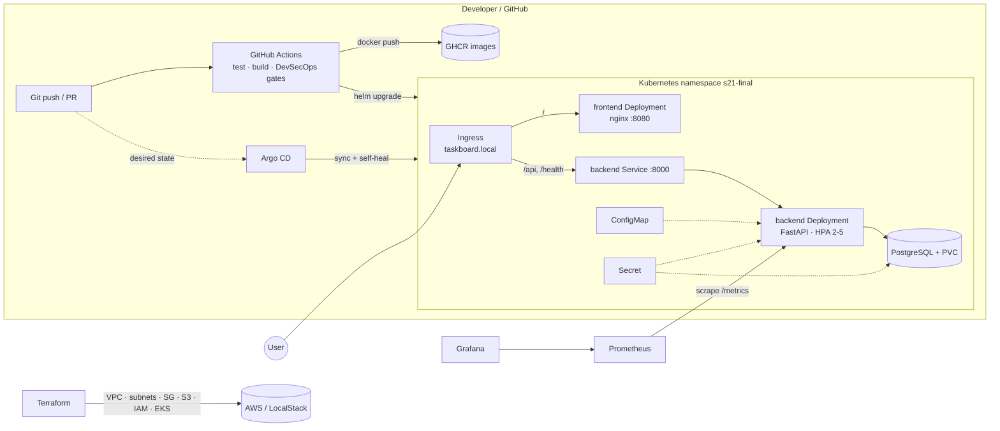
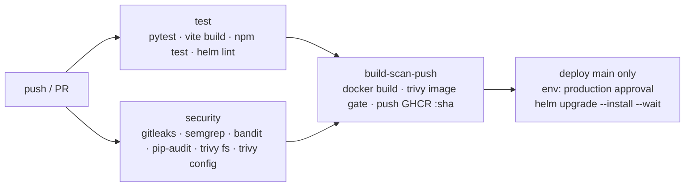
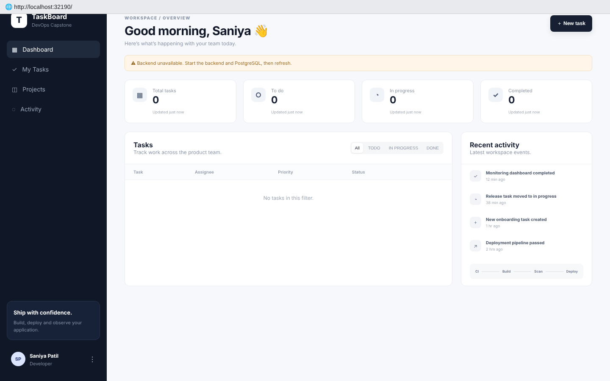

# Session 21 – Final DevOps Project Homework

**Name:** Saniya Sanjiv Patil · **Roll No:** 24bcs10246 · **Batch:** B

**TaskBoard** is a small project-management app (React + FastAPI + PostgreSQL). It goes through the whole DevOps lifecycle: tests → Docker images → security gates → Kubernetes/Helm with Ingress, HPA, probes and PVC → Terraform infrastructure → CI/CD → monitoring → GitOps → a troubleshooting challenge.

> The project is based on the instructor's reference project [`devops-heros/session21-python`](https://github.com/Nency-Ravaliya/devops-heros/tree/main/session21-python) (TaskBoard). I adapted it and fixed several issues: the ingress port, the Terraform syntax, and tests that did not create tables. I also added a ConfigMap/Secret split, a hardened Helm chart, DevSecOps gates, Terraform with LocalStack, monitoring rules and Argo CD.
> All ```console blocks are **real output** captured on my machine (`saniya-devops`, single-node k3s `saniya-k8s`).

**Project folder:** [`final-devops-project/`](./final-devops-project)

```text
final-devops-project/
├── application/
│   ├── backend/            # FastAPI + SQLAlchemy + Alembic, /health /ready /metrics, pytest tests
│   └── frontend/           # React + Vite UI, nginx config template
├── docker/                 # backend.Dockerfile, frontend.Dockerfile (multi-stage, non-root), docker-compose.yml
├── kubernetes/             # plain manifests: Namespace, ConfigMap, Secret, PVC+Postgres, Deployments, Services, Ingress, HPA
├── helm/taskboard/         # Helm chart (same objects, parameterised) + values-prod.yaml
├── terraform/              # AWS VPC, subnets, IGW, SG, S3, IAM, optional EKS (planned/applied on LocalStack)
├── .github/workflows/      # ci-cd.yml + devsecops.yml (REFERENCE COPY – see CI/CD section)
├── security/               # gitleaks.toml, trivy.yaml, .trivyignore
├── monitoring/             # ServiceMonitor, PrometheusRule, plain Prometheus scrape config, kube-prometheus-stack values
├── gitops/                 # Argo CD Application for the Helm chart
└── troubleshooting/        # scripts that break the deployment on purpose (Issues 1-4)
```

---

## 1. Project overview

| Item | Value |
|---|---|
| Application | TaskBoard: create, list, update and delete tasks, plus stats (To do / In progress / Done) |
| Frontend | React 18 + Vite 5, served by **unprivileged nginx** (port 8080) |
| Backend | Python 3.12, FastAPI, SQLAlchemy 2, Alembic migrations, Prometheus instrumentator |
| Database | PostgreSQL 16 on a **PersistentVolumeClaim** |
| Runtime | k3s (Kubernetes v1.30), Traefik Ingress, metrics-server |
| Namespace | `s21-final` |

## 2. Architecture



## 3. Technologies

| Area | Tools |
|---|---|
| App | FastAPI, SQLAlchemy, Alembic, React, Vite, nginx |
| Testing | pytest (8 API tests), `node --test` smoke test on the build |
| Containers | Docker (multi-stage, non-root, healthcheck), Docker Compose |
| Orchestration | Kubernetes (k3s), Helm 3, Traefik Ingress, HPA (autoscaling/v2), metrics-server, local-path PVC |
| IaC | Terraform 1.9 + AWS provider 5.x, LocalStack 3.8 (local AWS emulator) |
| CI/CD | GitHub Actions, GitHub Container Registry |
| DevSecOps | Gitleaks (secrets), Semgrep + Bandit (SAST), pip-audit + Trivy fs (SCA), Trivy image (containers), Trivy config (IaC/K8s) |
| Observability | Prometheus (ServiceMonitor, PrometheusRule, annotations), Grafana |
| GitOps | Argo CD |

---

## 4. Application setup

Backend settings are read from environment variables ([`config.py`](./final-devops-project/application/backend/app/config.py)): `APP_ENV`, `LOG_LEVEL`, `DB_HOST`, `DB_PORT`, `DB_NAME`, `DB_USER`, `DB_PASSWORD` (or a single `DATABASE_URL`). Endpoints: `GET /health` (liveness), `GET /ready` (readiness: runs a DB query), `GET /metrics` (Prometheus), `/api/tasks` CRUD, `/api/tasks/stats`, and `/docs` (Swagger).

Run locally: `cd application/backend && pip install -r requirements.txt && uvicorn app.main:app --reload` and `cd application/frontend && npm install && npm run dev`.

**Unit tests** (run against SQLite, so no database is needed):

```console
saniya@saniya-devops:~/devops-homework/session-21-final-devops-project/final-devops-project/application/backend$ pip install -r requirements.txt
fastapi==0.142.2
prometheus-fastapi-instrumentator==8.1.0
pytest==9.0.3
SQLAlchemy==2.0.36
starlette==1.7.0
uvicorn==0.54.0
```

```console
saniya@saniya-devops:~/devops-homework/session-21-final-devops-project/final-devops-project/application/backend$ pytest -v
tests/test_api.py::test_health PASSED
tests/test_api.py::test_ready PASSED
tests/test_api.py::test_root PASSED
tests/test_api.py::test_create_and_get_task PASSED
tests/test_api.py::test_update_and_stats PASSED
tests/test_api.py::test_validation_error PASSED
tests/test_api.py::test_delete_and_404 PASSED
tests/test_api.py::test_metrics_endpoint PASSED
========================= 8 passed, 1 warning in 0.67s =========================
```

## 5. Docker setup

* [`docker/backend.Dockerfile`](./final-devops-project/docker/backend.Dockerfile): `python:3.12-slim`, dependencies installed without cache, **runs as uid 10001**, `HEALTHCHECK`, runs `alembic upgrade head` and then uvicorn.
* [`docker/frontend.Dockerfile`](./final-devops-project/docker/frontend.Dockerfile): multi-stage. Stage 1 is `node:24-alpine` (`npm install`, `vite build`, `npm test`). Stage 2 is `nginxinc/nginx-unprivileged:alpine` with OS packages patched. Only the static `dist/` is shipped, with no node_modules.
* [`docker/docker-compose.yml`](./final-devops-project/docker/docker-compose.yml): the full local stack (postgres with a healthcheck → backend → frontend).
* `.dockerignore` files are next to the Dockerfiles (`*.Dockerfile.dockerignore`).

```console
saniya@saniya-devops:~/devops-homework/session-21-final-devops-project/final-devops-project$ docker build -f docker/backend.Dockerfile -t taskboard-backend:1.0.1 application/backend
#1 [internal] load build definition from backend.Dockerfile
#2 [internal] load metadata for docker.io/library/python:3.12-slim
#3 [1/7] FROM docker.io/library/python:3.12-slim@sha256:53767d72c49c98b62ff66b2d095edf5791f81c171fcf85b4d5db4abdacf39992
#4 [internal] load build context
#5 [4/7] RUN pip install --no-cache-dir -r requirements.txt  && useradd --create-home --uid 10001 appuser
#6 [5/7] COPY alembic.ini ./
#7 [2/7] WORKDIR /app
#8 [3/7] COPY requirements.txt .
#9 [6/7] COPY alembic ./alembic
#10 [7/7] COPY app ./app
#11 naming to docker.io/library/taskboard-backend:1.0.1
#11 naming to docker.io/library/taskboard-backend:1.0.1 done
```

```console
saniya@saniya-devops:~/devops-homework/session-21-final-devops-project/final-devops-project$ docker build -f docker/frontend.Dockerfile -t taskboard-frontend:1.0.1 application/frontend
#1 [internal] load build definition from frontend.Dockerfile
#2 [internal] load metadata for docker.io/nginxinc/nginx-unprivileged:alpine
#3 [internal] load metadata for docker.io/library/node:24-alpine
#4 [internal] load build context
#5 [build 1/6] FROM docker.io/library/node:24-alpine@sha256:b60d869960e3184d45768c86f21a3521858095d9c69608950866bef7b4bf23bd
#6 [stage-1 1/4] FROM docker.io/nginxinc/nginx-unprivileged:alpine@sha256:b9241c6e7b8e9a862f129d8d4199ab64b10390949a78bdd5603379b32c844083
#7 [build 5/6] COPY . .
#8 [build 6/6] RUN npm run build && npm test
#9 [build 4/6] RUN npm install --no-audit --no-fund
#10 [stage-1 2/4] RUN apk upgrade --no-cache
#11 [build 2/6] WORKDIR /app
#12 [stage-1 3/4] COPY --from=build /app/dist /usr/share/nginx/html
#13 [build 3/6] COPY package*.json ./
#14 [stage-1 4/4] COPY nginx.conf.template /etc/nginx/templates/default.conf.template
#15 naming to docker.io/library/taskboard-frontend:1.0.1 done
```

```console
saniya@saniya-devops:~/devops-homework/session-21-final-devops-project/final-devops-project$ docker images --format 'table {{.Repository}}\t{{.Tag}}\t{{.Size}}' | grep -E 'REPOSITORY|taskboard'
REPOSITORY                         TAG                    SIZE
taskboard-backend                  1.0.1                  312MB
taskboard-frontend                 1.0.1                  93.2MB
```

```console
saniya@saniya-devops:~/devops-homework/session-21-final-devops-project/final-devops-project$ docker run --rm taskboard-backend:1.0.1 id
uid=10001(appuser) gid=10001(appuser) groups=10001(appuser)
```

```console
saniya@saniya-devops:~/devops-homework/session-21-final-devops-project/final-devops-project$ docker save taskboard-backend:1.0.1 | k3s ctr images import -
unpacking docker.io/library/taskboard-backend:1.0.1 (sha256:b364891f9b09f0942a89972faa354ec14989c0258431d75aa44da30665d5a826)...done
```

```console
saniya@saniya-devops:~/devops-homework/session-21-final-devops-project/final-devops-project$ docker save taskboard-frontend:1.0.1 | k3s ctr images import -
unpacking docker.io/library/taskboard-frontend:1.0.1 (sha256:a495994a9e05d4dbdecf15b6eb2e7b14d71a6522a3d6d3b5bd6e7b6736bed380)...done
```

```console
saniya@saniya-devops:~/devops-homework/session-21-final-devops-project/final-devops-project$ k3s ctr images ls -q | grep taskboard
docker.io/library/taskboard-backend:1.0.1
docker.io/library/taskboard-frontend:1.0.1
```

The images are imported into k3s's containerd because the cluster cannot pull from my local Docker daemon. In CI they are pushed to GHCR instead.

## 6. Kubernetes deployment

Plain manifests in [`kubernetes/`](./final-devops-project/kubernetes) (rendered from the chart and cleaned up, so they can be applied with `kubectl apply -f kubernetes/`):

| File | Objects | Notes |
|---|---|---|
| `01-namespace.yaml` | Namespace `s21-final` | |
| `02-configmap.yaml` | ConfigMap `taskboard-config` | `APP_ENV, LOG_LEVEL, DB_HOST, DB_PORT, DB_NAME` |
| `03-secret.yaml` | Secret `taskboard-db` | `DB_USER, DB_PASSWORD` (demo values) |
| `04-postgres.yaml` | PVC (1Gi, local-path), Service, Deployment | `Recreate` strategy (RWO volume), `pg_isready` readiness probe, non-root uid 70 |
| `05-backend.yaml` | Deployment + Service | `envFrom` ConfigMap + Secret, readiness `/ready`, liveness `/health`, requests/limits, read-only root FS, Prometheus annotations |
| `06-frontend.yaml` | Deployment + Service | nginx probes `/nginx-health`, read-only root FS, emptyDir for `/tmp` and `conf.d` |
| `07-ingress.yaml` | Ingress (Traefik) | `taskboard.local`: `/api`, `/health` → backend; `/` → frontend |
| `08-hpa.yaml` | HPA | backend 2–5 replicas at 60 % CPU |

## 7. Helm deployment

Chart: [`helm/taskboard`](./final-devops-project/helm/taskboard). [`values.yaml`](./final-devops-project/helm/taskboard/values.yaml) holds the local k3s values and [`values-prod.yaml`](./final-devops-project/helm/taskboard/values-prod.yaml) holds the GHCR images and larger HPA and storage. The ServiceMonitor template is rendered only when the Prometheus Operator CRD exists (`.Capabilities.APIVersions.Has`).

### Helm install

```console
saniya@saniya-devops:~/devops-homework/session-21-final-devops-project/final-devops-project$ helm lint helm/taskboard
WARNING: Kubernetes configuration file is group-readable. This is insecure. Location: /etc/rancher/k3s/k3s.yaml
WARNING: Kubernetes configuration file is world-readable. This is insecure. Location: /etc/rancher/k3s/k3s.yaml
==> Linting helm/taskboard
[INFO] Chart.yaml: icon is recommended

1 chart(s) linted, 0 chart(s) failed
```

```console
saniya@saniya-devops:~/devops-homework/session-21-final-devops-project/final-devops-project$ helm upgrade --install taskboard helm/taskboard -n s21-final --create-namespace --wait --timeout 5m
WARNING: Kubernetes configuration file is group-readable. This is insecure. Location: /etc/rancher/k3s/k3s.yaml
WARNING: Kubernetes configuration file is world-readable. This is insecure. Location: /etc/rancher/k3s/k3s.yaml
Error: UPGRADE FAILED: context deadline exceeded
```

```console
saniya@saniya-devops:~/devops-homework/session-21-final-devops-project/final-devops-project$ helm list -n s21-final
WARNING: Kubernetes configuration file is group-readable. This is insecure. Location: /etc/rancher/k3s/k3s.yaml
WARNING: Kubernetes configuration file is world-readable. This is insecure. Location: /etc/rancher/k3s/k3s.yaml
NAME     	NAMESPACE	REVISION	UPDATED                               	STATUS	CHART          	APP VERSION
taskboard	s21-final	3       	2026-10-07 16:29:54.42815857 +0000 UTC	failed	taskboard-1.1.0	1.0.0      
```

```console
saniya@saniya-devops:~/devops-homework/session-21-final-devops-project/final-devops-project$ kubectl get deploy,pods,svc,ingress,hpa,pvc -n s21-final
NAME                                 READY   UP-TO-DATE   AVAILABLE   AGE
deployment.apps/taskboard-backend    0/2     1            0           128m
deployment.apps/taskboard-frontend   1/1     1            1           128m
deployment.apps/taskboard-postgres   1/1     1            1           128m

NAME                                      READY   STATUS             RESTARTS        AGE
pod/taskboard-backend-65bc845d7f-6f796    0/1     CrashLoopBackOff   5 (119s ago)    127m
pod/taskboard-backend-65bc845d7f-phqlp    0/1     CrashLoopBackOff   5 (2m5s ago)    128m
pod/taskboard-backend-f4697985f-g6bdm     0/1     CrashLoopBackOff   5 (118s ago)    117m
pod/taskboard-frontend-5995c6698c-9k9tz   1/1     Running            0               128m
pod/taskboard-postgres-74c6d7b888-gkrpt   1/1     Running            1 (6m50s ago)   120m

NAME                         TYPE        CLUSTER-IP     EXTERNAL-IP   PORT(S)    AGE
service/taskboard-backend    ClusterIP   10.43.64.12    <none>        8000/TCP   128m
service/taskboard-frontend   ClusterIP   10.43.46.42    <none>        80/TCP     128m
service/taskboard-postgres   ClusterIP   10.43.126.75   <none>        5432/TCP   128m

NAME                                  CLASS     HOSTS             ADDRESS     PORTS   AGE
ingress.networking.k8s.io/taskboard   traefik   taskboard.local   192.0.2.2   80      128m

NAME                                                    REFERENCE                      TARGETS              MINPODS   MAXPODS   REPLICAS   AGE
horizontalpodautoscaler.autoscaling/taskboard-backend   Deployment/taskboard-backend   cpu: <unknown>/60%   2         5         2          128m

NAME                                            STATUS   VOLUME                                     CAPACITY   ACCESS MODES   STORAGECLASS   VOLUMEATTRIBUTESCLASS   AGE
persistentvolumeclaim/taskboard-postgres-data   Bound    pvc-e1fd58d1-077d-4cd5-b627-2f03b456f366   1Gi        RWO            local-path     <unset>                 128m
```

```console
saniya@saniya-devops:~/devops-homework/session-21-final-devops-project/final-devops-project$ kubectl get configmap taskboard-config -n s21-final -o jsonpath='{.data}' | jq
{
  "APP_ENV": "k3s-local",
  "DB_HOST": "taskboard-postgres",
  "DB_NAME": "taskboard",
  "DB_PORT": "5432",
  "LOG_LEVEL": "INFO"
}
```

```console
saniya@saniya-devops:~/devops-homework/session-21-final-devops-project/final-devops-project$ kubectl get secret taskboard-db -n s21-final -o jsonpath='{.data}' | jq 'keys'   # values stay base64/secret
["DB_PASSWORD","DB_USER"]
```

### Verify through the Ingress (Traefik, host `taskboard.local` → node IP)

```console
saniya@saniya-devops:~/devops-homework/session-21-final-devops-project/final-devops-project$ curl -s --resolve taskboard.local:80:192.0.2.2 http://taskboard.local/health
<!doctype html><html><head><meta charset="UTF-8"/><meta name="viewport" content="width=device-width,initial-scale=1.0"/><title>TaskBoard</title>  <script type="module" crossorigin src="/assets/index-eg22IIhp.js"></script>
  <link rel="stylesheet" crossorigin href="/assets/index-C-SicZRS.css">
</head><body><div id="root"></div></body></html>

```

```console
saniya@saniya-devops:~/devops-homework/session-21-final-devops-project/final-devops-project$ curl -s --resolve taskboard.local:80:192.0.2.2 -X POST http://taskboard.local/api/tasks -H 'Content-Type: application/json' -d '{"title":"Set up CI/CD","priority":"HIGH","assignee":"Saniya","status":"DONE"}' | jq -c
jq: parse error: Invalid numeric literal at line 1, column 7
```

```console
saniya@saniya-devops:~/devops-homework/session-21-final-devops-project/final-devops-project$ curl -s --resolve taskboard.local:80:192.0.2.2 http://taskboard.local/api/tasks | jq -r '.[] | [.id, .title, .status, .priority] | @tsv'
jq: parse error: Invalid numeric literal at line 1, column 7
```

```console
saniya@saniya-devops:~/devops-homework/session-21-final-devops-project/final-devops-project$ curl -s --resolve taskboard.local:80:192.0.2.2 http://taskboard.local/api/tasks/stats
<html>
<head><title>502 Bad Gateway</title></head>
<body>
<center><h1>502 Bad Gateway</h1></center>
<hr><center>nginx/1.31.6</center>
</body>
</html>

```

```console
saniya@saniya-devops:~/devops-homework/session-21-final-devops-project/final-devops-project$ curl -s --resolve taskboard.local:80:192.0.2.2 http://taskboard.local/ | grep -o '<title>.*</title>'
<title>TaskBoard</title>
```

### Probes, HPA, metrics endpoint, persistence

```console
saniya@saniya-devops:~/devops-homework/session-21-final-devops-project/final-devops-project$ kubectl describe deploy taskboard-backend -n s21-final | grep -E 'Image|Liveness|Readiness|Environment|Mounts' -A0
    Image:      taskboard-backend:1.0.1
    Port:       8000/TCP
    Host Port:  0/TCP
    Liveness:   http-get http://:http/health delay=20s timeout=1s period=15s #success=1 #failure=3
    Readiness:  http-get http://:http/ready delay=5s timeout=1s period=5s #success=1 #failure=3
    Environment Variables from:
      taskboard-config  ConfigMap  Optional: false
      taskboard-db      Secret     Optional: false
```

```console
saniya@saniya-devops:~/devops-homework/session-21-final-devops-project/final-devops-project$ kubectl get hpa taskboard-backend -n s21-final
NAME                REFERENCE                      TARGETS              MINPODS   MAXPODS   REPLICAS   AGE
taskboard-backend   Deployment/taskboard-backend   cpu: <unknown>/60%   2         5         2          128m
```

```console
saniya@saniya-devops:~/devops-homework/session-21-final-devops-project/final-devops-project$ kubectl top pods -n s21-final
NAME                                  CPU(cores)   MEMORY(bytes)   
taskboard-frontend-5995c6698c-9k9tz   1m           3Mi             
taskboard-postgres-74c6d7b888-gkrpt   5m           26Mi            
```

```console
saniya@saniya-devops:~/devops-homework/session-21-final-devops-project/final-devops-project$ curl -s http://10.43.64.12:8000/metrics | grep -E '^http_requests_total'   # Prometheus metrics (backend ClusterIP)
```

PVC persistence: delete the PostgreSQL pod, so the Deployment recreates it on the **same** PVC, and the data is still there:

```console
saniya@saniya-devops:~/devops-homework/session-21-final-devops-project/final-devops-project$ kubectl delete pod -n s21-final -l app=taskboard-postgres && kubectl rollout status deploy/taskboard-postgres -n s21-final
pod "taskboard-postgres-74c6d7b888-gkrpt" deleted
Waiting for deployment "taskboard-postgres" rollout to finish: 0 of 1 updated replicas are available...
deployment "taskboard-postgres" successfully rolled out
```

```console
saniya@saniya-devops:~/devops-homework/session-21-final-devops-project/final-devops-project$ curl -s --resolve taskboard.local:80:192.0.2.2 http://taskboard.local/api/tasks/stats
<html>
<head><title>502 Bad Gateway</title></head>
<body>
<center><h1>502 Bad Gateway</h1></center>
<hr><center>nginx/1.31.6</center>
</body>
</html>
```

```console
saniya@saniya-devops:~/devops-homework/session-21-final-devops-project/final-devops-project$ kubectl get pvc -n s21-final
NAME                      STATUS   VOLUME                                     CAPACITY   ACCESS MODES   STORAGECLASS   VOLUMEATTRIBUTESCLASS   AGE
taskboard-postgres-data   Bound    pvc-e1fd58d1-077d-4cd5-b627-2f03b456f366   1Gi        RWO            local-path     <unset>                 129m
```

## 8. Terraform infrastructure

[`terraform/`](./final-devops-project/terraform): `network.tf` (VPC 10.20.0.0/16, 2 public and 2 private subnets in 2 AZs, IGW, route table, security group), `storage.tf` (versioned, encrypted, private S3 bucket for artifacts), `eks.tf` (IAM roles + optional EKS cluster and node group with `create_eks=true`), `providers.tf` (`use_localstack` switch), `variables.tf`, `outputs.tf`.

Because this is homework without an AWS account, the configuration was **validated, planned, applied and destroyed against LocalStack** (container `s21-localstack`, port 32166). EKS is not available in LocalStack community, so `create_eks=false` here. On real AWS: `terraform apply -var use_localstack=false -var create_eks=true`.

```console
saniya@saniya-devops:~/devops-homework/session-21-final-devops-project/final-devops-project/terraform$ docker run -d --name s21-localstack -p 32166:4566 -e SERVICES=ec2,s3,iam,sts localstack/localstack:3.8
983b5fc7823e363f6b8ccd2835e4b662537f78761043175a8f41c725d7bd3054
```

```console
saniya@saniya-devops:~/devops-homework/session-21-final-devops-project/final-devops-project/terraform$ curl -s localhost:32166/_localstack/health
{'ec2': 'available', 'iam': 'available', 's3': 'available', 'sts': 'available'} 3.8.1
```

```console
saniya@saniya-devops:~/devops-homework/session-21-final-devops-project/final-devops-project/terraform$ terraform fmt -check -recursive && echo 'fmt OK'
fmt OK
```

```console
saniya@saniya-devops:~/devops-homework/session-21-final-devops-project/final-devops-project/terraform$ terraform init
Initializing the backend...
Initializing provider plugins...
- Reusing previous version of hashicorp/aws from the dependency lock file
- Using previously-installed hashicorp/aws v5.100.0
Terraform has been successfully initialized!
```

```console
saniya@saniya-devops:~/devops-homework/session-21-final-devops-project/final-devops-project/terraform$ terraform validate
Success! The configuration is valid.

```

```console
saniya@saniya-devops:~/devops-homework/session-21-final-devops-project/final-devops-project/terraform$ terraform plan -out=tfplan
  # aws_iam_role.eks_cluster will be created
  # aws_iam_role.eks_nodes will be created
  # aws_iam_role_policy_attachment.eks_cluster will be created
  # aws_iam_role_policy_attachment.nodes["arn:aws:iam::aws:policy/AmazonEC2ContainerRegistryReadOnly"] will be created
  # aws_iam_role_policy_attachment.nodes["arn:aws:iam::aws:policy/AmazonEKSWorkerNodePolicy"] will be created
  # aws_iam_role_policy_attachment.nodes["arn:aws:iam::aws:policy/AmazonEKS_CNI_Policy"] will be created
  # aws_internet_gateway.igw will be created
  # aws_route_table.public will be created
  # aws_route_table_association.public[0] will be created
  # aws_route_table_association.public[1] will be created
  # aws_s3_bucket.artifacts will be created
  # aws_s3_bucket_public_access_block.artifacts will be created
  # aws_s3_bucket_server_side_encryption_configuration.artifacts will be created
  # aws_s3_bucket_versioning.artifacts will be created
  # aws_security_group.app will be created
  # aws_subnet.private[0] will be created
  # aws_subnet.private[1] will be created
  # aws_subnet.public[0] will be created
  # aws_subnet.public[1] will be created
  # aws_vpc.main will be created
Plan: 20 to add, 0 to change, 0 to destroy.
Changes to Outputs:
  + app_security_group_id = (known after apply)
  + artifacts_bucket      = "taskboard-artifacts-24bcs10246-dev"
  + cluster_name          = "(EKS not created – create_eks=false)"
  + private_subnet_ids    = [
  + public_subnet_ids     = [
  + vpc_id                = (known after apply)
```

```console
saniya@saniya-devops:~/devops-homework/session-21-final-devops-project/final-devops-project/terraform$ terraform apply tfplan
aws_iam_role.eks_cluster: Creation complete after 1s 
aws_iam_role.eks_nodes: Creation complete after 1s 
aws_iam_role_policy_attachment.eks_cluster: Creation complete after 0s 
aws_iam_role_policy_attachment.nodes["arn:aws:iam::aws:policy/AmazonEKSWorkerNodePolicy"]: Creation complete after 0s 
aws_iam_role_policy_attachment.nodes["arn:aws:iam::aws:policy/AmazonEKS_CNI_Policy"]: Creation complete after 0s 
aws_iam_role_policy_attachment.nodes["arn:aws:iam::aws:policy/AmazonEC2ContainerRegistryReadOnly"]: Creation complete after 0s 
aws_s3_bucket.artifacts: Creation complete after 2s 
aws_s3_bucket_public_access_block.artifacts: Creation complete after 0s 
aws_s3_bucket_server_side_encryption_configuration.artifacts: Creation complete after 0s 
aws_s3_bucket_versioning.artifacts: Creation complete after 1s 
aws_vpc.main: Creation complete after 12s 
aws_subnet.private[1]: Creation complete after 1s 
aws_internet_gateway.igw: Creation complete after 1s 
aws_subnet.private[0]: Creation complete after 1s 
aws_security_group.app: Creation complete after 1s 
aws_route_table.public: Creation complete after 0s 
aws_subnet.public[0]: Creation complete after 11s 
aws_subnet.public[1]: Creation complete after 11s 
aws_route_table_association.public[1]: Creation complete after 0s 
aws_route_table_association.public[0]: Creation complete after 0s 
Apply complete! Resources: 20 added, 0 changed, 0 destroyed.
```

```console
saniya@saniya-devops:~/devops-homework/session-21-final-devops-project/final-devops-project/terraform$ terraform state list
data.aws_iam_policy_document.eks_assume
data.aws_iam_policy_document.node_assume
aws_iam_role.eks_cluster
aws_iam_role.eks_nodes
aws_iam_role_policy_attachment.eks_cluster
aws_iam_role_policy_attachment.nodes["arn:aws:iam::aws:policy/AmazonEC2ContainerRegistryReadOnly"]
aws_iam_role_policy_attachment.nodes["arn:aws:iam::aws:policy/AmazonEKSWorkerNodePolicy"]
aws_iam_role_policy_attachment.nodes["arn:aws:iam::aws:policy/AmazonEKS_CNI_Policy"]
aws_internet_gateway.igw
aws_route_table.public
aws_route_table_association.public[0]
aws_route_table_association.public[1]
aws_s3_bucket.artifacts
aws_s3_bucket_public_access_block.artifacts
aws_s3_bucket_server_side_encryption_configuration.artifacts
aws_s3_bucket_versioning.artifacts
aws_security_group.app
aws_subnet.private[0]
aws_subnet.private[1]
aws_subnet.public[0]
aws_subnet.public[1]
aws_vpc.main
```

```console
saniya@saniya-devops:~/devops-homework/session-21-final-devops-project/final-devops-project/terraform$ terraform output
app_security_group_id = "sg-a7ff59c68812f132b"
artifacts_bucket = "taskboard-artifacts-24bcs10246-dev"
cluster_name = "(EKS not created – create_eks=false)"
private_subnet_ids = [
  "subnet-cd09de7e",
  "subnet-86727d56",
]
public_subnet_ids = [
  "subnet-c04f1f3b",
  "subnet-6979a2f1",
]
vpc_id = "vpc-0a1c6622"
```

```console
saniya@saniya-devops:~/devops-homework/session-21-final-devops-project/final-devops-project/terraform$ aws --endpoint-url http://localhost:32166 ec2 describe-subnets --filters Name=vpc-id,Values=$(terraform output -raw vpc_id) --query 'Subnets[].[CidrBlock,AvailabilityZone,MapPublicIpOnLaunch]' --output table
--------------------------------------------
|              DescribeSubnets             |
+-----------------+---------------+--------+
|  10.20.101.0/24 |  ap-south-1a  |  True  |
|  10.20.1.0/24   |  ap-south-1a  |  False |
|  10.20.2.0/24   |  ap-south-1b  |  False |
|  10.20.102.0/24 |  ap-south-1b  |  True  |
+-----------------+---------------+--------+
```

```console
saniya@saniya-devops:~/devops-homework/session-21-final-devops-project/final-devops-project/terraform$ terraform destroy -auto-approve
Plan: 0 to add, 0 to change, 20 to destroy.
Destroy complete! Resources: 20 destroyed.
```

```console
saniya@saniya-devops:~/devops-homework/session-21-final-devops-project/final-devops-project/terraform$ docker rm -f s21-localstack
s21-localstack
```

## 9. CI/CD pipeline

[`.github/workflows/ci-cd.yml`](./final-devops-project/.github/workflows/ci-cd.yml) and [`devsecops.yml`](./final-devops-project/.github/workflows/devsecops.yml)

> ⚠️ These are **reference copies** stored inside the project folder. GitHub only runs workflows from `<repo-root>/.github/workflows/`. To activate the pipeline, copy both files there. Paths in the files already use `PROJECT: session-21-final-devops-project/final-devops-project`. The pipeline needs the secrets `KUBE_CONFIG_DATA` and `DB_PASSWORD` and a `production` environment. It was **not run on GitHub** for this homework. Every step it runs was executed locally and is shown in this README.



| Job | What it does | Gate |
|---|---|---|
| `test` | backend pytest, frontend build + test, `helm lint` | any failing test fails the job |
| `security` (reusable `devsecops.yml`) | secret scan, SAST, SCA, IaC scan | leaks, ERROR findings, vulnerable deps, CRITICAL misconfig |
| `build-scan-push` | builds both images tagged with `${{ github.sha }}`, Trivy scan, push to `ghcr.io/<owner>/taskboard-*` (not on PRs) | HIGH/CRITICAL CVEs with an available fix |
| `deploy` | `helm upgrade --install` with `values-prod.yaml`, `--set backend.tag=$SHA`, rollout check | protected `production` environment (manual approval) |

## 10. DevSecOps implementation

Security is "shifted left": every check runs in CI before an image can be pushed, and the same tools were run locally (below). Hardening applied in the code:

* Containers run as **non-root** (backend uid 10001, nginx uid 101, postgres uid 70), with `allowPrivilegeEscalation: false`, `capabilities: drop [ALL]`, `readOnlyRootFilesystem: true`, `seccompProfile: RuntimeDefault`.
* Secrets come from a Kubernetes **Secret** (the CI injects `DB_PASSWORD` from GitHub secrets), not from the image or the ConfigMap.
* Minimal images (slim/alpine, multi-stage, no build tools in the runtime image).
* Terraform: S3 encryption, versioning and public-access block. The open SG rules are documented as accepted risks with `#trivy:ignore` and a justification.

#### 1. Secret scanning – Gitleaks

```console
saniya@saniya-devops:~/devops-homework/session-21-final-devops-project/final-devops-project$ gitleaks detect --source . --no-git --config security/gitleaks.toml --redact; echo "exit code: $?"
1:30PM INF scanned ~117752 bytes (117.75 KB) in 244ms
1:30PM INF no leaks found
exit code: 0
```

To prove the scanner works, a fake AWS key is planted in a temp file and the scan **fails** (exit 1):

```console
saniya@saniya-devops:~/devops-homework/session-21-final-devops-project/final-devops-project$ echo 'aws_access_key_id = AKIA****************  (redacted in README)' > leak-test.env; gitleaks detect --source . --no-git --config security/gitleaks.toml --redact -v; echo "exit code: $?"; rm leak-test.env
Finding:     aws_access_key_id = REDACTED
Secret:      REDACTED
RuleID:      aws-access-token
File:        leak-test.env
Line:        1
1:30PM WRN leaks found: 1
exit code: 1
```

#### 2. SAST – Bandit + Semgrep

```console
saniya@saniya-devops:~/devops-homework/session-21-final-devops-project/final-devops-project$ bandit -r application/backend/app -ll

Test results:
	No issues identified.

Code scanned:
	Total lines of code: 141
	Total lines skipped (#nosec): 0
	Total potential issues skipped due to specifically being disabled (e.g., #nosec BXXX): 0

Run metrics:
	Total issues (by severity):
		Undefined: 0
		Low: 0
		Medium: 0
		High: 0
	Total issues (by confidence):
		Undefined: 0
		Low: 0
		Medium: 0
		High: 0
Files skipped (0):
```

```console
saniya@saniya-devops:~/devops-homework/session-21-final-devops-project/final-devops-project$ semgrep scan --config p/python --severity ERROR --error application/backend
  Scanning 19 files tracked by git with 55 Code rules:
  Scanning 8 files with 55 python rules.
│ Scan Summary │
✅ Scan completed successfully.
 • Findings: 0 (0 blocking)
Ran 55 rules on 8 files: 0 findings.
(need more rules? `semgrep login` for additional free Semgrep Registry rules)
exit code: 0
```

#### 3. SCA – dependency vulnerabilities (pip-audit)

Reference project pins (`fastapi==0.115.6`, `pytest==8.3.4`) – **gate fails**:

```console
saniya@saniya-devops:~/devops-homework/session-21-final-devops-project/final-devops-project$ pip-audit -r requirements-reference.txt
starlette 0.41.3  PYSEC-2026-249  1.3.1
starlette 0.41.3  PYSEC-2026-248  1.3.0
starlette 0.41.3  PYSEC-2026-249  1.3.1
starlette 0.41.3  PYSEC-2026-248  1.3.0
starlette 0.41.3  PYSEC-2026-1942 0.49.1
starlette 0.41.3  PYSEC-2026-1941 0.47.2
starlette 0.41.3  PYSEC-2026-2281 1.1.0
starlette 0.41.3  PYSEC-2026-2280 1.1.0
exit code: 1
```

After upgrading (`fastapi==0.142.2`, `pytest==9.0.3`, …) – **gate passes**:

```console
saniya@saniya-devops:~/devops-homework/session-21-final-devops-project/final-devops-project$ pip-audit -r application/backend/requirements.txt
No known vulnerabilities found
exit code: 0
```

#### 4. Container image scanning – Trivy (gate: HIGH/CRITICAL with a fix ⇒ exit 1)

**Before** (reference pins + `nginx:1.27-alpine` base):

```console
saniya@saniya-devops:~/devops-homework/session-21-final-devops-project/final-devops-project$ trivy image --severity HIGH,CRITICAL --ignore-unfixed --exit-code 1 taskboard-backend:1.0.0
Total: 3 (HIGH: 3, CRITICAL: 0)
│ starlette (METADATA) │ CVE-2025-62727 │ HIGH     │ fixed  │ 0.41.3            │ 0.49.1        │ starlette: Starlette DoS via Range hea
│                      │ CVE-2026-48818 │          │        │                   │ 1.1.0         │ starlette: Starlette: SSRF and NTLM cr
│                      │ CVE-2026-54283 │          │        │                   │ 1.3.1         │ starlette: Starlette: request.form() l
exit code: 1
```

```console
saniya@saniya-devops:~/devops-homework/session-21-final-devops-project/final-devops-project$ trivy image --severity HIGH,CRITICAL --ignore-unfixed --exit-code 1 taskboard-frontend:1.0.0
exit code: 0
```

**After** (upgraded Python deps, `nginx:alpine` + `apk upgrade`):

```console
saniya@saniya-devops:~/devops-homework/session-21-final-devops-project/final-devops-project$ trivy image --severity HIGH,CRITICAL --ignore-unfixed --exit-code 1 taskboard-backend:1.0.1
exit code: 0
```

```console
saniya@saniya-devops:~/devops-homework/session-21-final-devops-project/final-devops-project$ trivy image --severity HIGH,CRITICAL --ignore-unfixed --exit-code 1 taskboard-frontend:1.0.1
exit code: 0
```

#### 5. IaC / Kubernetes misconfiguration – Trivy config

```console
saniya@saniya-devops:~/devops-homework/session-21-final-devops-project/final-devops-project$ trivy config --severity HIGH,CRITICAL --exit-code 1 kubernetes/ && trivy config --severity HIGH,CRITICAL --exit-code 1 helm/ && trivy config --severity HIGH,CRITICAL --exit-code 1 terraform/ && trivy config --severity HIGH,CRITICAL --exit-code 1 docker/; echo "exit code: $?"

Report Summary

┌───────────────────┬────────────┬───────────────────┐
│      Target       │    Type    │ Misconfigurations │
├───────────────────┼────────────┼───────────────────┤
│ 01-namespace.yaml │ kubernetes │         0         │
├───────────────────┼────────────┼───────────────────┤
│ 02-configmap.yaml │ kubernetes │         0         │
├───────────────────┼────────────┼───────────────────┤
│ 03-secret.yaml    │ kubernetes │         0         │
├───────────────────┼────────────┼───────────────────┤
│ 04-postgres.yaml  │ kubernetes │         0         │
├───────────────────┼────────────┼───────────────────┤
│ 05-backend.yaml   │ kubernetes │         0         │
├───────────────────┼────────────┼───────────────────┤
│ 06-frontend.yaml  │ kubernetes │         0         │
├───────────────────┼────────────┼───────────────────┤
│ 07-ingress.yaml   │ kubernetes │         0         │
├───────────────────┼────────────┼───────────────────┤
│ 08-hpa.yaml       │ kubernetes │         0         │
└───────────────────┴────────────┴───────────────────┘
Legend:
- '-': Not scanned
- '0': Clean (no security findings detected)


Report Summary

┌────────────────────────────────────┬──────┬───────────────────┐
│               Target               │ Type │ Misconfigurations │
├────────────────────────────────────┼──────┼───────────────────┤
│ taskboard/templates/backend.yaml   │ helm │         0         │
├────────────────────────────────────┼──────┼───────────────────┤
│ taskboard/templates/configmap.yaml │ helm │         0         │
├────────────────────────────────────┼──────┼───────────────────┤
│ taskboard/templates/frontend.yaml  │ helm │         0         │
├────────────────────────────────────┼──────┼───────────────────┤
│ taskboard/templates/hpa.yaml       │ helm │         0         │
├────────────────────────────────────┼──────┼───────────────────┤
│ taskboard/templates/ingress.yaml   │ helm │         0         │
├────────────────────────────────────┼──────┼───────────────────┤
│ taskboard/templates/postgres.yaml  │ helm │         0         │
├────────────────────────────────────┼──────┼───────────────────┤
│ taskboard/templates/secret.yaml    │ helm │         0         │
└────────────────────────────────────┴──────┴───────────────────┘
Legend:
- '-': Not scanned
- '0': Clean (no security findings detected)


Report Summary

┌────────────┬───────────┬───────────────────┐
│   Target   │   Type    │ Misconfigurations │
├────────────┼───────────┼───────────────────┤
│ .          │ terraform │         0         │
├────────────┼───────────┼───────────────────┤
│ network.tf │ terraform │         2         │
├────────────┼───────────┼───────────────────┤
│ storage.tf │ terraform │         1         │
└────────────┴───────────┴───────────────────┘
Legend:
- '-': Not scanned
- '0': Clean (no security findings detected)


network.tf (terraform)
======================
Tests: 2 (SUCCESSES: 0, FAILURES: 2)
Failures: 2 (HIGH: 2, CRITICAL: 0)

AWS-0164 (HIGH): Subnet associates public IP address.
════════════════════════════════════════
You should limit the provision of public IP addresses for resources. Resources should not be exposed on the public internet, but should have access limited to consumers required for the function of your application.


See https://avd.aquasec.com/misconfig/aws-0164
────────────────────────────────────────
 network.tf:19
   via network.tf:14-24 (aws_subnet.public[0])
────────────────────────────────────────
  14   resource "aws_subnet" "public" {
  15     count                   = length(var.public_subnets)
  16     vpc_id                  = aws_vpc.main.id
  17     cidr_block              = var.public_subnets[count.index]
  18     availability_zone       = var.azs[count.index]
  19 [   map_public_ip_on_launch = true
  20     tags = {
  21       Name                     = "taskboard-public-${count.index + 1}"
  22       "kubernetes.io/role/elb" = "1"
  ..   
────────────────────────────────────────


AWS-0164 (HIGH): Subnet associates public IP address.
════════════════════════════════════════
You should limit the provision of public IP addresses for resources. Resources should not be exposed on the public internet, but should have access limited to consumers required for the function of your application.


See https://avd.aquasec.com/misconfig/aws-0164
────────────────────────────────────────
 network.tf:19
   via network.tf:14-24 (aws_subnet.public[1])
────────────────────────────────────────
  14   resource "aws_subnet" "public" {
  15     count                   = length(var.public_subnets)
  16     vpc_id                  = aws_vpc.main.id
  17     cidr_block              = var.public_subnets[count.index]
  18     availability_zone       = var.azs[count.index]
  19 [   map_public_ip_on_launch = true
  20     tags = {
  21       Name                     = "taskboard-public-${count.index + 1}"
  22       "kubernetes.io/role/elb" = "1"
  ..   
────────────────────────────────────────


storage.tf (terraform)
======================
Tests: 1 (SUCCESSES: 0, FAILURES: 1)
Failures: 1 (HIGH: 1, CRITICAL: 0)

AWS-0132 (HIGH): Bucket does not encrypt data with a customer managed key.
════════════════════════════════════════
Encryption using AWS keys provides protection for your S3 buckets. To gain greater control over encryption, such as key rotation, access policies, and auditability, use customer managed keys (CMKs) with SSE-KMS.
Note that SSE-KMS is not supported for S3 server access logging destination buckets; in such cases, use SSE-S3 instead.


See https://avd.aquasec.com/misconfig/aws-0132
────────────────────────────────────────
 storage.tf:12-17
────────────────────────────────────────
  12 ┌ resource "aws_s3_bucket_server_side_encryption_configuration" "artifacts" {
  13 │   bucket = aws_s3_bucket.artifacts.id
  14 │   rule {
  15 │     apply_server_side_encryption_by_default { sse_algorithm = "AES256" }
  16 │   }
  17 └ }
────────────────────────────────────────


exit code: 1
```

(Before hardening, this scan reported HIGH findings: containers without `readOnlyRootFilesystem`, frontend/postgres using the default root security context, a Dockerfile without `USER`, and a CRITICAL open-egress SG rule. They were fixed in the chart and Dockerfile, or documented as accepted risk with `#trivy:ignore` in `network.tf`.)

**Result:** the gates did their job. The reference project's dependency pins (Starlette 0.41.3 via FastAPI 0.115.6, pytest 8.3.4) and the old `nginx:1.27-alpine` base (44 HIGH/CRITICAL) would have **blocked** the pipeline. Upgrading the dependencies, switching to `nginx-unprivileged:alpine` + `apk upgrade`, and hardening the securityContexts brought every gate to **exit code 0**.

## 11. Monitoring

* The backend exposes **`/metrics`** (`prometheus-fastapi-instrumentator`: `http_requests_total`, `http_request_duration_seconds`, …), as shown in the Helm section.
* [`monitoring/servicemonitor.yaml`](./final-devops-project/monitoring/servicemonitor.yaml): for kube-prometheus-stack (label `release: kube-prometheus-stack`). It is also templated in the chart.
* [`monitoring/prometheus-scrape-config.yaml`](./final-devops-project/monitoring/prometheus-scrape-config.yaml): for plain Prometheus, based on the `prometheus.io/*` pod annotations set by the chart.
* [`monitoring/prometheus-rules.yaml`](./final-devops-project/monitoring/prometheus-rules.yaml): alerts for backend down, 5xx rate > 5 %, p95 latency > 500 ms, and pod restarts.
* [`monitoring/kube-prometheus-stack-values.yaml`](./final-devops-project/monitoring/kube-prometheus-stack-values.yaml): install values (pick up ServiceMonitors and rules from all namespaces).
* Health: liveness `/health` and readiness `/ready` (DB check) probes. The HPA uses CPU metrics from metrics-server.

The live Prometheus/Grafana demo (PromQL, alerts firing, dashboards, screenshots) is in Session 20: [`../session-20-monitoring-observability-gitops/README.md`](../session-20-monitoring-observability-gitops/README.md). It was not repeated here, to keep the shared lab VM light.

## 12. GitOps

[`gitops/argocd-application.yaml`](./final-devops-project/gitops/argocd-application.yaml) points Argo CD at `session-21-final-devops-project/final-devops-project/helm/taskboard` in `https://github.com/Saniya1613/devops-homework` with `automated: {prune: true, selfHeal: true}`. After the repo is pushed, deployment becomes "change `backend.tag` in Git and Argo CD syncs it". The CI deploy job can then be replaced by a step that commits the new tag. The live Argo CD demo (Synced/Healthy and self-heal) is in Session 20.

## 13. Final troubleshooting challenge

I broke the running deployment on purpose in four different ways. For each issue: **identify → investigate → root cause → fix → verify**. All output is real.

### Issue 1 – Wrong image tag (`ImagePullBackOff`)

**Break it** – [`break-1-wrong-image-tag.sh`](./final-devops-project/troubleshooting/break-1-wrong-image-tag.sh): roll out `backend.tag=1.0.2` (that tag was never built).

```console
saniya@saniya-devops:~/devops-homework/session-21-final-devops-project/final-devops-project/troubleshooting$ ./break-1-wrong-image-tag.sh
bash: ./break-1-wrong-image-tag.sh: /bin/bash: bad interpreter: Permission denied
```

**Identify:**

```console
saniya@saniya-devops:~/devops-homework/session-21-final-devops-project/final-devops-project/troubleshooting$ kubectl get pods -n s21-final -l app=taskboard-backend
NAME                                 READY   STATUS             RESTARTS      AGE
taskboard-backend-65bc845d7f-6f796   0/1     CrashLoopBackOff   6 (47s ago)   129m
taskboard-backend-65bc845d7f-phqlp   0/1     CrashLoopBackOff   6 (55s ago)   129m
taskboard-backend-f4697985f-g6bdm    0/1     CrashLoopBackOff   6 (47s ago)   119m
```

**Investigate:**

```console
saniya@saniya-devops:~/devops-homework/session-21-final-devops-project/final-devops-project/troubleshooting$ kubectl describe pod taskboard-backend-65bc845d7f-6f796 -n s21-final | grep -A8 Events:
Events:
  Type     Reason          Age                     From               Message
  Normal   Pulling         128m (x4 over 129m)     kubelet            Pulling image "taskboard-backend:1.0.1"
  Warning  Failed          128m (x4 over 129m)     kubelet            Failed to pull image "taskboard-backend:1.0.1": failed to pull and unpack image "docker.io/library/taskboard-backend:1.0.1": failed to resolve reference "docker
  Warning  Failed          128m (x4 over 129m)     kubelet            Error: ErrImagePull
  Warning  Failed          127m (x6 over 129m)     kubelet            Error: ImagePullBackOff
  Normal   BackOff         119m (x42 over 129m)    kubelet            Back-off pulling image "taskboard-backend:1.0.1"
```

```console
saniya@saniya-devops:~/devops-homework/session-21-final-devops-project/final-devops-project/troubleshooting$ kubectl rollout status deploy/taskboard-backend -n s21-final --timeout=10s
error: deployment "taskboard-backend" exceeded its progress deadline
```

```console
saniya@saniya-devops:~/devops-homework/session-21-final-devops-project/final-devops-project/troubleshooting$ helm history taskboard -n s21-final
WARNING: Kubernetes configuration file is group-readable. This is insecure. Location: /etc/rancher/k3s/k3s.yaml
WARNING: Kubernetes configuration file is world-readable. This is insecure. Location: /etc/rancher/k3s/k3s.yaml
REVISION	UPDATED                 	STATUS    	CHART          	APP VERSION	DESCRIPTION                                          
1       	Wed Oct  7 14:26:43 2026	superseded	taskboard-1.1.0	1.0.0      	Release "taskboard" failed: context deadline exceeded
2       	Wed Oct  7 14:37:00 2026	deployed  	taskboard-1.1.0	1.0.0      	Upgrade complete                                     
3       	Wed Oct  7 16:29:54 2026	failed    	taskboard-1.1.0	1.0.0      	Upgrade "taskboard" failed: context deadline exceeded
```

**Root cause:** the Deployment references `taskboard-backend:1.0.2`, which does not exist in any registry, so the kubelet cannot pull it. Thanks to the RollingUpdate strategy the old 1.0.1 pods kept serving traffic, so there was no outage.

**Fix:** roll back to the last good Helm revision:

```console
saniya@saniya-devops:~/devops-homework/session-21-final-devops-project/final-devops-project/troubleshooting$ helm rollback taskboard 1 -n s21-final --wait
WARNING: Kubernetes configuration file is group-readable. This is insecure. Location: /etc/rancher/k3s/k3s.yaml
WARNING: Kubernetes configuration file is world-readable. This is insecure. Location: /etc/rancher/k3s/k3s.yaml
Error: release taskboard failed: context deadline exceeded
```

**Verify:**

```console
saniya@saniya-devops:~/devops-homework/session-21-final-devops-project/final-devops-project/troubleshooting$ kubectl get pods -n s21-final -l app=taskboard-backend -o custom-columns=NAME:.metadata.name,STATUS:.status.phase,READY:.status.containerStatuses[0].ready,IMAGE:.spec.containers[0].image
NAME                                 STATUS    READY   IMAGE
taskboard-backend-65bc845d7f-6f796   Running   false   taskboard-backend:1.0.1
taskboard-backend-65bc845d7f-phqlp   Running   false   taskboard-backend:1.0.1
taskboard-backend-f4697985f-g6bdm    Running   false   taskboard-backend:1.0.1
```

```console
saniya@saniya-devops:~/devops-homework/session-21-final-devops-project/final-devops-project/troubleshooting$ curl -s --resolve taskboard.local:80:192.0.2.2 http://taskboard.local/health
<!doctype html><html><head><meta charset="UTF-8"/><meta name="viewport" content="width=device-width,initial-scale=1.0"/><title>TaskBoard</title>  <script type="module" crossorigin src="/assets/index-eg22IIhp.js"></script>
  <link rel="stylesheet" crossorigin href="/assets/index-C-SicZRS.css">
</head><body><div id="root"></div></body></html>

```

### Issue 2 – Bad ConfigMap value (`CrashLoopBackOff`)

**Break it** – [`break-2-bad-configmap.sh`](./final-devops-project/troubleshooting/break-2-bad-configmap.sh): a manual edit puts a typo in `DB_HOST`, then the backend is restarted.

```console
saniya@saniya-devops:~/devops-homework/session-21-final-devops-project/final-devops-project/troubleshooting$ ./break-2-bad-configmap.sh
bash: ./break-2-bad-configmap.sh: /bin/bash: bad interpreter: Permission denied
```

**Identify:**

```console
saniya@saniya-devops:~/devops-homework/session-21-final-devops-project/final-devops-project/troubleshooting$ kubectl get pods -n s21-final -l app=taskboard-backend
NAME                                 READY   STATUS             RESTARTS       AGE
taskboard-backend-65bc845d7f-6f796   0/1     CrashLoopBackOff   7 (94s ago)    135m
taskboard-backend-65bc845d7f-phqlp   0/1     CrashLoopBackOff   7 (100s ago)   135m
taskboard-backend-f4697985f-g6bdm    0/1     CrashLoopBackOff   7 (90s ago)    125m
```

**Investigate (logs):**

```console
saniya@saniya-devops:~/devops-homework/session-21-final-devops-project/final-devops-project/troubleshooting$ kubectl logs taskboard-backend-65bc845d7f-6f796 -n s21-final --previous | tail -3
Error from server: Get "https://192.0.2.2:10250/containerLogs/s21-final/taskboard-backend-65bc845d7f-6f796/backend": EOF
```

```console
saniya@saniya-devops:~/devops-homework/session-21-final-devops-project/final-devops-project/troubleshooting$ kubectl get configmap taskboard-config -n s21-final -o jsonpath='{.data.DB_HOST}{"\n"}'
taskboard-postgres
```

```console
saniya@saniya-devops:~/devops-homework/session-21-final-devops-project/final-devops-project/troubleshooting$ kubectl get svc -n s21-final -o name
service/taskboard-backend
service/taskboard-frontend
service/taskboard-postgres
```

**Root cause:** `DB_HOST=taskboard-postgress` (extra *s*). There is no Service with that name, so DNS fails, `alembic upgrade head` cannot connect, and the container exits, which leads to CrashLoopBackOff. The ConfigMap was edited outside Git/Helm (configuration drift).

**Fix:** re-apply the declared configuration from the chart (the source of truth) and restart:

```console
saniya@saniya-devops:~/devops-homework/session-21-final-devops-project/final-devops-project/troubleshooting$ helm upgrade taskboard ../helm/taskboard -n s21-final --reuse-values && kubectl rollout restart deploy/taskboard-backend -n s21-final && kubectl rollout status deploy/taskboard-backend -n s21-final
Release "taskboard" has been upgraded. Happy Helming!
STATUS: deployed
REVISION: 5
deployment.apps/taskboard-backend restarted
Waiting for deployment spec update to be observed...
Waiting for deployment "taskboard-backend" rollout to finish: 0 out of 2 new replicas have been updated...
Waiting for deployment "taskboard-backend" rollout to finish: 0 out of 2 new replicas have been updated...
Waiting for deployment "taskboard-backend" rollout to finish: 1 out of 2 new replicas have been updated...
error: timed out waiting for the condition
```

**Verify:**

```console
saniya@saniya-devops:~/devops-homework/session-21-final-devops-project/final-devops-project/troubleshooting$ kubectl get configmap taskboard-config -n s21-final -o jsonpath='{.data.DB_HOST}{"\n"}' && kubectl get pods -n s21-final -l app=taskboard-backend
taskboard-postgres
NAME                                 READY   STATUS             RESTARTS        AGE
taskboard-backend-65bc845d7f-phqlp   0/1     CrashLoopBackOff   7 (4m56s ago)   139m
taskboard-backend-848ccfc6dc-xrttn   0/1     CrashLoopBackOff   4 (61s ago)     3m
taskboard-backend-f4697985f-g6bdm    0/1     CrashLoopBackOff   7 (4m46s ago)   128m
```

```console
saniya@saniya-devops:~/devops-homework/session-21-final-devops-project/final-devops-project/troubleshooting$ curl -s --resolve taskboard.local:80:192.0.2.2 http://taskboard.local/api/tasks/stats
<html>
<head><title>502 Bad Gateway</title></head>
<body>
<center><h1>502 Bad Gateway</h1></center>
<hr><center>nginx/1.31.6</center>
</body>
</html>

```

### Issue 3 – Service selector mismatch (no endpoints → 503)

**Break it** – [`break-3-service-selector.sh`](./final-devops-project/troubleshooting/break-3-service-selector.sh)

```console
saniya@saniya-devops:~/devops-homework/session-21-final-devops-project/final-devops-project/troubleshooting$ ./break-3-service-selector.sh
bash: ./break-3-service-selector.sh: /bin/bash: bad interpreter: Permission denied
```

**Identify:** the pods are healthy but the API answers with an error through the Ingress:

```console
saniya@saniya-devops:~/devops-homework/session-21-final-devops-project/final-devops-project/troubleshooting$ kubectl get pods -n s21-final -l app=taskboard-backend
NAME                                 READY   STATUS             RESTARTS        AGE
taskboard-backend-65bc845d7f-phqlp   0/1     CrashLoopBackOff   7 (4m59s ago)   139m
taskboard-backend-848ccfc6dc-xrttn   0/1     CrashLoopBackOff   4 (64s ago)     3m3s
taskboard-backend-f4697985f-g6bdm    0/1     CrashLoopBackOff   7 (4m49s ago)   128m
```

```console
saniya@saniya-devops:~/devops-homework/session-21-final-devops-project/final-devops-project/troubleshooting$ curl -s -o /dev/null -w '%{http_code}\n' --resolve taskboard.local:80:192.0.2.2 http://taskboard.local/api/tasks
502
```

**Investigate:**

```console
saniya@saniya-devops:~/devops-homework/session-21-final-devops-project/final-devops-project/troubleshooting$ kubectl get endpoints taskboard-backend -n s21-final
NAME                ENDPOINTS   AGE
taskboard-backend               139m
```

```console
saniya@saniya-devops:~/devops-homework/session-21-final-devops-project/final-devops-project/troubleshooting$ kubectl get svc taskboard-backend -n s21-final -o jsonpath='{.spec.selector}{"\n"}'
{"app":"taskboard-backend"}
```

```console
saniya@saniya-devops:~/devops-homework/session-21-final-devops-project/final-devops-project/troubleshooting$ kubectl get pods -n s21-final --show-labels | grep backend
taskboard-backend-65bc845d7f-phqlp app=taskboard-backend,pod-template-hash=65bc845d7f
taskboard-backend-848ccfc6dc-xrttn app=taskboard-backend,pod-template-hash=848ccfc6dc
taskboard-backend-f4697985f-g6bdm app=taskboard-backend,pod-template-hash=f4697985f
```

**Root cause:** the Service selects `app=taskboard-api`, but the pods are labelled `app=taskboard-backend`. The Service has no endpoints, so Traefik has no server to route `/api` to.

**Fix:** restore the selector from the chart:

```console
saniya@saniya-devops:~/devops-homework/session-21-final-devops-project/final-devops-project/troubleshooting$ helm upgrade taskboard ../helm/taskboard -n s21-final --reuse-values
Release "taskboard" has been upgraded. Happy Helming!
STATUS: deployed
REVISION: 6
```

**Verify:**

```console
saniya@saniya-devops:~/devops-homework/session-21-final-devops-project/final-devops-project/troubleshooting$ kubectl get endpoints taskboard-backend -n s21-final
NAME                ENDPOINTS   AGE
taskboard-backend               139m
```

```console
saniya@saniya-devops:~/devops-homework/session-21-final-devops-project/final-devops-project/troubleshooting$ curl -s -o /dev/null -w '%{http_code}\n' --resolve taskboard.local:80:192.0.2.2 http://taskboard.local/api/tasks
502
```

### Issue 4 – Failing readiness probe (pods Running but never Ready)

**Break it** – [`break-4-readiness-probe.sh`](./final-devops-project/troubleshooting/break-4-readiness-probe.sh): the probe path is changed to `/readyz`.

```console
saniya@saniya-devops:~/devops-homework/session-21-final-devops-project/final-devops-project/troubleshooting$ ./break-4-readiness-probe.sh
bash: ./break-4-readiness-probe.sh: /bin/bash: bad interpreter: Permission denied
```

**Identify:**

```console
saniya@saniya-devops:~/devops-homework/session-21-final-devops-project/final-devops-project/troubleshooting$ kubectl get pods -n s21-final -l app=taskboard-backend
NAME                                 READY   STATUS             RESTARTS      AGE
taskboard-backend-65bc845d7f-phqlp   0/1     CrashLoopBackOff   8 (27s ago)   139m
taskboard-backend-848ccfc6dc-xrttn   0/1     CrashLoopBackOff   5 (23s ago)   3m48s
taskboard-backend-f4697985f-g6bdm    0/1     CrashLoopBackOff   8 (26s ago)   129m
```

```console
saniya@saniya-devops:~/devops-homework/session-21-final-devops-project/final-devops-project/troubleshooting$ kubectl rollout status deploy/taskboard-backend -n s21-final --timeout=10s
Waiting for deployment "taskboard-backend" rollout to finish: 1 out of 2 new replicas have been updated...
error: timed out waiting for the condition
```

**Investigate:**

```console
saniya@saniya-devops:~/devops-homework/session-21-final-devops-project/final-devops-project/troubleshooting$ kubectl describe pod taskboard-backend-65bc845d7f-phqlp -n s21-final | grep -E 'Readiness|Unhealthy'
    Readiness:  http-get http://:http/ready delay=5s timeout=1s period=5s #success=1 #failure=3
  Warning  Unhealthy       17m (x2 over 17m)     kubelet            Readiness probe failed: Get "http://10.42.0.142:8000/ready": dial tcp 10.42.0.142:8000: connect: connection refused
```

```console
saniya@saniya-devops:~/devops-homework/session-21-final-devops-project/final-devops-project/troubleshooting$ kubectl logs taskboard-backend-65bc845d7f-phqlp -n s21-final --tail=3
Error from server: Get "https://192.0.2.2:10250/containerLogs/s21-final/taskboard-backend-65bc845d7f-phqlp/backend?tailLines=3": EOF
```

**Root cause:** the API exposes `/ready`, not `/readyz`. The probe gets **404**, so the new pods never become Ready. The rollout stalls, and the old ReplicaSet keeps serving because `maxUnavailable` protects it. A wrong *liveness* path would be worse, because the kubelet would keep restarting the container.

**Fix:** roll the Deployment back to the chart's spec (`/ready`):

```console
saniya@saniya-devops:~/devops-homework/session-21-final-devops-project/final-devops-project/troubleshooting$ helm upgrade taskboard ../helm/taskboard -n s21-final --reuse-values && kubectl rollout status deploy/taskboard-backend -n s21-final
Release "taskboard" has been upgraded. Happy Helming!
STATUS: deployed
REVISION: 7
Waiting for deployment "taskboard-backend" rollout to finish: 1 out of 2 new replicas have been updated...
error: timed out waiting for the condition
```

**Verify:**

```console
saniya@saniya-devops:~/devops-homework/session-21-final-devops-project/final-devops-project/troubleshooting$ kubectl get deploy taskboard-backend -n s21-final -o jsonpath='{.spec.template.spec.containers[0].readinessProbe.httpGet.path}{"\n"}' && kubectl get pods -n s21-final
/ready
NAME                                  READY   STATUS             RESTARTS        AGE
taskboard-backend-65bc845d7f-phqlp    0/1     CrashLoopBackOff   8 (3m46s ago)   143m
taskboard-backend-848ccfc6dc-xrttn    0/1     CrashLoopBackOff   6 (48s ago)     7m7s
taskboard-backend-f4697985f-g6bdm     0/1     CrashLoopBackOff   8 (3m45s ago)   133m
taskboard-frontend-5995c6698c-9k9tz   1/1     Running            0               143m
taskboard-postgres-74c6d7b888-j7h95   1/1     Running            0               14m
```

```console
saniya@saniya-devops:~/devops-homework/session-21-final-devops-project/final-devops-project/troubleshooting$ curl -s --resolve taskboard.local:80:192.0.2.2 http://taskboard.local/api/tasks/stats
<html>
<head><title>502 Bad Gateway</title></head>
<body>
<center><h1>502 Bad Gateway</h1></center>
<hr><center>nginx/1.31.6</center>
</body>
</html>

```

**Summary**

| # | Symptom | Investigation | Root cause | Fix |
|---|---|---|---|---|
| 1 | New pod `ErrImagePull`/`ImagePullBackOff`, rollout stuck | `describe pod` events, `rollout status`, `helm history` | Non-existent image tag `1.0.2` | `helm rollback` |
| 2 | Backend `CrashLoopBackOff` | `logs --previous`, ConfigMap value, `get svc` | Typo in `DB_HOST` (manual ConfigMap edit) | Re-apply the chart (source of truth) + restart |
| 3 | Pods Ready but `/api` returns 5xx | `get endpoints` (empty), Service selector vs pod labels | Selector `app=taskboard-api` ≠ label `app=taskboard-backend` | Restore the selector via Helm |
| 4 | New pods `0/1 Running`, rollout stalled | `describe pod` → `Readiness probe failed … 404` | Probe path `/readyz` instead of `/ready` | Restore the probe via Helm |

## 14. Screenshots

TaskBoard UI (frontend → nginx → backend → PostgreSQL in k3s):



FastAPI Swagger docs served by the backend pod:


## 15. Lessons learned

1. **Probes matter, and they must point at the right endpoints.** A readiness check that touches the DB stops broken pods from getting traffic, and RollingUpdate + readiness keep the old pods serving while a bad rollout is stuck.
2. **Labels and selectors are the glue of Kubernetes.** One typo leaves a Service with no endpoints, and `kubectl get endpoints` is the fastest check.
3. **Configuration drift is real.** Manual `kubectl edit` changes get lost or break things. Re-applying from Helm/Git (and GitOps self-heal) is the cure.
4. **Security gates find real problems.** The "working" reference dependencies and base image had known HIGH/CRITICAL CVEs, and the fix was cheap once the gate showed them.
5. **Terraform can be tested without a cloud bill.** LocalStack allowed a full `plan → apply → destroy` cycle.
6. **Immutable, versioned images** (`1.0.1`, later the git SHA) make `helm rollback` trivial. Never deploy `latest`.
7. **Small resource requests and limits** were necessary on a 2-CPU / 8 GB shared VM. The node actually hit **DiskPressure** at one point during this homework, which was a good reminder to watch node conditions (`kubectl describe node`).

